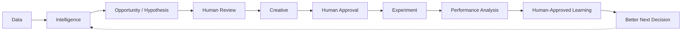

# Softline Marketing Hub

A multi-client AI marketing intelligence and experimentation workspace, built as an
incremental portfolio/demo project. This README is the source of truth for the
project's intent, architecture, and rules. Read it before making any structural
changes.

**Current status: Milestone 31 (marketing-teammate voice pass across every
agent's generated text) complete**, on top of Milestone 30.1 (markdown-heading
typography fix), Milestone 30 (Jira-inspired typography: Inter, centralized
in `core/ui.py`), Milestone 29.2 (stable stylesheet + fixed sidebar
structure across page navigation), Milestone 29.1
(sidebar active-page fix, all nav items real page_links), Milestone 29
(post-demo UX/
presentation polish pass), Milestone 28.9 (default-checked generated creatives)
and Milestone 28.8 (Overview period control), on top of Milestone
28.5 (creative-direction card proportions restored), Milestone 28.4
(creative-direction briefs, pre-generation), Milestone 28.3 (restored
pre-generation Creative Lab
presentation), Milestone 28.2 (fresh-run demo presentation), Milestone 28.1
(demo generation playback), Milestone 28 (Creative Studio V3), and Milestone
27 (final core UI polish), on top of Milestone 25 (product-model consistency pass across
Overview, Insights, Creative Lab, Experiments), on top of Milestone 24 (Experiments visual polish + Insights
workflow correction) and Milestone 23 (Experiments V2:
multi-arm concept experiments, no mandatory baseline), on top of Milestone 22
(Creative Lab V2: Creative Plan redesign) and an unlogged product-wide
UX/design-system pass
(navigation reorder to Overview -> Customer Signals -> Insights -> Creative
Lab -> Experiments; a shared `core/ui.py` component library; page-level UX
corrections) done in the sessions between 17C.2 and this one. Overview,
Customer Signals, Insights (product-facing name for the Marketing
Intelligence page; the module/agent stay `intelligence`), Creative Lab, and
Experiments (prepared review AND a deterministic demo-results view) are
all live. Marketing Intelligence, the Creative Strategist,
and Creative Studio's ad/version generation all remain deterministic
preview implementations (`agents/intelligence/engine.py`,
`agents/strategist/engine.py`, `agents/creative_studio/engine.py`) that
turn evidence into structured `Finding`, `ExperimentProposal`, `AdPackage`,
and `CreativeVersion` objects.

As of Milestone 22, Creative Lab no longer asks a marketer to pick one
Insights finding first. `agents/strategist/creative_plan.py::
build_creative_plan` runs the Strategist over EVERY current finding at
once: each experiment-worthy finding (Emerging Opportunity or Messaging
Gap) becomes its own `CreativeOpportunity` (`agents/strategist/engine.py`)
with 3 angle-differentiated `CreativeConcept`s (`agents/creative_studio/
engine.py`: Problem recognition / Desired outcome / Proof-led, distinct
hypotheses about what moves the audience, not visual variants of one ad),
grouped into a `CreativeFamily`; a Performance Pattern finding is folded in
as plan-wide cross-cutting CONTEXT instead of a 3rd family, since it
describes an already-observed pattern in one specific product/funnel-stage
context, never proof for a different one. The page renders the whole
`CreativePlan` (evidence strip, Strategist synthesis paragraph,
cross-cutting context, then each family with its strategy brief and 3
concept cards) and lets a marketer include/exclude concepts before
"Prepare selected experiments," which can build MORE THAN ONE proposed
experiment at once (one per family with at least one included concept;
see `app_pages/experiments.py`'s `st.session_state["experiment_handoffs"]`,
now a dict keyed by proposal_id instead of one slot). Concepts render
through `ui.render_creative_placeholder` (a "Creative preview: image
generation added next" placeholder) rather than any generated or reused
image: reconnecting live generation for these concepts is explicit future
work. The OLD single-finding, 3-stage flow (Opportunity -> Experiment ->
Creatives; `generate_proposal`, `build_treatment_ad_package`,
`generate_creative_versions`, `VISUAL_DIRECTION_STRATEGIES`) is UNCHANGED
and still fully callable, just no longer this page's entry path; see
Milestone 22's own changelog entry (§11) for what's reused versus new, and
why. `agents/creative_studio/image_provider.py`/`generation.py` (live vs.
demo image generation, `CREATIVE_GENERATION_MODE`) are also unchanged and
not currently wired into Creative Lab's default page; the section below
(prior to §11's Milestone 22 entry) describes that OLD flow, which the
image-generation infrastructure was originally built for and will be
reconnected to a form of.

Clicking "Prepare selected experiments" on the Creative Plan hands each
resulting handoff to the Experiments page as a prepared-but-not-launched
experiment summary. As of Milestone 23 (Experiments V2, a product-logic
redesign of `app_pages/experiments.py`, not just a visual pass), that page
no longer centers on "current ad vs. treatments, find a winner": a
handoff's selected concepts ARE the experiment's own arms (concept vs.
concept vs. concept), compared against each other, never against a
mandatory baseline. The existing reference ad Creative Lab already
selected (`control_ad_package`, same deterministic, same-product/
same-funnel-stage selection as before) rides along only as creative-
memory/performance context (quietly shown in "View experiment details"),
anchoring realistic, comparable synthetic performance for every arm
(`core.experiment_simulation.build_concept_arms_result`, current_ad_result
explicitly `None`) without ever becoming a competing row.

Each prepared experiment gets its own `st.tabs` tab, labeled by its
human-readable customer theme (never a technical id); Creative Lab can
prepare more than one at once (one per Creative Opportunity), and each
tab's prepared/result state lives in its own `proposal_id`-keyed
session-state slot, so running or resetting one experiment never touches
another (`st.session_state["experiment_handoffs"]`/`["experiment_
results"]`/`["experiment_analyses"]`, all dicts keyed by proposal_id,
Milestone 22/23).

The prepared view walks: a short description, "What we're trying to
learn" (the learning question plus the underlying hypothesis), a compact
"Test setup" (product/audience/funnel stage/variable/metrics/what's kept
consistent, all read from the handoff's own structured fields, never
hardcoded), the concept arms as equal-height comparison cards (`ui.
render_creative_placeholder`, the same "image generation added next"
placeholder Creative Lab itself uses; no image provider call, no reused
asset), then "Run Demo Test." That button builds ONE deterministic,
Python-owned `ExperimentResult` (`core.experiment_simulation.
build_concept_arms_result`: every arm gets the same test budget and
evidence-gated tilt, then its own independent hash-seeded variation, so
no arm is guaranteed to lead) and immediately runs the Performance Agent's
new `analyze_concept_experiment` (`agents/performance/engine.py`) against
it, replacing the prepared view with a results view answering, in order:
what did we test, what happened (an evidence-tied headline, never
"proven"/"winner"), what did we learn (tied explicitly back to the
original learning question, plus its limitations, stated once), and what
should we test next (a `RecommendedNextTest`: one concrete next dimension
to investigate, e.g. hook/format/revisit strategy, never "scale the
winner," alongside a `ProposedLearning`, an in-session-only, clearly
"Pending review" structured object never written to
`approved_learnings.json`). See §11's Milestone 23 entry for the full
detail, including exactly what the OLD current-ad-vs-treatments page code
and Performance Agent analysis (both UNCHANGED, just no longer wired into
this page by default) still offer for a future baseline-based experiment
type.

Since Milestone 16.2, a generated image's
stored path is re-checked (`core.assets.generated_asset_exists`)
immediately before every render in Creative Lab (a concept this milestone
has none to check, by design). Live-mode image generation is the one live
model call the app can make; by default it makes none, and every other
agent is still a deterministic preview. See
[Roadmap](#11-roadmap).

---

## 1. What this is

Softline Marketing Hub demonstrates how AI can help a marketing team learn the
market faster, understand customers earlier, test more ideas, and make
better-informed decisions: **without replacing the marketer**.

AI gathers, organizes, analyzes, generates, and recommends. The human marketer
reviews evidence, contributes their own ideas, approves experiments and creative,
interprets results, and decides what becomes an accepted learning.

The long-term goal is to unify marketing information that normally lives across
many disconnected systems (Meta Ads Manager, AgencyAnalytics, CRM, website
analytics, customer messages, Reddit/social discussion, reviews) and use
specialized AI agents to help answer questions like:

- What are customers talking about, and is that changing?
- What language do customers naturally use?
- What creative/message patterns are performing?
- What have we already tested, and what did we learn?
- What's worth testing next, and why?
- What happened when we tested it?

### The core loop



Every step where AI produces something consequential (a hypothesis, a creative
variant, a learning) is followed by a human decision point. AI never
auto-promotes its own output into permanent memory or into a live experiment.

---

## 2. Multi-client design

Softline works with multiple client companies. The app is **not** built as a
Brio-only tool: it has a client selector, and everything client-specific
(knowledge, products, signals, campaign data, experiment history, creative
assets, approved learnings) is scoped by `client_id`.

**Brio Water** is the only client we build out with real (public, Meta Ads
Library sourced) creative examples and realistic demo data. `clients/registry.json`
currently lists Brio only, marked `active: true`. We are deliberately not
spending time on disabled placeholder clients yet: the registry is shaped so
adding one later is just appending another entry.

The five agents (below) are reusable logic that reads whatever client is
currently selected. Agent design must never hardcode "Brio."

---

## 3. Agent architecture

Five specialized agents, each with a narrow and genuinely distinct
responsibility. None make live LLM calls yet (see [Tech stack](#5-tech-stack--whats-deliberately-out-for-now)).
Two still exist only as design specs (`agents/<name>/*.md`). Intelligence
(Milestone 7), the Creative Strategist (Milestone 8), and Creative Studio
(Milestone 9) also have real deterministic preview implementations in code;
see "Agent file structure" below for what that changes and doesn't change.

| Agent | Core question | Reads | Produces |
|---|---|---|---|
| **Manager** | "What does the marketer need, and who can answer it?" | The marketer's request, other agents' outputs | Delegation, synthesized answers, a request for a human decision |
| **Intelligence** *(has a preview implementation)* | "What are customers and the market telling us, and how does that compare with what our marketing is currently doing?" | Customer signals, creative coverage, Meta performance, via `core/analytics.py` and `core/creative_coverage.py` | Structured `Finding` objects: type, title, summary, confidence, evidence, recommended next step |
| **Performance** | "What is actually performing?" | Quantitative data (Meta Ads, AgencyAnalytics-style reports, website, CRM, experiment results) | CTR/CPC/CPA/ROAS patterns, trends by angle/creative attribute |
| **Creative Strategist** *(has a preview implementation)* | "What's worth testing next, and why?" | One experiment-worthy `Finding`, plus `creative_catalog.csv` and `meta_ads.csv` to choose a control creative | Structured `ExperimentProposal`: control creative + reason, variable to test, what stays constant, falsifiable hypothesis, proposed direction, success metrics |
| **Creative Studio** *(ad/version generation is a preview implementation; image generation is live)* | "Turn an approved experiment into a Meta-shaped ad package (primary text, headline, description, CTA), then render several real, genuinely distinct visual creative versions underneath it." | An approved `ExperimentProposal` + the control creative + observed Meta Ads Library copy when available | A `control_ad_package` and `treatment_ad_package` (primary text, headline, description, CTA each), then batches of 3 `CreativeVersion`s (visual direction + own on-image copy), then one real, reference-based `GeneratedCreative` image per version a human requests via OpenAI |

Rules that keep this honest:

- **Python owns facts and calculations.** AI owns interpretation, classification,
  summarization, hypotheses, recommendations, and creative work.
- **AI must not invent evidence.** Every meaningful insight must be traceable to
  source data.
- **Control ≠ winner.** "Control" always means the existing/current creative used
  as the experiment's baseline, never "the best historical performer."

### Agent file structure

Each agent gets four concise Markdown files describing it:

```
agents/<agent_name>/
    agent.md       # one-paragraph purpose, inputs, outputs, boundaries
    identity.md    # persona/voice used when the agent's actions appear in the Agent Activity feed
    tools.md       # capabilities it can use (data queries, calculations)
    workflow.md    # its step(s) in the core loop, who it hands off to/from, where a human gate sits
```

These stay intentionally simple. We expand them only when a real behavior needs
more detail, not speculatively.

**Intelligence, the Creative Strategist, and Creative Studio are the three
exceptions, and only in one specific way.** Their `engine.py` files are
real, deterministic preview implementations: fixed rules that produce the
same structured output a future live model call would return (see §9 for
exactly what each computes). This is not "an agent framework": it's plain
Python functions over `core/` evidence (and, downstream, over each other's
structured output: the Strategist consumes Intelligence's `Finding`,
Creative Studio consumes the Strategist's `ExperimentProposal`), with no
orchestration, no LLM, and no state beyond a single function call. The
other two agents remain markdown-only specs until their own milestones.
When any of the three eventually gets a live model call, its own
detector/proposal/concept functions are what gets replaced; the
`Finding`/`Evidence`/`ExperimentProposal`/`CreativeConcept` schemas, and
everything downstream that renders them, should not need to change.

---

## 4. Shared client memory

Memory is **not** a sixth agent: it's shared context that all agents can read.
For each client we maintain (or will maintain):

- Company profile, products, audience, brand guidelines
- Experiment history
- Previous insights
- Approved learnings
- Rejected / unconfirmed hypotheses

**The critical separation** is between tiers, kept in different places so an AI
opinion can never quietly become a fact:

| Tier | What it is | Where it lives | Who writes it |
|---|---|---|---|
| **Raw data** | Source evidence and calculated facts: ad performance, customer signals, analytics | `data/<client>/` (loaded/joined by `core/data.py`, calculated by `core/analytics.py`) | Ingested (simulated for now) |
| **AI analysis / hypotheses** | Interpretations and hypotheses that have **not** been approved | `insights/<client>/findings.json`, `insights/<client>/hypotheses.json` | AI agents |
| **Approved client memory** | Facts and learnings a human has signed off on | `clients/<client>/approved_learnings.json` | Only written after human approval |
| **Agent activity / audit log** *(later)* | A record of what agents did, for the Agent Activity feed, not analysis, not memory | `logs/<client>/` *(not created yet)* | Appended automatically as agents act |

An AI-generated insight is only promoted from `insights/` into
`clients/<client>/approved_learnings.json` when a human explicitly approves it.
Agent activity logs are kept in their own future `logs/` tier rather than mixed
into `insights/`, because "Intelligence scanned 241 conversations" is an audit
record, not an interpretation: conflating the two would blur what's evidence
versus what's process history.

---

## 5. Tech stack & what's deliberately out for now

**In:**
- Python
- Streamlit
- pandas
- CSV / JSON / Markdown as the data and context layer
- OpenAI's image-editing API (`openai` package), for Creative Studio's live
  generation step only (`agents/creative_studio/image_provider.py`). See
  §9 for the exact model and setup, and §13 for environment variable
  configuration.

**Deliberately not yet (until there's a real milestone for them):**
- No other LLM API calls: Intelligence, the Creative Strategist, and
  Creative Studio's concept generation are still deterministic preview
  implementations, not live model calls. Live image generation is the one
  exception, added in Milestone 10.
- No other image-generation/editing provider: one clean provider seam
  (`ImageGenerationProvider`) plus the OpenAI implementation, deliberately
  not an enterprise multi-provider framework. A second provider (Google,
  FLUX, etc.) is addable later without changing Creative Lab.
- No database: files + IDs are sufficient at this scale
- No autonomous-agent framework: agents are plain Python modules/functions until we hit a real need for orchestration
- No auth, deployment, or infra beyond running Streamlit locally

We prefer deterministic, reliable demo behavior over live AI calls until an API
is intentionally introduced for a specific milestone.

---

## 6. Application shell & navigation

The app uses Streamlit's `st.navigation` / `st.Page` API (stable since
Streamlit 1.36) rather than the older filename-convention `pages/` auto-MPA
feature. Reasons:

- **One shared entry point.** `app.py` builds the page list, then calls
  `render_sidebar(pages)` (in `core/shell.py`) before `st.navigation(...)`.
  Because `app.py` is the script Streamlit always re-runs, that sidebar code
  executes on every page view: there's exactly one place to change global
  chrome (client selector now; Ask Marketing Hub and Agent Activity later),
  instead of every page file re-implementing it.
- **No hidden folder-naming magic.** The old `pages/` convention derives
  navigation from filenames (`1_Overview.py`, etc.) and orders/labels pages
  implicitly. `st.navigation([st.Page(...), ...])` makes the page list and
  order explicit in one place (`app.py`).
- **Folder is named `app_pages/`, not `pages/`.** Streamlit still
  auto-scans a literal `pages/` directory for the legacy feature even when
  you call `st.navigation` explicitly, which caused a real
  `st.navigation was called in an app with a pages/ directory` warning during
  testing. Renaming the folder removed the conflict, confirmed by re-running
  the test suite with no warnings.
- **Navigation widget is hidden; links are drawn manually.** `st.navigation`
  is called with `position="hidden"`, and `core/shell.py` renders a
  `st.sidebar.page_link()` per page itself, right after the client selector.
  Streamlit's auto-drawn nav widget renders in a fixed slot at the very top
  of the sidebar regardless of call order, which put navigation above the
  client/workspace context; this was the only way found to put "which
  workspace am I in" before "where do I go." Routing is unaffected, only the
  widget's placement is.

Client state (`st.session_state["client_id"]`) is initialized and read through
`core/shell.py`, so it persists automatically as Streamlit reruns `app.py` on
every navigation. No page-specific state handling is needed.

---

## 7. Application pages (planned)

Streamlit multipage app, five pages, plus two cross-cutting UI elements. Today
each page is a placeholder (title, one-sentence purpose, selected client),
except Overview. See [Roadmap](#11-roadmap) for when the rest arrives.

1. **Overview** *(live)*: Performance Overview (KPIs with vs.-prior-period
   deltas, one trend chart) → Marketing Intelligence (three compact insight
   cards: Emerging Signal / Winning Pattern / Next Opportunity, computed by
   `core/insights.py`, not agent output yet) → Action Center (a demo review
   queue). See §9 for the modules involved and the exact logic behind each
   insight card.
2. **Marketing Intelligence** *(live, nav label "Intelligence")*: connects
   customer signals, current creative, and Meta performance into structured
   findings, generated by the Intelligence Agent's deterministic preview
   (`agents/intelligence/engine.py`). Intelligence Brief (up to 3 findings:
   type, title, 1-2 sentence summary, confidence, one next step, evidence
   on demand) → Customer Language vs Current Marketing (a scatter of signal
   share vs. creative coverage per theme, product-filterable) → Creative
   Performance Patterns (message-style performance within one product,
   always compared within a single funnel stage). Not the same page as
   Overview's own "Marketing Intelligence" section (the three compact
   preview cards there, from `core/insights.py`): that section is a
   lighter-weight, non-agent preview; this page is the full evidence-linked
   version. Proposes; never generates creative, decides an experiment, or
   approves a learning. See §9 for the exact calculations and finding
   types.
3. **Creative Lab**: Turn an approved hypothesis (AI-proposed or
   marketer-initiated) into controlled creative experiments: hypothesis,
   evidence, control, proposed variants, human edit/approve controls.
4. **Experiments**: Active / Completed / Planned. Each experiment: hypothesis,
   variable tested, control, variants, performance, result, AI interpretation,
   confidence, next-experiment suggestion, human approval of any proposed
   learning.
5. **Customer Signals** *(live)*: the evidence layer, not the interpretation
   layer. Sources → Themes → Individual evidence: Source Coverage (signal
   volume by source), Conversation Themes (ranked by volume, with change vs.
   an earlier comparable period when the selected range supports it), and a
   searchable, paginated Signal Feed of individual signals. Filterable by
   date range, product, and source; the feed adds its own search/theme/
   intent/sentiment filters. Never proposes a recommendation, a hypothesis,
   or a "next step": that's Marketing Intelligence's and Creative Lab's job.
   See §9 for the exact calculations.

**Cross-cutting (later milestones):**
- **Ask Marketing Hub**: a persistent conversational interface, coordinated by
  the Manager agent. Not implemented until we add an LLM API.
- **Agent Activity**: a small feed of agent *actions* (not hidden reasoning),
  e.g. "Intelligence analyzed 241 customer conversations." Shows the team
  working; doesn't leak chain-of-thought. Backed by `logs/<client>/` (§4).

---

## 8. ID conventions

To keep synthetic datasets internally consistent and joinable, every record
carries a stable, prefixed identifier. No datasets exist yet; this convention
is agreed now so nothing needs renaming later. Prefixes extend as needed.

- `client_id`: e.g. `brio`
- `product_id`: e.g. `brio_prod_001`
- `campaign_id`: e.g. `brio_cmp_001`
- `creative_id`: e.g. `brio_cr_001`
- `experiment_id`: e.g. `brio_exp_001`
- `hypothesis_id`: e.g. `brio_hyp_001`
- `signal_id`: e.g. `brio_sig_001`
- `source_id`: a fixed enum: `meta_ads`, `agency_analytics`, `reddit`, `crm`,
  `social_messages`, `website_analytics`, `reviews`

---

## 9. Project structure

As it exists after Milestone 17B:

```
softline_marketing_hub/
├── README.md
├── .gitignore
├── .env                               # gitignored; your real OPENAI_API_KEY, loaded by app.py's load_dotenv()
├── .env.example                      # documents OPENAI_API_KEY; copy to .env (gitignored) with your real key
├── requirements.txt
├── app.py                            # entry point: page config, page list, sidebar, navigation
├── core/
│   ├── __init__.py
│   ├── clients.py                    # pure client-registry helpers, no Streamlit dependency
│   ├── shell.py                      # sidebar (client context + nav links), page placeholder layout
│   ├── data.py                       # loads/joins data/<client>/*.csv, no calculation, no interpretation
│   ├── analytics.py                  # KPIs, aggregations, filtering, period/theme comparison, attribute_style_leaders
│   ├── assets.py                     # resolves a creative_id to a source-ad image path; stores generated assets
│   ├── brand_context.py              # short, prompt-ready client brand context, "" while client files are placeholders
│   ├── insights.py                   # deterministic preview logic for Overview's 3 "learning" cards, see below
│   ├── creative_coverage.py          # shared theme<->creative-copy taxonomy and coverage calculations
│   ├── visual_performance.py         # visual taxonomy + synthetic performance join, insufficient-evidence aware
│   └── experiment_simulation.py      # deterministic demo-test ExperimentResult/CreativeResult; +build_concept_arms_result (Milestone 23)
├── app_pages/                        # named app_pages/, not pages/, see §6
│   ├── overview.py                   # live: wires core/* to widgets, no calculation of its own
│   ├── intelligence.py               # live ("Marketing Intelligence"): wires agents.intelligence.engine + core/*
│   ├── creative_lab.py               # live (Milestone 22): renders the Strategist's CreativePlan (all findings at once)
│   ├── experiments.py                # live (Milestone 23): multi-arm concept experiments, tabs per prepared experiment, see §11
│   └── signals.py                    # live (labeled "Customer Signals" in nav/title): same wiring-only rule
├── agents/
│   ├── manager/{agent,identity,tools,workflow}.md
│   ├── intelligence/
│   │   ├── {agent,identity,tools,workflow}.md
│   │   └── engine.py                 # deterministic preview implementation, see §3
│   ├── performance/
│   │   ├── {agent,identity,tools,workflow}.md
│   │   └── engine.py                 # deterministic preview experiment analysis, see §9 notes below
│   ├── strategist/
│   │   ├── {agent,identity,tools,workflow}.md
│   │   ├── engine.py                 # deterministic preview implementation, see §3; now also CreativeOpportunity (Milestone 22)
│   │   └── creative_plan.py          # Milestone 22: CreativePlan/CreativeFamily, synthesizes ALL current findings at once
│   └── creative_studio/
│       ├── {agent,identity,tools,workflow}.md
│       ├── engine.py                 # deterministic preview ad/version generation, see §3
│       ├── generation.py             # GenerationRequest/GeneratedCreative, prompt construction, storage, get_creative_resolver
│       ├── image_provider.py         # ImageGenerationProvider seam + OpenAIImageProvider, the one live model call
│       └── demo_assets.py            # pre-generated demo asset manifest + resolution, CREATIVE_GENERATION_MODE=demo
├── clients/
│   ├── registry.json                 # [{ "client_id": "brio", "name": "Brio Water", "active": true }]
│   └── brio/
│       ├── profile.md                # placeholder, real brand info not added yet
│       ├── products.md               # placeholder
│       ├── audience.md               # placeholder
│       ├── brand_guidelines.md       # placeholder
│       └── approved_learnings.json   # [] , nothing approved yet
├── data/
│   └── brio/
│       ├── creative_catalog.csv      # 24 creatives: campaign, funnel stage, product, messaging attributes
│       ├── meta_ads.csv              # 1,440 rows: 60 days x 24 creatives, daily Meta performance
│       ├── customer_signals.csv      # 240 synthetic customer signals (Reddit, reviews, CRM, social, search)
│       ├── observed_ad_copy.csv      # real Meta Ads Library ad-level copy for 7 creatives; data_type=public_ad_library_observed
│       └── creative_visual_attributes.csv  # compact visual taxonomy, one row per creative_id; see §9 note below
├── insights/
│   └── brio/
│       ├── findings.json             # [], no AI findings generated yet
│       └── hypotheses.json           # [], no AI hypotheses generated yet
└── assets/
    └── brio/
        ├── source_ads/                # real, public-ad-inspired control creative evidence, never overwritten
        │   ├── asset_mapping.csv     # creative_id -> filename lookup, plus provenance metadata
        │   ├── brio_99_9_contaminants.png
        │   ├── brio_pure_water_zero_concerns.png
        │   ├── brio_everyday_hydration.png
        │   ├── brio_premium_refreshment.png
        │   ├── brio_entire_home_filtration.png
        │   └── brio_q60.png
        └── generated/                  # AI-generated creatives, created on first live generation; see §9
            ├── demo_manifest.json      # pre-generated demo asset index, see §9 note below (Milestone 17A.1)
            └── <concept_id>_<timestamp>_<id>.{png,json}
```

`brio_cr_002`'s mapped image ("There's Bad Guys in Your Water") was intentionally removed from `source_ads/` (its only available source screenshot included a video-play overlay); `asset_mapping.csv` still lists the row, and `resolve_creative_image` correctly returns `None` for it rather than erroring, exactly the "no image for this creative" case the module was built to handle. `assets/brio/generated/` does not exist until the first live generation call creates it (in `"live"` mode) or `rebuild_demo_manifest` is run against an already-populated folder (in `"demo"` mode, the default).

All three original CSVs carry a `data_type: demo_synthetic` column (catalog
also has `creative_origin: public_ad_inspired | synthetic_demo`), so any UI
built on top of them can render a clear "simulated data" badge instead of
guessing. The two Milestone 15 CSVs distinguish three `data_type` values
instead of two, never blurred: `observed_ad_copy.csv` rows are all
`public_ad_library_observed` (real Meta Ads Library copy, collected, not
generated); `creative_visual_attributes.csv` rows are
`public_ad_observed_analysis` for the 6 creatives with a real local source
image (our own classification of what's actually visible in that image)
and `demo_synthetic` for every other creative (heuristically derived from
existing catalog fields, since no real image exists to inspect). Three of
`observed_ad_copy.csv`'s 7 rows (`brio_cr_004`/`brio_cr_005`/`brio_cr_008`)
share one `source_ad_id` (`brio_ad_home_filtration_multi`), which is how
the "one ad, many creative versions" grouping is represented today: a
join key on already-present data, not a new required column on the
catalog itself.

Not created yet, noted for later (§4): `logs/<client>/` for Agent Activity /
audit history, kept separate from `insights/`.

**Data note:** `meta_ads.csv` has 31 rows (of 1,440) where `purchases` is one
higher than `add_to_carts`, including 25 with `add_to_carts=0`. This isn't
corrupt data: Meta's add-to-cart and purchase pixels are independently
tracked events with different attribution windows, so real Meta exports show
this too. `core/analytics.py` treats funnel steps as independent counts
rather than assuming strict monotonicity.

**Evidence vs. performance stays two files, not one.** Six creatives
(`brio_cr_001`, `003`, `004`, `005`, `008`, `009`) have a real, cropped
screenshot of a publicly-visible Brio ad in `assets/brio/source_ads/`,
resolved via `core/assets.py` (`brio_cr_002` is mapped in
`asset_mapping.csv` but has no file on disk; see §9's project structure for
why). Those images are
creative evidence: real ads that exist in the world. The spend/CTR/ROAS
numbers attached to those same `creative_id`s in `meta_ads.csv` are
synthetic demo data, generated for this project, not a report of how those
real ads actually performed. The two are joined only by `creative_id` at
render time, in memory, never merged into one file or record, specifically
so a future page can show "here's the real ad" and "here's simulated
performance for the demo" as two clearly separate facts, not one.

**How the three "Marketing Intelligence" cards on Overview are actually
computed** (`core/insights.py`; full detail in that file's docstrings):

- **Emerging Signal**: splits customer-signal history into two equal halves
  by date and finds the theme with the largest absolute mention increase
  (a floor on the recent count avoids a tiny-n theme looking "explosive" by
  percentage). Falls back to naming the most-mentioned theme overall,
  explicitly labeled "prominent" rather than "emerging," if nothing grew.
- **Winning Pattern**: compares creative angles only within the same
  *(product, funnel_stage)* cell, never across products or funnel stages.
  Rather than crowning whichever angle has the single highest ROAS (which
  mostly just confirms that promotional/retargeting creative converts well
  at the bottom of the funnel, not a new pattern), it first looks for a
  genuine **tradeoff**: one angle with the higher CTR (more attention), a
  *different* angle with the higher ROAS (more efficient conversion), both
  gaps clearing a 10%-relative noise floor. If no cell shows that kind of
  split, it falls back to the single angle most outperforming its peers
  within the same product + funnel stage (still never compared outside that
  context), and says so plainly if nothing clears that bar either.
- **Next Opportunity**: answers "what are customers repeatedly talking
  about that our creative isn't emphasizing enough," not a signal-share vs.
  spend-share comparison (those turned out not to be comparable enough to
  imply an opportunity on their own). For each customer-signal theme, finds
  the product customers most associate it with, then classifies that
  product's own creatives as using the theme as a **primary hook**
  (in the headline), **mentioned** (body copy only), or **absent**,
  via the explicit, central `CUSTOMER_THEME_TO_CREATIVE_KEYWORDS` taxonomy
  in `core/insights.py` (not ad hoc keyword checks). A theme qualifies only
  if it's a meaningful share of all signals *and* rarely a primary hook for
  its product; the most-discussed qualifying theme is reported, phrased as
  a hypothesis worth testing, never a causal claim, and never claiming a
  theme is completely absent from copy when it's merely under-led.

All three return a `found: bool` and a structured `data` dict of the exact
numbers behind the headline; the Overview page's compact card visuals read
only from that dict (never hardcoding or re-deriving a number), and render
"why not" text instead when a function's own evidence bar isn't cleared.

**What Customer Signals calculates** (all in `core/analytics.py`, reused from
Overview where applicable; the page itself only wires these to widgets):

- **`filter_signals`**: the one function behind every filter on the page
  (date range, product, source, theme, intent, sentiment, search text), all
  optional and AND-composed, so any combination, including none, composes
  correctly. `search_text` is a plain case-insensitive substring match
  (`str.contains(..., regex=False)`), not fuzzy or ranked.
- **`summarize_signals`**: the three summary numbers (signals analyzed,
  active sources, themes detected) as literal counts over whatever's
  currently filtered, never a fixed list, so a filter that removes a source
  removes it from the count too.
- **`aggregate_signals`** *(already existed, reused as-is)*: signal volume by
  source for the Source Coverage chart.
- **`theme_movement`**: per-theme counts for the page's *currently selected*
  period, plus change vs. the immediately preceding period of equal length
  (via the same `previous_period`/`has_full_period` pair Overview's KPIs
  use), when the dataset fully covers that prior period; otherwise counts
  only, no movement column, rather than a number built on partial history.
  A 30-day selection compares against the 30 days right before it, never a
  split of the selected range's own first and second half. Because the
  current dataset spans exactly 60 days, the default latest-30-day view's
  prior period lands exactly on the other 30 days, so its numbers currently
  match `core/insights.py`'s `emerging_signal` card on Overview exactly
  (Taste & odor: 40 selected, 17 prior, +23); a custom range on Customer
  Signals will generally produce a different, independently correct answer
  for the period it describes, since `emerging_signal` always reasons about
  the full history regardless of any filter on this page.

Customer Signals never cross-references `creative_catalog.csv` or
`meta_ads.csv`: it only reads `customer_signals.csv`, deliberately, since
this page is the evidence layer, not the interpretation layer that Overview's
Next Opportunity card already does. `demo_theme_label`, `demo_intent_label`,
and `demo_sentiment_label` are labeled as synthetic demo preprocessing
throughout the page's copy, never presented as fields a real Reddit/CRM/
review source would supply. Individual feed entries show only fields that
exist in `customer_signals.csv` (source, date, text, theme, intent,
sentiment, product context) and are captioned "Simulated customer signal";
no usernames, subreddit names, URLs, or other provenance is invented, since
none exists in the dataset.

A theme filter can be pre-selected by another page before switching here
(`st.session_state["signals_prefill_theme"] = "Taste & odor"`), read once and
validated against the current global filters before use. Nothing sets this
key yet; it exists so a future click-through (e.g. from Overview's Emerging
Signal card) doesn't require restructuring this page later.

**How Marketing Intelligence and the Intelligence Agent work**
(`agents/intelligence/engine.py` for the agent logic; `core/creative_
coverage.py` and `core/analytics.py` for the calculations underneath it):

The theme-to-creative-copy taxonomy that used to live only in
`core/insights.py` (for Overview's Next Opportunity card) moved to
`core/creative_coverage.py`, so both consumers share one definition of
"does this creative address this theme." `core/insights.py` now imports it;
`next_opportunity`'s behavior is unchanged (verified byte-identical before
and after the move).

`core/creative_coverage.py` adds `classify_theme_emphasis` (tag each
relevant creative as leading with, mentioning, or absent for a theme) and
`creative_coverage` (the counts, ratio, and funnel-stage/product
distributions for one theme). `core/analytics.py` adds
`theme_associated_products` (which products customers most associate with a
theme, floor of 3 mentions) and `theme_coverage_landscape` (one row per
theme: signal share alongside creative coverage, for the page's Customer
Language vs Current Marketing chart).

`agents/intelligence/engine.py` runs four independent detectors over a
shared per-theme evidence base (movement, associated products limited to
ones that exist in the catalog, and coverage), plus the joined performance
data:

- **Emerging Opportunity**: a theme growing by at least 10 signals (and at
  least 15 in the current period) with a primary-hook coverage ratio at or
  below 15%. When a message style also clearly leads (higher ROAS *and*
  higher CTR than every other qualifying style) within one of the theme's
  associated products and funnel stages, that's folded in as additional
  evidence, not raised as a separate finding.
- **Messaging Gap**: a theme that's at least 10% of signals and has the
  same low-coverage profile as above, regardless of trend direction.
  Excludes any theme already reported as an Emerging Opportunity.
- **Saturated Theme**: a theme that's a meaningful share of signals *and*
  already leads at least 40% of its relevant creatives. Explicitly
  informational (probably not an untapped angle); nothing in the current
  demo data clears this bar, and the detector correctly reports nothing
  rather than forcing a weak candidate.
- **Performance Pattern**: a message style that clearly leads (both ROAS
  and CTR) within one (product, funnel_stage) cell, on volume clearing the
  same floors as Overview's Winning Pattern card (>=$1,500 spend, >=15
  purchases, >=10% relative gap). Never compares across funnel stages or
  products, for the same reason Overview's `winning_pattern` doesn't:
  different funnel stages have different economics by design. Skips any
  cell already cited as supporting evidence in an Emerging Opportunity
  finding, so the same numbers aren't presented as two different findings.

`generate_findings()` ranks all candidates by confidence, then by how much
evidence backs them, and returns the top 3 while skipping a candidate whose
(type, product) combination is already represented, so the brief stays
varied instead of showing two near-duplicate findings about the same
product. It returns fewer than 3 (including zero) when the data doesn't
support that many; nothing is padded to hit a target count.

Confidence is capped at `medium` for both hypothesis-shaped types (Emerging
Opportunity, Messaging Gap), regardless of how strong the supporting
numbers are, because the recommendation itself is untested. `high` is
reserved for a Performance Pattern with volume comfortably above the floor,
since that describes something already observed, not a bet on the future.

Every `Finding` carries `generated_by="preview"`. A future live model call
would populate the identical `Finding`/`Evidence` schema with
`generated_by="agent"`, so the page's rendering code would not need to
change, only which function produces the data it renders.

**How the Creative Strategist and Creative Lab work (legacy single-finding
path, kept as reusable infrastructure, not the default page since Milestone
22)** (`agents/strategist/engine.py` for the agent logic;
`app_pages/creative_lab.py` for the page):

> As of Milestone 22 (see §11), `app_pages/creative_lab.py` no longer calls
> `generate_proposal`/`experiment_worthy_findings` as its entry point: it
> renders `agents/strategist/creative_plan.py::build_creative_plan`
> instead, which runs every current finding through the Strategist at
> once. Everything below still describes real, unmodified, callable code
> (`generate_proposal`, `select_control_creative`,
> `_select_performance_evidence`, `build_treatment_ad_package`,
> `generate_creative_versions`), and `CreativeOpportunity`/
> `build_creative_opportunity` (also in `agents/strategist/engine.py`)
> directly reuse `_select_funnel_stage`, `select_control_creative`, and
> `_select_performance_evidence` described here rather than re-deriving
> them; this section is kept as the accurate reference for that shared
> logic, not as a description of the page a marketer sees today.

The Strategist does not discover customer signals or calculate performance.
It takes one experiment-worthy `Finding` (Emerging Opportunity or Messaging
Gap; the same `EXPERIMENT_WORTHY_TYPES` set the Intelligence page uses,
moved into `agents/intelligence/engine.py` so both consumers agree on it)
and turns it into a structured `ExperimentProposal`:

```
proposal_id, source_finding_id, title, product, funnel_stage,
customer_theme, customer_insight, performance_insight,
control_creative_id, control_reason, variable_to_test,
constant_elements, hypothesis, proposed_direction, success_metrics,
confidence, evidence, generated_by
```

Every factual claim traces back to the source `Finding`'s own evidence,
`creative_catalog.csv`, or `meta_ads.csv`. `generate_proposal` picks the
Finding's first listed product, then a funnel stage
(`_select_funnel_stage`: TOF preferred, since a message-hook experiment is a
top-of-funnel lever, falling back to MOF then BOF when the product has no
TOF creative), then a control creative for that exact product and funnel
stage.

**Control selection is the one part of this milestone the brief called out
as needing verification, not assumption.** `select_control_creative` never
picks a global "best ad": candidates are scoped to the same product and
funnel stage the experiment is about, then chosen by, in order: (1) the
creative already using the catalog's `technical` message style, since that
claim is what the experiment keeps constant while it changes the hook; (2)
failing that, a creative with an evidentiary hook type (`proof`,
`education`, `outcome`); (3) failing that, the strongest already-proven
performer (highest ROAS) clearing the Intelligence Agent's own volume floor;
(4) failing that, the lowest `creative_id` in scope, so a control is always
chosen. No `creative_id` is ever hardcoded. Run against the current data,
this rule independently selects `brio_cr_001` ("Removes Up to 99.9% of
Contaminants") as the control for the Taste & odor opportunity, matching
this milestone's own worked example without that example being encoded
anywhere in the logic, and `brio_cr_009` ("RO Sparkling Water Dispenser")
for the Bottled water frustration opportunity, a different product and a
different, still-correct answer.

**Performance evidence is always recomputed for the experiment's own exact
(product, funnel stage), never inherited from the Finding as-is.** A
Finding's own "Messaging performance" evidence (when it has one) is chosen
across the theme's whole associated-product scope, to support the Finding's
own broader claim; it is not necessarily about the specific funnel stage
`_select_funnel_stage` later picks for the actual experiment. Milestone 8
displayed it anyway, which surfaced a real bug: the Taste & odor proposal
showed an MOF performance statistic while proposing a TOF experiment, as if
the two funnel stages' economics were interchangeable. `_select_performance_
evidence` fixes this by trying, in order: (1) direct evidence, a qualifying
message-style pattern in the exact (product, funnel_stage) cell, used as
real support; (2) context evidence, a qualifying pattern elsewhere in the
theme's broader scope, shown only as explicitly-labeled background ("...but
MOF and TOF have different economics by design, so this is background, not
support for this experiment"), never as if it applied to this experiment;
(3) an honest "no qualifying pattern" statement when neither exists. Run
against the current data, Taste & odor (Reverse Osmosis Systems / TOF) has
no direct evidence and correctly falls to tier 2 (RO's only qualifying
pattern is at MOF); Bottled water frustration (Q60 Countertop Dispenser /
MOF) has genuine direct evidence for that exact cell, which the old
Finding-inheriting logic had been missing entirely, since Messaging Gap
findings never carry "Messaging performance" evidence at the Finding level.

Every hypothesis follows one comparative structure and avoids promising an
outcome ("may improve... compared with... has not been tested," never
"will improve"). Each proposal changes exactly one variable (the primary
message hook) and lists what stays constant (product, funnel stage, CTA,
format, the control's own proof claim), so the experiment stays
interpretable.

`app_pages/creative_lab.py` is a 3-stage flow (Milestone 11): Opportunity,
Experiment, Creatives. Only the current stage renders (a `clab_stage`
session-state value dispatches to one render function; earlier stages are
never stacked above it), with a lightweight `Opportunity → Experiment →
Creatives` progress caption at the top. The Experiment stage shows the
control image alongside a short summary (customer insight, hypothesis,
what's being tested, a compact "Product • Funnel stage • CTA • Format •
Proof claim" constants reminder), with the source finding, performance
insight, control-selection reasoning, control performance metrics, and the
full evidence trail tucked under one "View experiment details" expander,
not the default view. One button, "Generate Creative Options," replaces
the old approve/edit/develop-concepts/select/approve chain: the proposal
itself is treated as the approved plan, and clicking it builds the message
package and moves to the Creatives stage (see "How Creative Studio works"
below). "← Back to opportunities" / "← Back to experiment" navigate
without destroying useful state (see below).

(Historical, removed in Milestone 24: Insights no longer has a per-finding
"Develop experiment" button; see §11.) Arriving via Marketing Intelligence's
"Develop experiment" button
(`st.session_state["clab_source_finding_id"]`) loaded that finding directly
into the Experiment stage. Visiting Creative Lab from the sidebar with no
such key shows the Opportunity stage: every current experiment-worthy
finding as a compact card (a couple of best-effort stats pulled from
evidence text for display only, plus the finding's own summary, plus a
"View evidence" expander), so the page never assumes the Taste & odor story
specifically. Picking a *different* opportunity than the one already active
clears message-package/creative-version state (`_reset_experiment_state`);
re-picking the *same* one, or just moving between stages, does not.

Every `ExperimentProposal` carries `generated_by="preview"`, the same
convention as `Finding`.

**How Creative Studio works** (`agents/creative_studio/engine.py`):

> As of Milestone 22, `CreativeConcept`/`generate_concepts_for_opportunity`
> (also in `agents/creative_studio/engine.py`) are a SEPARATE model from
> everything below: a concept varies the MESSAGING ANGLE for one
> `CreativeOpportunity` (Problem recognition / Desired outcome /
> Proof-led), while a `CreativeVersion` below varies the VISUAL execution
> of one fixed `AdPackage`. `validate_creative_concepts` reuses this
> section's `PERFORMANCE_CLAIM_PATTERN`/`_numbers_in`/`_text_too_similar`
> claim-safety checks rather than duplicating them. Everything below is
> unmodified and still callable, just not Creative Lab's default path; see
> §11's Milestone 22 entry.

**Central model, since Milestone 15: one ad package, many visual creative
versions, each free to say something different on-image.** Creative
Studio does not decide what to test: it takes an already-approved
`ExperimentProposal` and builds a `control_ad_package` and a
`treatment_ad_package` (each a Meta-shaped ad: primary text, headline,
description, CTA), then, on request, batches of 3 `CreativeVersion`s
against the treatment package: distinct VISUAL executions, each with its
OWN `on_image_headline` and optional `on_image_supporting_copy`/
`on_image_proof`/`on_image_cta`. This replaced Milestone 11's design, where
every version shared byte-identical hook/supporting copy/proof/CTA baked
into the image, effectively treating "ad" and "creative" as the same
object. Looking at how Meta's own Ads Library actually structures a real
ad, one ad-level primary text/headline/description/CTA with several
creative versions underneath it, each with its own on-image treatment,
motivated the change: Brio's own account already has this shape
(`brio_cr_004`/`brio_cr_005`/`brio_cr_008` share one real observed ad,
`brio_ad_home_filtration_multi`, and each carries different on-image
copy). What must NOT drift between versions is now the true constant set
(`ad_package_id`, `proposal_id`, `control_creative_id`, product, funnel
stage, format, and any stated on-image proof against the package's
`proof_to_retain`), not sameness of on-image wording; `validate_creative_
versions` enforces exactly that boundary.

`_load_observed_ad_copy` reads `data/<client>/observed_ad_copy.csv`: real
Meta Ads Library ad-level copy (primary text, headline, description, CTA,
observed creative-version count) collected for 7 Brio creatives, each row
carrying `data_type="public_ad_library_observed"`, joined by
`creative_id`. This is copy/creative data only, never performance: spend,
CTR, CPA, purchases, and ROAS stay synthetic demo data everywhere,
including inside a `control_ad_package`'s own historical numbers. One of
the 7 (`brio_cr_002`, "Bad guys in your water") has no local source image
by design (its original public asset had a video-play-button overlay that
would misrepresent a static creative) and is retained in the CSV as
context only. A creative with no observed-copy row falls back to the
catalog's own headline/primary text/CTA rather than a fabricated Meta
value; blank/unknown beats invented.

`build_control_ad_package` assembles the `control_ad_package`: observed
copy when a row exists for the control creative, the catalog fallback
otherwise, plus its historical synthetic performance via
`core.analytics.aggregate_performance`, and `source_type="existing"`.
`build_treatment_ad_package` builds the `treatment_ad_package` from the
proposal and the control package: a new, customer-language `primary_text`
(`_default_treatment_primary_text`), with `headline`/`description`/`cta`
carried over UNCHANGED from the control, since the ad-level offer/CTA is
part of what an experiment keeps constant; only the message angle and the
creative execution are what's being tested. `source_type="generated"`,
`historical_performance=None` (a never-run ad has no history yet).

6 visual-direction strategies (`VISUAL_DIRECTION_STRATEGIES`: control-
inspired, lifestyle, sensory focus, minimal studio, human moment, bold
graphic) each turn a `treatment_ad_package` into one `CreativeVersion`'s
`visual_direction` plus its own on-image copy (e.g. "Still dealing with
{theme}?", "{theme} shouldn't be part of your routine.", '"{theme}? Not
with {product}."'), parameterized only by the package's own product/theme
fields, never a specific theme or product name, so the same pool applies
to any future experiment-worthy finding. `generate_creative_
versions(ad_package, batch_index)` cycles through 3 of the 6 per batch
(`batch_index=0` gets strategies 0-2, `batch_index=1` gets 3-5,
`batch_index=2` wraps back to 0-2): "Generate 3 More" gets genuinely new
directions for one additional batch before repeating, a known, acceptable
limit for a fixed deterministic pool. Every version's `generation_
instruction` names the control creative, states the true shared constants
as fixed, and lists only that version's own on-image fields as its
execution.

`validate_creative_versions` is the reusable, model-agnostic constraint
check, rewritten around the new boundary: every version in a batch must
match the package on `ad_package_id`/`proposal_id`/`control_creative_id`/
product/funnel stage/format exactly; a version's `on_image_proof`, if it
states one at all, must equal the package's `proof_to_retain` exactly
(never a different or embellished claim); no version's on-image text may
introduce a number/percentage absent from the approved proof (a token-based
check, `_numbers_in`, that correctly ignores digits embedded in a product
name like "Q60" while still catching a genuinely invented "50%"); no
version's copy may match `PERFORMANCE_CLAIM_PATTERN` (a denylist for
"guarantee," "proven," "#1," and similar fabricated-result language); and
every pair of versions must have a meaningfully distinct `visual_direction`
(a word-overlap check, not merely non-identical strings). Deliberately does
NOT require on-image headlines or supporting copy to match across
versions, and does not use exact-word equality anywhere to decide whether
two versions share a strategy: that judgment is made structurally, via the
shared package identifiers, not by comparing copy text. `generate_creative_
versions` runs this on its own output and raises if it ever fails, since a
deterministic generator producing an invalid batch would be a real bug,
not a normal outcome; the same function would gate a future live model's
output identically. `validate_version_edit` is the parallel per-edit guard
(checking only the true shared package fields, leaving on-image copy/
visual_direction/concept_name/rationale editable): not wired into the
default workflow since version development is internal Creative Studio
work now, but kept for optional internal/expander use.

Run against the current data, Taste & odor's treatment ad package keeps
`brio_cr_001`'s real observed headline/description/CTA constant while its
primary text becomes a new customer-language message, and each of the 3
generated versions carries its own on-image headline while sharing product
(Reverse Osmosis Systems), funnel stage (TOF), and format. Bottled water
frustration independently produces its own package against `brio_cr_009`
(Q60 Countertop Dispenser / MOF), with no code path shared between the two
beyond the same generic engine.

**Visual taxonomy and visual-performance context** (`data/<client>/
creative_visual_attributes.csv`, `core/visual_performance.py`): a compact,
6-attribute taxonomy (`human_present`, `product_prominence`,
`water_or_glass_prominence`, `text_density`, `environment`,
`proof_visible`), one row per creative. For the 6 creatives with a real
local source image, values are our own structured analysis of what is
actually visible in that image (`data_type="public_ad_observed_analysis"`,
never claimed as Meta-provided, since Meta has no "visual style" field);
every other creative gets deterministic demo metadata derived from its own
existing catalog fields (`data_type="demo_synthetic"`).
`visual_performance_context(client_id, product, funnel_stage)` reuses the
same volume-floored, funnel-stage-scoped comparison `message_style_
leaders` already applies to message style (`core.analytics.
attribute_style_leaders`, generalized out of what used to be a
message-style-only function), returning one `VisualPatternResult` per
attribute, each explicitly `sufficient` or an honest "not enough data"
reason, never a manufactured pattern, never phrased as causal, and never
comparing across an unrelated product/funnel-stage context (Q60 BOF is
never compared to Reverse Osmosis TOF as if predictive). A known
limitation, disclosed rather than hidden: because the synthetic visual
attributes for creatives without a real image are themselves derived from
message-style-correlated catalog fields, a "sufficient" visual-attribute
pattern in that portion of the data often reflects the same underlying
signal as the existing message-style pattern, not an independent one; only
the 6 creatives with real observed visual attributes carry a genuinely
independent signal. `attribute_value_provenance(client_id, attribute,
product, funnel_stage, value)` reports which case applies to one specific
result ("observed," "synthetic," or "mixed"), so a caller can say so
honestly instead of presenting every pattern with the same confidence.

**Balanced exploration: visual evidence steers one direction, never all
three** (`agents/creative_studio/engine.py::_select_batch_roles`,
`_pick_evidence_informed_direction`). Each batch of 3 fills exactly one
evidence-informed role, one hypothesis-informed role, and one exploratory
role, never simply the 3 historically strongest visual patterns.
Evidence-informed: `_pick_evidence_informed_direction` walks
`visual_performance_context`'s results in a fixed attribute order and, via
a small generic table keyed only by the visual taxonomy's own attribute/
value vocabulary (e.g. `human_present: {"True": "Human moment", "False":
"Minimal studio"}`, never a product or creative id), maps the first
qualifying pattern to one of the 6 existing visual-direction strategies;
when no attribute both qualifies and maps, it returns nothing and the role
falls back to the batch's rotation head instead, with the reasoning saying
so plainly. Hypothesis-informed: a strategy built from the package's own
`customer_theme` (a distillation of the proposal's customer insight),
preferring one of the 5 templates that actually use the theme in their
on-image headline over "Minimal studio," which instead echoes the ad's own
headline. Exploratory: whatever's left, guaranteed meaningfully different
from the other two. A subtlety this surfaced: 2 of the 6 templates
("Control-inspired"/"Human moment") render the identical on-image headline
when used alone, and so do 2 others ("Sensory focus"/"Bold graphic"); the
old fixed 3-then-3 cycling never combined either pair in one batch, but a
name-based role rotation could, so `_select_batch_roles` groups the 6 by
their actual rendered headline for this ad_package first and excludes the
evidence pick's whole group before rotating the other two roles through
what's left by `batch_index`, guaranteeing 3 distinct on-image headlines
every batch and fresh directions (not a repeat of the same 3) on "Generate
3 More" until the small pool is exhausted. Every evidence-informed
rationale is phrased associatively, never causally ("carries forward a
visual characteristic associated with stronger historical performance,"
never "performs better, therefore use"), and names whether that pattern is
backed by an independently reviewed image or only heuristic demo-synthetic
metadata.

How a future live model replaces the demo generator without touching the
page: `generate_creative_versions`'s signature and return shape
(`list[CreativeVersion]`) are fixed. Internally it calls `_demo_generate_
versions`, a plain `(AdPackage, batch_index) -> list[CreativeVersion]`
function; a live implementation would add `_live_generate_versions` with
the same signature, `generated_by="agent"`, and an actual model call
deriving visual directions and on-image copy (informed by `visual_
performance_context`), and `generate_creative_versions` would call that
instead. Neither `app_pages/creative_lab.py` nor the `AdPackage`/
`CreativeVersion` schemas would need to change.

**How demo vs. live generation mode works** (`agents/creative_studio/
generation.py::get_creative_resolver`, `agents/creative_studio/
demo_assets.py`, Milestone 17A.1). Live image generation works exactly as
described below, but takes too long and costs real API credits for
ordinary development and for a live demo/interview, where an interviewer
would otherwise wait on 3 real API calls just to see "Generate Creatives"
render. `CREATIVE_GENERATION_MODE` (an env var alongside `OPENAI_API_KEY`
in `.env`, default `"demo"`, never a Streamlit control: this is an
application/development configuration, not something a marketer chooses)
decides at exactly one narrow seam, `get_creative_resolver(client_id)`,
which of two paths a batch takes:

- **`"demo"` (default):** resolves each `GenerationRequest` against
  `assets/<client_id>/generated/demo_manifest.json`, a small, deterministic
  index (never fuzzy filename matching) mapping one (proposal, control
  creative, product, funnel stage, concept_id) tuple to an existing,
  already-generated image. Zero provider calls, so "Generate Creatives"
  appears immediately. The resolved `GeneratedCreative`'s `provider`/
  `model`/`generated_at`/`prompt` are the REAL values from that image's
  original generation (read back from its own metadata sidecar), never a
  fabricated "just now" call; only `generation_source="pre_generated_demo"`
  marks that resolving it just now made no call at all. A request with no
  matching manifest entry, or whose entry's file has gone missing, raises
  the same `ImageGenerationError` a live failure would (never a guess,
  never silently reusing a different creative's image), so that one slot
  shows Creative Lab's existing failed-slot UI ("Retry" tries the same
  resolution again, still with zero provider calls).
- **`"live"`:** the exact existing path below, completely unchanged: a
  real `OpenAIImageProvider` call, a real image, `generation_source="live"`.

`demo_manifest.json` is built by `agents/creative_studio/demo_assets.py::
rebuild_demo_manifest`, run by hand (never by the app itself) after
manually generating and saving a new batch: it scans every real
`metadata.json` already under `assets/<client_id>/generated/`, so it can
never claim an asset that doesn't exist, keeping one entry per unique
`concept_id` (the earliest real generation when a slot has more than one,
and never a metadata file whose own image has gone missing, even if that
means excluding the "earliest" one in favor of a surviving duplicate).
References existing files by `generated_id`; never copies image bytes.

This is the one place in the app that CAN make a live model call, in
`"live"` mode. Everything upstream (Intelligence, the Strategist, Creative
Studio's own ad/version generation) stays deterministic either way; only
`"live"`-mode rendering of a `CreativeVersion` into an actual image talks
to a real API.

```
CreativeVersion -> GenerationRequest -> ImageGenerationProvider -> GeneratedCreative
```

`ImageGenerationProvider` is a one-method Protocol
(`generate_image(prompt, reference_image_path, ...) -> ProviderImageResult`):
deliberately a single clean seam, not a multi-provider framework. It never
sees a `CreativeVersion` or an `ExperimentProposal`, only the final prompt
string and a reference image path, so a second provider (Google, FLUX,
etc.) can be added later by writing one more class with the same method;
neither `agents/creative_studio/generation.py` nor `app_pages/
creative_lab.py` would need to change. `OpenAIImageProvider` is the one
implementation, using OpenAI's current image-editing API
(`images.edit`, verified against the official API reference at build time,
not assumed from training data) with model `gpt-image-2.5-sunburst`, the
GPT image model OpenAI documents as suited to editing-precision workflows
(as opposed to `gpt-image-2.5-flare`, tuned for speed). GPT Image 2.5
always edits at high input fidelity, so no `input_fidelity` parameter is
passed. The API returns image bytes as base64 (`b64_json`) for every GPT
image model, never a URL, so the provider always decodes and returns raw
bytes; nothing here writes to disk.

`build_generation_request` assembles a `GenerationRequest` directly from
one `CreativeVersion`'s own on-image fields (`on_image_headline`/
`on_image_supporting_copy`/`on_image_proof`/`on_image_cta`), plus product,
funnel stage, format, the version's own `constants_preserved`/`generation_
instruction`, a `batch_id` for traceability, the control's resolved image
path (`core/assets.py::resolve_creative_image`), and a short brand context
(`core/brand_context.py::creative_context`, "" today, since every
`clients/brio/*.md` file is still a placeholder). An `AdPackage`'s
ad-level `primary_text`/`headline`/`description` are never part of this
request: ad-level copy doesn't need to appear inside the image at all, and
only a version's own on-image fields are ever sent to the provider.
Nothing is reinterpreted here: every field traces straight back to the
version Creative Lab already built.

**Experimental constants vs. visual guidance.** `build_prompt` does not
claim pixel-perfect preservation, since manual testing showed a useful
reference-based edit may make controlled visual changes (background
treatment, exact text placement, typography, crop, minor composition)
while preserving what actually matters. The prompt makes explicit that
multiple visual versions of the same ad may use different on-image
wording:
- **EXACT ON-IMAGE COPY**: only this version's own non-empty on-image
  fields, marked exact/reproducible; an empty field (e.g. no on-image CTA
  for this version) is omitted from the prompt entirely, never rendered as
  empty text or invented.
- **ALSO FIXED**: product, format, funnel stage, and the experiment
  variable, stated as semantic constraints the model should honor, not a
  pixel-identical-copy request.
- **THIS VERSION'S VISUAL DIRECTION**: the one thing allowed to differ
  between versions of the same package, alongside each version's own
  on-image wording.
- **REFERENCE**: the attached control image, as the strongest visual and
  product reference, keeping its brand identity/product design/packaging.
- **AVOID**: changing the offer, inventing a claim, changing the product
  or CTA beyond what's specified, introducing a second marketing
  hypothesis, or changing the on-image copy simply to create visual
  variety.

This structure mirrors OpenAI's own documented best practice for
reference-image editing (separate what changes from what must be
preserved, state identity constraints explicitly). Every value in the
prompt comes from `GenerationRequest` fields, so the same code produces a
correct prompt for Bottled water frustration, or any future proposal, with
no Brio- or theme-specific text hardcoded anywhere in
`agents/creative_studio/`.

**Generated-asset storage** (`core/assets.py::generated_assets_dir` /
`save_generated_asset`): every generated image and a JSON metadata sidecar
land in `assets/<client_id>/generated/`, named
`<concept_id>_<UTC timestamp>_<8-char id>` (colons and other non-alphanumeric
characters in `concept_id` sanitized to underscores), collision-checked
before writing. This directory is never `source_ads/`, and a source ad is
never overwritten: see the module docstring in `core/assets.py`. The
metadata sidecar records `generated_id`, `client_id`, `proposal_id`,
`concept_id`, `control_creative_id`, `control_image_path`, `batch_id`,
`on_image_headline`/`on_image_supporting_copy`/`on_image_proof`/
`on_image_cta`, `provider`, `model`, `generated_at`, the exact `prompt`
sent, and `revised_prompt` if the provider returned one, so a generated
file can always be traced back to the version, batch, proposal, control,
and exact on-image copy that produced it without reconstructing anything
from display text.

**Creative Lab's generation step, batches, multi-select, and partial
failure**: one click, "Generate Creatives" on the Experiment stage, both
enters the Creatives stage and starts the first batch (Milestone 12
removed an earlier, confusing second "Generate Creative Options" click
that did nothing but repeat the first). The click creates 3 slots with
status `"pending"` (`_create_batch_slots`: just `generate_creative_
versions`, no API call yet) and switches `clab_stage`; on the very next
render, `_render_creatives_stage` draws all 3 slots first (a pending slot
shows its visual-direction label, a ⏳, and "Generating..."), *then* calls
`_generate_pending_slots`, which only ever touches slots still marked
`"pending"` and resolves each to `"success"`/`"failed"` before the one
`st.rerun()` that follows. Because that resolution happens synchronously,
before the rerun, no later rerun (an unrelated click, "Retry," "Generate 3
More") can ever find a stale `"pending"` slot to reprocess, so a batch of 3
never fires more than 3 API calls, and one retry never fires more than 1.
Both the Experiment-stage button and the Creatives-stage fallback (for the
rare case an ad package exists with no batch yet) are disabled with an
explanation when `OPENAI_API_KEY` is missing, rather than starting a batch
that would fail 3 times.

One slot's `ImageGenerationError` (missing key, auth, timeout, refusal,
malformed response) is caught and recorded per slot, never discarding
another slot's success in the same batch. Slots render as a grid (image +
visual-direction label + Select, or an error + Retry for a failed slot);
"Retry" flips just that one slot back to `"pending"` and lets the same
auto-resolve logic pick it up, leaving every other slot's state untouched.
The Creatives stage supports true multi-select (0, 1, 2, or all 3+
generated creatives can be selected at once, tracked as a set of version
ids in `st.session_state`), not a forced single winner. "Generate 3 More"
appends a new batch of 3 slots to the gallery against the exact same
`treatment_ad_package`; it never replaces existing slots and never changes
the ad copy. A compact "View ad copy" expander below the gallery (Milestone
15; deliberately secondary, not on every card) shows the treatment
package's primary text/headline/description/CTA on demand, keeping the
gallery cards themselves limited to image + visual-direction label +
Select, exactly as before. Going back to the Experiment stage and forward
again shows the same slots rather than regenerating them; switching to a
genuinely different opportunity clears all of it (`_reset_experiment_state`).

**Selecting creatives now has an endpoint.** Once at least 1 creative is
selected, "Continue to Experiment →" is enabled (disabled, with a one-line
explanation, at 0); it builds a nested dict handoff (`_build_experiment_
handoff`): `client_id`, `proposal_id`, `source_finding_id`,
`customer_theme`, `hypothesis`, `customer_insight`, `variable_to_test`,
`constant_elements`, a `control_ad_package` (primary text, headline,
description, CTA, source creative id and image path, historical synthetic
performance), and a `treatment_ad_package` (primary text, headline,
description, CTA, and one entry per *selected* creative version with its
`generated_id`, `image_path`, `visual_direction`, and on-image copy fields,
never reconstructed from display text), stores it in
`st.session_state["experiment_handoff"]`, and navigates to
`app_pages/experiments.py`. That page shows a plain "prepared, not
launched" summary (theme, hypothesis, primary variable, both ad packages'
copy side by side, the control's historical synthetic performance, and
every selected creative's image) when a handoff exists for the *currently
active* client, falling back to the placeholder otherwise (a stale handoff
from a different client is never shown as if it applied).

Nothing here creates an experiment record, integrates with Meta, or writes
to `approved_learnings.json`; this is the bridge to that future milestone,
not that milestone itself.

**Exact copy, not a paraphrase.** The first real generated outputs showed
the model treating the approved copy as inspiration rather than fixed
text. `build_prompt` gives one version's own non-empty on-image fields
their own block, ahead of every other instruction, listing only the fields
that version actually uses:
```
EXACT ON-IMAGE COPY - DO NOT REWRITE OR PARAPHRASE

On-image headline:
"<this version's exact on-image headline>"

On-image supporting line:
"<this version's exact on-image supporting copy, if any>"

On-image proof callout:
"<this version's exact on-image proof, if any, matching proof_to_retain>"

On-image CTA text:
"<this version's exact on-image CTA, if any>"
```
followed by an explicit instruction to reproduce them character for
character, include ONLY the fields listed (omit rather than invent one
that isn't present, such as a CTA this version doesn't use), never invent
an additional claim, never paraphrase, never change a number or
percentage, and never add a feature claim not supplied above. Product,
format, funnel stage, and the experiment variable remain a second,
separate "ALSO FIXED" block, never the ad-level primary text/headline/
description, which is never sent to the provider at all; the visual
direction (and each version's own on-image wording) is what's framed as
changeable. This is a prompt-level constraint only, not a deterministic
text-overlay/compositing engine: the model can still fail to comply, and
nothing here corrects its output after the fact.

**Error handling**: every provider failure and every storage failure
raises `ImageGenerationError` with a message already safe to show a user
directly (never the raw exception, which for an HTTP client can carry
request internals), scoped to the one generation slot it happened in.

**How the Experiments page USED TO work (historical: this page-level code
was REMOVED from `app_pages/experiments.py` in Milestone 23's Experiments
V2 rewrite, see §11; kept here only as a record of the earlier design.
The underlying `core.experiment_simulation.build_experiment_result` and
`agents.performance.engine.analyze_experiment`/`ExperimentAnalysis` this
page used to call are UNCHANGED and still real, callable code, just no
longer wired into any page by default)** (Milestone 16, "prepared test UI"
only, not results): reads
`st.session_state["experiment_handoff"]` (built by Creative Lab; see
above), never rebuilds or recomputes any of it, so navigating here and
back regenerates nothing and calls the image provider zero times.
Restructured twice after browser-testing each earlier version (Milestone
16.1's own 3-area cleanup still read as a report; Milestone 16.3 is the
current, fundamental one): `AdPackage`'s own `control`/`treatment` terms
stay the backend vocabulary (see `agents/creative_studio/engine.py`) but
never appear in this page's own text, since a marketer thinks in "the ad
we're running" and "the new creatives we made," not "control" and
"treatment." One current ad against several new creatives is also an
inherently asymmetric comparison, so it's presented as vertical sections,
never forced into equal side-by-side columns.

Top to bottom:

1. **Header.** Title (the theme, title-cased), a status caption ("Prepared
   • Not launched" or "Results ready"), and exactly ONE plain-English
   explanation (`_test_explanation`, built only from `customer_theme`:
   "We're testing whether customer-language `<theme>` messaging can
   improve performance while keeping the core offer the same."), replacing
   what had been both a "Testing: ..." line and a full hypothesis paragraph
   shown together, an explicit repetition audit finding. The full original
   hypothesis moved entirely into "View experiment details."
2. **Current ad.** One bordered card treating the image, headline/CTA,
   historical performance, and full copy as a single cohesive unit
   (`_render_current_ad`), rather than scattering the metrics into a
   separate page section. Image + a "View larger" dialog (identical
   pattern to Creative Lab's own) on the left; headline, CTA, "Historical
   performance" (`historical_performance` as 4 compact `st.metric` cards,
   ROAS/CTR/CPA/Purchases, individually formatted: `0.60x`, `1.35%`,
   `$458.24`, `5`, never concatenated into one markdown sentence, which was
   an earlier version's real bug: two `$`-prefixed values in one markdown
   string silently triggered Streamlit's LaTeX rendering, the same class of
   issue fixed for Overview in Milestone 5, producing the reported garbled
   output `"2,291spend, 5purchases, 1.35458.24 CPA, 0.60x ROAS."`; Spend
   stays in "View experiment details"), captioned "Synthetic demo
   performance" so it's never mistaken for something Meta Ads Library
   supplied, and "View full ad copy" (primary text, description, and
   ad-copy provenance, "Observed ad copy (Meta Ads Library)"/"Demo
   synthetic ad copy" depending on whether `observed_ad_copy.csv` actually
   has a row for it; headline/CTA aren't repeated inside it, since they're
   already visible just above) on the right. Creative-image provenance
   ("Public-ad-observed source creative"/"Demo synthetic source creative")
   is one small muted caption under the image, never a prominent line.
3. **New creatives.** A dynamic intro line ("Comparing the current ad with
   `<n>` new creative variations.") states the count instead of the page
   assuming it. Every selected `CreativeVersion` renders at one FIXED image
   width and in rows of at most 3 regardless of `n` (`GALLERY_IMAGE_WIDTH`;
   no more per-count size tiering), so cards stay aligned whether 1, 3, or
   6 were selected. Each card shows only the image, a short quoted preview
   of that version's own `on_image_headline`, and "View larger": the long
   `visual_direction` sentence (e.g. "Stay close to the existing control
   creative's composition...") no longer renders under every card, since
   that was real visual noise and the direct cause of uneven card heights;
   it's still available, per version, in "View experiment details."
   `AdPackage`-level copy (headline, CTA, full primary text/description) is
   rendered exactly ONCE below the whole gallery, in its own bordered card,
   captioned "These creatives share the same ad-level copy and offer,"
   never repeated per creative.
4. **What we're testing.** One plain-English sentence
   (`_keep_constant_phrase`, joining the same short constant labels as
   before into readable prose, e.g. "New taste & odor messaging while
   keeping the product, proof, CTA, and format the same."), replacing what
   had been a 4-column "Changing / Keeping constant / Primary metric /
   Secondary" grid a browser test found confusing and misaligned. "Primary
   measure: ROAS" and "Also watching: CTR · CPA · Purchases" follow as two
   plain lines, not a table.
5. **Run Demo Test**, the final action, after a divider, only reachable
   once everything above has been reviewed (a deliberate reversal of
   Milestone 16.1's choice to put it at the top: browser-testing showed the
   user needs to read the test before running it, not jump around).

Proposal id, source finding id, customer insight, the raw
`variable_to_test` label, historical spend, the full hypothesis, the full
constant-elements list, and every selected version's `visual_direction`
(the long strategy sentence, moved here from the gallery cards) stay
available for traceability behind one "View experiment details" expander
in BOTH the prepared and results views, never shown by default. With no
handoff (or one for a different client), the page shows a clean empty
state, "No experiment
prepared yet," plus a "Go to Creative Lab" button, instead of any broken
or placeholder field.

**How simulated experiment results work** (`core/experiment_simulation.py`,
Milestone 17A: the result data model and its UI, not the Performance
Agent's interpretation of it, which is future work). Clicking "Run Demo
Test" calls `build_experiment_result(client_id, handoff)` exactly once (an
`on_click` callback, `_run_demo_test`, not an inline `if st.button(...):
...; st.rerun()` block: the inline pattern left a stale "Run Demo Test"
element behind in testing, a real bug this milestone found and fixed by
switching to the same callback pattern `_toggle_selection` already uses in
Creative Lab), storing the result in `st.session_state["experiment_result"]`
and flipping `handoff["status"]` to `"results_pending"`, which fully
REPLACES the prepared view with a results view rather than appending a
section beneath it. Never calls an LLM, the image provider, or a paid API;
never regenerated on a rerender or by "Reset Demo Test" (see below).

**The core principle this module exists to enforce: an AI-generated
creative is never guaranteed to win.** A real experiment can produce a
clear winner, a mixed result (one metric up, another down), a neutral
result, or a clear loser, and the demo has to be capable of all four.
Verified directly: across this project's real demo data, the same
mechanism produces both an underperforming and an improving new creative,
in different real experiment contexts, without either being forced.

**Schema:** `CreativeResult` (creative_id, role `"current"|"new"`, name,
image_path, spend, impressions, clicks, purchases, revenue, and
ctr/cpa/roas each `float | None`) and `ExperimentResult` (experiment_id,
client_id, generated_at, `current_ad_result`, `treatment_results` (one
`CreativeResult` per selected creative, never collapsed into a single
treatment-wide average, since the point is learning which execution
performed how), status, `data_type="demo_synthetic"`). Structured so a
future Performance Agent can consume it directly, as typed objects with
already-self-consistent numbers, never values it would have to scrape back
out of rendered Streamlit widgets.

**Methodology, in order:**
1. *Test-period normalization.* The current ad's REAL historical aggregate
   (`data/<client>/meta_ads.csv`, summed over its full real history) is
   rescaled to one fixed, fair per-creative test budget: this creative's
   own real daily spend rate times `DEMO_TEST_DAYS` (30, a documented demo
   assumption chosen for legible volume, not derived from evidence),
   applied identically to the current ad and every new creative, so
   spend/exposure is comparable across variants with no history of their
   own. Rescaling multiplies every raw count by the same factor, so the
   current ad's real rates (CTR, CPA, ROAS) come through exactly unchanged;
   only the volume changes. This is a normalized test-period projection,
   never additional real Meta data.
2. *A modest, evidence-gated group tilt.* `_evidence_tilt` reuses
   `core.analytics.attribute_style_leaders` (the same volume-floored,
   funnel-stage-scoped comparison Marketing Intelligence and Milestone
   15.1's visual-evidence seam already use) to check whether
   `"customer_language"` message-style creatives have a real, sufficient
   edge for the control's own product and funnel stage (looked up directly
   from `creative_catalog.csv`, never by re-deriving a proposal, so this
   module has no dependency on `agents/`, respecting core's own
   never-imports-agents rule). A qualifying result applies `EVIDENCE_TILT`
   (a fixed 1.08, an isolated demo fixture value) to every new creative;
   insufficient evidence (genuinely the case for some real contexts in
   this dataset) applies no tilt at all, the same "don't force a pattern"
   discipline already established. Never per-creative, never causal.
3. *Deterministic per-creative variation.* Each new creative's own stable
   `generated_id` seeds two INDEPENDENT uniform draws (a CTR multiplier and
   a conversion-rate multiplier, via `random.Random` with a sha256-derived
   integer seed, never global `random` state and never a wall-clock seed),
   applied on top of the control's own real rates and the group tilt. Two
   independent multipliers, not one combined one, are what makes "improves
   CTR but hurts conversion" a real possible outcome. The same
   `generated_id` always produces the same draw, forever.
4. *Mathematical consistency by construction.* Impressions/clicks/
   purchases are computed as whole-number counts first; ctr/cpa/roas are
   DERIVED from those same stored counts afterward (`ctr = clicks /
   impressions`, `cpa = spend / purchases`, `roas = revenue / spend`),
   never invented independently, and rounding happens before, not after,
   deriving the rates, so a displayed rate can never disagree with its own
   displayed counts (a real off-by-rounding bug this milestone found and
   fixed). A zero denominator (e.g. zero purchases) yields `None`, not a
   manufactured `0.0`: "no purchases" and "$0 per purchase" are different
   facts.

**Results view** (redesigned in Milestone 17C.2 around three questions
asked directly, replacing 17C/17C.1's per-card-plus-expander layout after
a browser review found it hid the page's own main purpose behind "View
detailed performance" and forced the user to mentally compare oversized
individual cards):

- **What happened? -> the hero** (`_render_hero`): theme title, a small
  "Demo synthetic results" provenance label, the Performance Agent's own
  `headline` sentence (naming the highest-ROAS new creative, hedged by
  its own outcome so an all-underperform batch never reads as though
  something "won"), that creative's concrete ROAS/CTR values plus their
  deltas (`_delta_display`, still the same neutral arrow-plus-percentage
  or "similar to current," never green/red), and the evidence label
  (`EVIDENCE_STRENGTH_LABELS`) with its one-sentence `evidence_strength_
  reason`. All of it above the fold, no scrolling required to learn what
  happened.
- **What did the system learn from it? -> the performance matrix**
  (`_render_performance_matrix`) **plus "What the AI found"**
  (`_render_ai_findings`). The matrix is ALWAYS visible, never behind an
  expander (the earlier "View detailed performance" section, and its
  Altair bar chart, are gone entirely: a chart repeating the same ROAS
  numbers the matrix already shows would be exactly the "duplicating the
  same information in both chart and table" this milestone's own brief
  warned against): one row per creative (current ad first, then every new
  one), a small thumbnail kept directly beside its own name so "what it
  looked like" and "how it performed" stay visually connected, and
  ROAS/CTR/CPA/Purchases aligned in the SAME columns down every row so
  scanning vertically works as a real comparison; a bare neutral arrow
  (`_direction_arrow`, no percentage, no color) marks a real, non-noise
  move. "What the AI found" replaces the earlier generic "What we
  learned" text block with 2-4 compact, deterministic findings
  (`agents/performance/engine.py::_build_ai_findings`): which execution
  was strongest/weakest (reusing the SAME per-creative outcome
  classification, never a new signal), any genuine CPA-vs-ROAS conflict
  (`_cpa_conflict_note`, unchanged since Milestone 17C), and a
  cross-creative pattern connecting performance back to an actual
  creative decision tested (an in-image proof claim, or the visual
  direction itself, both already-existing `CreativeVersion` fields, never
  an invented category) ONLY when the metadata genuinely supports one;
  associative language throughout ("may suggest," "is consistent with"),
  never causal ("proves," "causes," "customers prefer").
- **What should we do next? -> the recommendation** (`_render_
  recommendation`): the Performance Agent's own `recommended_next_step`
  as a headline (through `NEXT_STEP_LABELS`'s action-oriented wording),
  except when evidence has cleared "Limited" AND the hypothesis has
  directional support, where the headline reads "Save this learning" (a
  UI-only framing over the same fields, never a new backend category);
  one `recommendation_note` sentence explicitly distinguishing a RESULT
  ("X produced ROAS Y") from something worth saving as a LEARNING, so
  "Limited" evidence never implies a durable pattern has been found; then
  the decision UI itself, whose action SET still depends on
  `evidence_strength` (kept from Milestone 17C.1): "Continue Test"
  (primary) / "End Experiment" (secondary) under "Limited" evidence,
  never an enabled "Save Learning" at that tier; "Save Learning" / "Run
  Another Test" / "Reject" once evidence clears "Limited." Entirely
  session-state only: no write to `clients/<client>/
  approved_learnings.json` happens here or anywhere in this module.
- **Secondary, collapsed, at the very bottom:** "View experiment details"
  (unchanged since Milestone 16.3) and a new "Methodology" expander (a
  short, static paraphrase of `core/experiment_simulation.py`'s own
  docstring, no new logic), then "Reset Demo Test," deliberately the
  least visually prominent element on the page.

New creatives are labeled by their own `concept_name` (e.g. "Lifestyle,"
"Sensory focus," "Minimal studio," already set once by Creative Studio's
6 fixed visual-direction strategies in `agents/creative_studio/
engine.py`, now carried through the handoff's `selected_creative_
versions` and threaded into `core.experiment_simulation.CreativeResult.
name`) rather than an anonymous "Creative N": existing `CreativeVersion`
metadata, never a newly invented classification; `generated_id`/
`concept_id` stay backend traceability only, never shown. Deliberately
never says "winner," "best creative," "winning strategy," or "AI
recommendation" outside the Performance Agent's own careful,
evidence-capped vocabulary. "Reset Demo Test" clears the stored result,
its analysis, AND any temporary human decision, returning to "prepared"
without touching the handoff itself (selected creatives, control,
everything Creative Lab built), so running the demo test again reproduces
the exact same numbers and analysis, verified directly.

**How the Performance Agent's original (current-ad-vs-treatments)
analysis works, still real and unchanged** (`agents/performance/
engine.py`, Milestone 17B: the reasoning layer, not the final results UI).

> As of Milestone 23, this is no longer the ONLY analysis this module can
> do. `analyze_concept_experiment`/`ConceptExperimentAnalysis` (also in
> `agents/performance/engine.py`) analyze a Creative Lab V2 experiment
> (several Creative Concepts compared against EACH OTHER, no mandatory
> baseline): see this file's own new module section and §11's Milestone 23
> entry. Everything below is UNCHANGED and still callable, kept for a
> future experiment type that genuinely has a baseline.

Turns one
`ExperimentResult` plus the `experiment_handoff` it belongs to into a
structured `ExperimentAnalysis`, following the same "Python owns facts, AI
owns interpretation" split every other agent's preview implementation
already follows: every number here is arithmetic over `ExperimentResult`'s
own already-validated counts and rates, never recomputed from
`meta_ads.csv`, never invented, never from an LLM.

- **Per-creative outcome**, `_classify_outcome`: `"improved"` /
  `"underperformed"` / `"mixed"` / `"neutral"`, decided on ROAS (the
  experiment's own stated primary measure) and CTR (the metric most
  attributable to a creative's own execution, as opposed to CPA/purchases,
  which also absorb this demo's simulated conversion-rate noise), using
  the app's own existing non-noise gap
  (`core.analytics.PERFORMANCE_MIN_RELATIVE_GAP`, the same floor
  `message_style_leaders`/`attribute_style_leaders` already require).
  When ROAS and CTR move in different directions, that disagreement IS
  the `"mixed"` outcome; it's never averaged into "improved" or
  "underperformed." Each `CreativeAnalysis` keeps its own ROAS/CTR/CPA/
  purchases deltas (`None`, never a fabricated number, when the current
  ad's own value is zero) alongside that outcome and a one-sentence
  interpretation: the quantitative comparison is never collapsed into
  prose alone.
- **Evidence strength**, `_evidence_strength`: a 3-tier
  `weak`/`moderate`/`strong` read, driven first by `_min_purchases` (the
  SMALLEST purchase count anywhere in the comparison, computed once and
  threaded through rather than each function recomputing it; the current
  ad's own volume is just as limiting as a treatment creative's) against
  `EVIDENCE_WEAK_PURCHASES_FLOOR` (5) and
  `core.analytics.PERFORMANCE_MIN_PURCHASES` (15, the app's own existing
  "trust this comparison" floor, reused here as the `"strong"` threshold),
  then demoted from `"strong"` to `"moderate"` whenever any creative's own
  outcome was `"mixed"`, since cross-metric disagreement is itself weaker
  evidence even at good volume. A dramatic-looking delta on a 3-4 purchase
  sample still reads `"weak"`: volume, not the size of the delta, decides
  this. Paired with `_evidence_strength_reason`, a one-sentence
  explanation naming the actual purchase count (e.g. "Purchase volume is
  still small (4 purchases), so this result should be treated as
  directional rather than conclusive"), generated from the real evidence
  state, never hardcoded to any one experiment. Since Milestone 17C, the
  UI never shows the backend tier name directly:
  `EVIDENCE_STRENGTH_LABELS` maps `weak`/`moderate`/`strong` to "Limited" /
  "Directional" / "Moderate," so even the `"strong"` tier displays as
  "Moderate," never "Strong" or "Confirmed": a UI review found that
  "Strong" read as a claim of statistical confidence this demo experiment
  never earns just because purchase count crossed a threshold.
- **CPA/ROAS conflict note**, `_cpa_conflict_note` (Milestone 17C, a
  small, additive review, not a classifier redesign): CPA and purchases
  inform the narrative but don't drive `_classify_outcome` (ROAS+CTR do),
  so a creative whose CPA moves the "wrong" way relative to its own ROAS
  move (both worsening, or both improving, in a way that disagrees, each
  by a real non-noise margin) gets an extra `key_observations` entry
  flagging it, so a material disagreement is never silently hidden.
  Verified correct and general via a hand-crafted test that bypasses
  `core/experiment_simulation.py`'s own AOV-constancy assumption; a
  disclosed limitation is that against TODAY's actual simulated data this
  rarely or never fires, because that simulation holds spend and each
  creative's own AOV constant within one experiment, which mathematically
  couples ROAS and CPA together (ROAS is proportional to purchases, CPA
  inversely so) far more often than not.
- **Hypothesis assessment**, `_hypothesis_assessment`: rule-grounded,
  never a simple pass/fail. `"weak"` evidence always forces
  `insufficient_evidence`, full stop, regardless of how promising a delta
  looks. Otherwise the assessment reads the SET of per-creative outcomes,
  never an average: any `improved`+`underperformed` disagreement, or any
  individually `"mixed"` creative, makes the whole experiment `"mixed"`,
  since execution-sensitivity is itself the finding, not something to net
  out. The vocabulary is deliberately capped at
  `"supported_directionally"`, never `"proven"`, `"confirmed"`, or
  `"statistically significant,"` at any evidence level: this demo
  experiment cannot support a stronger claim than direction, no matter how
  much volume backs it.
- **Recommended next step**, `_recommended_next_step`: a bounded advisory
  category for a human marketer (`test_again` / `scale_cautiously` /
  `iterate_creative` / `return_to_current` / `needs_more_data`), derived
  only from the assessment and evidence strength above; never an
  autonomous action, never a Meta call. Displayed through `NEXT_STEP_
  LABELS`, rewritten in Milestone 17C.1 with action-oriented phrasing a
  marketer would actually say ("Collect more data," "Run another test,"
  "Try another creative direction," "Keep current ad," "Continue testing
  cautiously") rather than the earlier status-sounding wording ("Needs
  more data," "Test again"); the backend enum values are unchanged.
- **`best_observed_creative_id`**: the highest-ROAS new creative, purely
  as an observed fact for traceability, `None` whenever evidence is
  `"weak"`. Deliberately never called a "winner," and nothing else in the
  analysis is derived from it, so a caller can't accidentally treat "the
  creative we happen to point at" as a verdict.
- **The results hero's own fields** (Milestone 17C.2): `headline_
  creative_id`/`headline`/`recommendation_note`/`ai_findings`, computed by
  new `_strongest_observed`/`_headline`/`_recommendation_note`/
  `_build_ai_findings` functions. `headline_creative_id` is deliberately
  DIFFERENT from `best_observed_creative_id`: it's always populated (the
  plain highest-ROAS new creative, regardless of evidence_strength), since
  the results hero must show a concrete result even under "Limited"
  evidence, paired with the evidence caveat right next to it, never
  presented as a decided winner; `headline` phrases that fact by the
  creative's own outcome ("showed the strongest result" /"came closest...
  but still underperformed" / "had the strongest ROAS, though results
  were mixed" / "performed about the same"). `ai_findings` reads
  `handoff["treatment_ad_package"]["selected_creative_versions"]`
  (already-existing `concept_name`/`on_image_proof` fields, aligned by
  POSITION with `result.treatment_results`, since `build_experiment_
  result` builds them from that exact same list in that exact same
  order) to ground its cross-creative-pattern finding; missing or
  misaligned metadata (e.g. a hand-built test `ExperimentResult`) degrades
  gracefully to no such finding, never a crash or a fabricated one.
- **Traceability**: `analyze_experiment` reads `hypothesis` and
  `source_finding_id` straight from the `experiment_handoff` dict Creative
  Lab already built (no new state, no re-deriving a proposal), so an
  `ExperimentAnalysis` can always be traced back to Customer Signal ->
  Finding -> `ExperimentProposal` -> `AdPackage` -> selected creatives ->
  this result.

Since Milestone 17C, wired directly into `_run_demo_test`
(`app_pages/experiments.py`, the same `on_click` callback that builds the
`ExperimentResult`): `analyze_experiment` is called exactly once, in the
same click, and stored in `st.session_state["experiment_analysis"]`
alongside the result; there is no separate "Analyze Results" step or
button anymore, and a plain rerender never recomputes either. The
redesigned results view described above (hero / performance matrix / What
the AI found / recommendation / secondary detail) is what renders it,
using `EVIDENCE_STRENGTH_LABELS`/`NEXT_STEP_LABELS`/`OUTCOME_LABELS`
throughout for conservative, human-facing wording rather than the backend
enum values. "Reset Demo Test" clears this analysis, the result it was
built from, and any temporary human decision, together. Still never
writes to `clients/<client>/approved_learnings.json`: the "Continue
Test" / "End Experiment" / "Save Learning" / "Run Another Test" /
"Reject" buttons only set a temporary `st.session_state` value for
inspecting the decision UX; turning an `ExperimentAnalysis` into durable,
approved memory is still a future, human-approval step, not something
this agent or these buttons do on their own.

---

## 10. Engineering & product rules

1. Build one strong end-to-end Brio demo story before adding feature breadth.
2. Python owns facts and calculations; AI owns interpretation, classification,
   summarization, hypotheses, recommendations, and creative work.
3. AI must not invent evidence: insights must trace to source data.
4. Keep "control" and "winner" conceptually separate, always.
5. Human approval is required before important actions and before AI output
   becomes approved client memory.
6. Clearly distinguish synthetic/demo data from real integrations or real
   company performance, in the UI and in code comments.
7. Fake datasets must be internally consistent, joined via the stable IDs in
   [§8](#8-id-conventions).
8. Agents have narrow, genuinely different responsibilities.
9. No complicated autonomous-agent framework unless a real need appears.
10. No unnecessary infrastructure.
11. The app stays functional after every milestone.
12. Support both AI-discovered opportunities and human-created ideas.
13. Cross-source intelligence is a core differentiator: design for it.
14. The product augments marketers; it does not replace them.
15. Agent Markdown files start simple; expand only when needed.
16. Prefer deterministic/reliable demo behavior over unnecessary live AI calls.
17. Do not use em dashes anywhere in user-facing copy, documentation, agent
    text, generated demo content, or new project text. Use commas, periods,
    colons, parentheses, or hyphens instead. (Quoted/source material is
    exempt where preserving it exactly matters.)

---

## 11. Roadmap

This list will grow and get more detailed as we go; it's directional, not a
committed spec beyond Milestone 1.

- **Milestone 0 (done):** Repo foundation: README, `.gitignore`, git init.
  No app code, no data, no agent files yet.
- **Milestone 1 (done):** Skeleton Streamlit app: full folder scaffold,
  `core/clients.py` + `core/shell.py` shared shell, `clients/registry.json`
  with Brio as the only active client, Brio context placeholders, all 20
  agent Markdown files, and five stub pages (title, purpose, selected client)
  navigated via `st.navigation`/`st.Page`. No real data, no agent logic
  executed, no LLM/image APIs.
- **Milestone 2 (done):** Real synthetic Brio datasets:
  `creative_catalog.csv` (24 creatives), `meta_ads.csv` (1,440 daily
  performance rows), `customer_signals.csv` (240 signals), validated for
  join integrity, ID uniqueness, and consistent synthetic labeling. Added
  `core/data.py` (loading/joining) and `core/analytics.py` (KPI calculation,
  aggregation, date filtering, period comparison). No UI reads this data yet;
  no agent logic; no interpretation: every function returns numbers, not
  conclusions.
- **Milestone 3 (done):** Creative asset resolution: seven real,
  publicly-visible Brio ad screenshots added under
  `assets/brio/source_ads/`, mapped to their `creative_id` via
  `asset_mapping.csv`, resolved through `core/assets.py`
  (`resolve_creative_image(client_id, creative_id) -> Path | None`).
  Filenames stay human-readable, not renamed to creative IDs. Creatives
  without an image resolve to `None`, never a placeholder. No UI reads this
  yet.
- **Milestone 4 (done):** Overview page: KPI cards (spend, revenue, ROAS,
  purchases, CTR, CPC, CPA) with vs.-prior-period deltas when a full prior
  period exists (`core/analytics.py`'s new `previous_period`/
  `has_full_period`), a single Altair trend chart (ROAS/Revenue/CPA/CTR
  toggle), three deterministic "learning" cards from the new
  `core/insights.py`, and a static demo "needs your attention" queue linking
  to the relevant placeholder pages. No agent logic, no LLM, no hardcoded
  conclusions: every number and headline is recomputed from `data/brio/*.csv`
  on each run.
- **Milestone 5 (done):** Overview UX refinement. Sidebar reordered so the
  client/workspace selector appears before navigation (`st.navigation`
  hidden; links drawn manually via `st.sidebar.page_link`). Section headings
  made product-facing: "Performance Overview," "Marketing Intelligence,"
  "Action Center." The three insight cards redesigned as compact,
  same-height visuals (fixed-height `st.container` + CSS to pin the "View
  evidence" control near the bottom) instead of paragraphs of text; a real
  Streamlit markdown/LaTeX rendering bug (two `$`-prefixed values in one
  string) was found and fixed. Action Center items gained compact status
  labels. Added the project-wide no-em-dash writing rule (§10.17) and swept
  existing project text to match. No calculation, dataset, or insight-logic
  changes.
- **Milestone 6 (done):** Customer Signals page, the evidence layer: global
  filters (date range, product, source) that every section responds to;
  a three-metric Summary; Source Coverage (horizontal bar chart, sources
  derived from the data, never hardcoded); Conversation Themes (ranked bar
  chart with a movement label when the selected range supports one); and a
  searchable, paginated Signal Feed (compact per-signal entries, 10 at a
  time, "Show more" to page further, each explicitly captioned "Simulated
  customer signal"). Added `filter_signals`, `summarize_signals`, and
  `theme_movement` to `core/analytics.py`; no page computes its own numbers.
  Nav/title renamed "Signals" to "Customer Signals." No recommendations,
  hypotheses, ROAS/CPA, or agent logic: this page is evidence only.
- **Milestone 6.1 (done):** Customer Signals clarity pass. `theme_movement`
  reworked from "split the selected range in half" to "selected period vs.
  the immediately preceding period of equal length" (§9), matching
  Overview's KPI-delta philosophy exactly; found and fixed a real bug where
  the page had been feeding the function an already date-filtered frame,
  which made a full prior period impossible to see. Theme chart labels no
  longer truncate (`labelLimit=0`) and now spell out the comparison in
  words (e.g. "40 signals · +23 vs prior 30d") instead of a bare number.
  Added `_humanize_label` (display-only; never touches stored values) so
  intent/sentiment show as "Problem awareness" / "Neutral" instead of raw
  `problem_awareness` / `neutral`, in both the feed filters and feed
  entries. Signal Feed metadata split into a small four-column grid (Theme/
  Intent/Sentiment/Product) instead of one run-on caption line. No
  calculation, dataset, or scope changes beyond the above.
- **Milestone 7 (done):** Marketing Intelligence page and the Intelligence
  Agent's first real implementation. Moved the theme-to-creative-copy
  taxonomy out of `core/insights.py` into shared `core/creative_coverage.py`
  (`classify_theme_emphasis`, `creative_coverage`), added
  `theme_associated_products` and `theme_coverage_landscape` to
  `core/analytics.py`. Added `agents/intelligence/engine.py`: a
  deterministic preview implementation returning structured `Finding`/
  `Evidence` objects from four detectors (Emerging Opportunity, Messaging
  Gap, Saturated Theme, Performance Pattern), each funnel-stage-aware and
  volume-floored, ranked and de-duplicated for a diverse top-3 brief.
  Rebuilt `app_pages/intelligence.py`: Intelligence Brief (finding cards),
  Customer Language vs Current Marketing (a signal-share vs. coverage
  scatter, product-filterable), and Creative Performance Patterns (a
  message-style table within one product, always within a single funnel
  stage, with a visible "Limited" sample-size flag). No hardcoded
  conclusions: on the current data, the system independently discovered a
  Taste & odor / Reverse Osmosis Systems / benefit-plus-proof messaging
  story matching the milestone's own worked example, without that example
  ever appearing in code. Updated all four `agents/intelligence/*.md`
  files to match the agent's expanded scope. No dataset changes.
- **Milestone 7.1 (done):** Marketing Intelligence UX polish, no detection
  logic, thresholds, or calculations changed. Finding titles simplified to
  read as marketer-facing sentences instead of internal analytics labels
  (quotes dropped, funnel stage moved to summary-only, Performance Pattern
  titles now name the specific runner-up style being beaten, via a new
  `runner_up_style` field on `message_style_leaders`, exposed, not
  computed, by that function). Customer Language vs Current Marketing
  gained an explicit reading guide above the chart and better-spaced point
  labels. Creative Performance Patterns now highlights (bold + light tint)
  only the rows that clear `message_style_leaders`' own bar, reusing that
  function directly rather than re-deriving the criteria in the page, so a
  "Limited" sample row can never be highlighted. Added a lightweight
  Intelligence-to-Creative-Lab handoff: a "Develop experiment" button on
  Emerging Opportunity and Messaging Gap findings only (not Performance
  Pattern or Saturated Theme, which don't reasonably imply an untested
  experiment) sets `st.session_state["clab_source_finding_id"]` and calls
  `st.switch_page`; Creative Lab reads and clears that key and shows which
  finding it came from, with no processing yet. Renamed
  `_message_style_leaders` to `message_style_leaders` (now shared between
  the engine and the page) as a pure rename, verified behavior-identical.
- **Milestone 8 (done):** Fixed a Creative Performance Patterns display
  regression on Marketing Intelligence (Spend/CTR/CPA/ROAS/Purchases were
  not formatting once the table's row-highlighting Styler was combined with
  `column_config`); replaced with pre-formatted display strings, no
  underlying values or calculations changed. Built the Creative Strategist's
  first real implementation, `agents/strategist/engine.py`: a deterministic
  preview that turns one experiment-worthy `Finding` into a structured
  `ExperimentProposal` (control creative + reason, one variable to test,
  what stays constant, falsifiable hypothesis, proposed direction, success
  metrics), with a general, non-hardcoded control-selection rule verified
  against the current data (see §9). Rebuilt `app_pages/creative_lab.py`
  from a placeholder into a 5-section human-review workflow (Experiment
  Opportunity, Experiment Design, Control Creative, Proposed Creative
  Direction, Human Review), reachable both from Marketing Intelligence's
  "Develop experiment" handoff and directly from the sidebar (which lists
  every current experiment-worthy finding rather than assuming one).
  Approve/Edit/Reject are session-state only: no experiment result, no
  `approved_learnings.json` write, no image generation. Moved
  `EXPERIMENT_WORTHY_TYPES` into `agents/intelligence/engine.py` as the
  one definition both the Intelligence page and the Strategist use. Updated
  all four `agents/strategist/*.md` files to match. No detection logic,
  thresholds, or existing calculations changed.
- **Milestone 8.1 (done):** Fixed a real evidence/context mismatch: the
  Taste & odor proposal displayed an MOF performance statistic to support a
  TOF experiment, because the Strategist inherited the source Finding's
  "Messaging performance" evidence as-is instead of checking it matched the
  experiment's own chosen funnel stage. Added `_select_performance_evidence`
  to `agents/strategist/engine.py`: a three-tier rule (direct evidence for
  the exact product+funnel_stage, explicitly-labeled broader-context
  evidence when the exact cell has none, or an honest "no qualifying
  pattern" statement) that never presents one funnel stage's economics as
  support for another. This also fixed the reverse gap for Bottled water
  frustration, which was showing no performance evidence at all despite a
  genuine, directly-qualifying pattern existing for its exact (Q60
  Countertop Dispenser, MOF) context; Messaging Gap findings never carry
  "Messaging performance" evidence at the Finding level, so the Strategist's
  own recomputation was the only way to find it. No control-selection logic,
  detection thresholds, or datasets changed.
- **Milestone 9 (done):** Creative Studio's first real implementation,
  `agents/creative_studio/engine.py`: a deterministic preview that turns a
  human-approved `ExperimentProposal` + brief into 3 `CreativeConcept`
  briefs (hook, supporting copy, visual direction, an explicit generation
  instruction), each varying only the proposal's own named variable while a
  reusable `validate_concepts` check keeps product, funnel stage, CTA,
  format, and the retained proof identical across all 3, screens for
  fabricated performance claims, and enforces the 3 concepts are
  meaningfully distinct. `validate_concept_edit` guards a marketer's edit to
  one concept the same way. Extended `app_pages/creative_lab.py`'s approved
  state with a "Develop creative concepts" step, a 3-card concept review
  (select / edit / reject), and a "Selected Creative Direction" summary
  ending in a disabled "Generate creative" button, no image generated.
  Reused the existing `creative_id -> image` resolution
  (`core/assets.py::resolve_creative_image`) rather than duplicating it;
  confirmed the current `asset_mapping.csv` has zero mismatches against
  `creative_catalog.csv` and that a creative with no mapped image (an
  intentionally removed source asset) still fails gracefully, showing
  metadata only. No datasets or existing control-selection/hypothesis logic
  changed.
- **Milestone 10 (done):** Live creative generation, the app's first real
  model call. Added `agents/creative_studio/image_provider.py`: a one-
  method `ImageGenerationProvider` seam plus `OpenAIImageProvider`, using
  OpenAI's current `images.edit` API with model `gpt-image-2.5-sunburst`
  (verified against the official API reference, not assumed), reference-
  image editing rather than text-to-image, since the control creative is
  always supplied as the reference. Added `agents/creative_studio/
  generation.py`: `GenerationRequest`/`GeneratedCreative` schemas, prompt
  construction that separates CHANGE / PRESERVE / VISUAL DIRECTION / AVOID
  (mirroring OpenAI's own reference-editing guidance) with an explicit
  experimental-constants-vs-visual-guidance distinction (semantic
  preservation, not a pixel-perfect-copy claim), and generated-asset
  storage. Added `core/brand_context.py` (a short, prompt-ready client
  context, "" today since every `clients/brio/*.md` file is still a
  placeholder) and `core/assets.py::generated_assets_dir`/
  `save_generated_asset` (assets/<client>/generated/, collision-safe
  filenames, a JSON metadata sidecar tracing back to proposal, concept, and
  control; never source_ads/, never an overwrite). Made Creative Lab's
  "Generate creative" button functional: enabled only once brief approved,
  concepts exist, one selected, the concept set still validates, the
  control has a resolvable image, and `OPENAI_API_KEY` is present; shows
  CONTROL/GENERATED VARIANT side by side with an explicit "not a real Brio
  advertisement" label, a generation summary, and approve/regenerate/
  return-to-concepts review. Every provider or storage failure raises one
  `ImageGenerationError` with a user-safe message; nothing crashes the app.
  All automated tests mock the provider; no API credits were spent running
  them (see §13 for the one manual smoke-test path, not run this
  milestone). No dataset changed; `EXPERIMENT_WORTHY_TYPES`/control-
  selection/hypothesis logic untouched.
- **Milestone 11 (done):** Creative Lab UX redesign, done before any real
  paid API call was made. Rebuilt `app_pages/creative_lab.py` as a 3-stage
  flow (Opportunity/Experiment/Creatives, only the current stage rendered,
  a lightweight progress caption, "← Back" navigation that preserves
  useful state) replacing the old single long page and its approve-brief /
  develop-concepts / select-concept / approve-concept / generate chain with
  one primary action per stage ("Develop experiment," "Generate Creative
  Options"). Adopted a new central model in `agents/creative_studio/
  engine.py`: ONE `MessagePackage` (the fixed hook, supporting copy, proof,
  CTA, product, format) can have MANY visual `CreativeVersion`s, replacing
  the earlier design where 3 "concepts" carried 3 different hooks (in
  effect 3 different message strategies) with one where all versions of a
  batch share an identical message and differ only in visual direction (6
  generic strategies cycled 3 at a time); `validate_creative_versions`
  enforces the shared fields as a hard error, not a warning. Creative Lab's
  generation step now handles a batch of 3 independently (one provider
  failure never discards another slot's success), supports "Retry" on a
  single failed slot, true multi-select of generated creatives (0 to
  3+, tracked as a set), and "Generate 3 More" that appends a fresh batch
  against the same unchanged message. Added best-effort, display-only stat
  extraction for opportunity cards and pushed source finding/evidence,
  control-selection reasoning, and control performance behind a "View
  experiment details" expander, per the milestone's core UX principle: the
  human sees decisions, not the agents' internal reasoning, by default.
  `agents/creative_studio/generation.py`'s prompt gained a `batch_id` field
  and switched to an explicit FIXED ACROSS CREATIVE VERSIONS / THIS
  VERSION'S VISUAL DIRECTION / REFERENCE / AVOID structure. All automated
  tests mock the provider; still no real paid API call has been made. No
  dataset changed; Strategist control-selection/hypothesis logic untouched.
- **Milestone 12 (done):** Creative Lab polish, based on observing the
  actual redesigned workflow, no architecture change. Removed the
  confusing double "Generate Creative Options" click: the Experiment
  stage's single "Generate Creatives" button now both enters the Creatives
  stage and starts the first batch, with an explicit "only touch slots
  still pending" guard (`_create_batch_slots` creates, `_render_creatives_
  stage` renders then resolves, one rerun) so a batch can never fire more
  than once. The Creatives stage now shows all 3 slots immediately (visual-
  direction label + ⏳ + "Generating...") instead of an empty page with a
  spinner; a resolved slot replaces its own placeholder in place, and a
  failed slot's "Retry" only reprocesses that one slot. Tightened
  `agents/creative_studio/generation.py::build_prompt` with an "EXACT COPY
  - DO NOT REWRITE OR PARAPHRASE" block for the hook/supporting message/
  proof/CTA, after the first real outputs showed the model paraphrasing
  approved copy; the visual direction remains the only thing framed as
  changeable. Gave multi-selection a purpose: "Continue to Experiment →"
  (disabled at 0 selected) builds a plain-dict handoff (proposal, source
  finding, `MessagePackage`, control, and every selected creative's id/
  image path) into `st.session_state["experiment_handoff"]` and navigates
  to `app_pages/experiments.py`, which now shows a "prepared, not
  launched" summary when a handoff exists for the active client. Compacted
  the Creatives-stage header (small control thumbnail instead of a wide
  column) so the generated gallery is the visual focus, shortened default-
  visible copy ("We're testing: <theme> customer-language messaging,"
  "Keeping constant: Product • Proof • CTA • Format," funnel stage moved
  into "View experiment details"), and upgraded the progress indicator to
  checkmarks/a filled dot for the current stage. No backend field renamed;
  all display-only. All automated tests mock the provider; still no real
  paid API call has been made. No dataset changed.
- **Milestone 13 (done):** Creative Lab UI polish, no architecture change
  (same stages, `MessagePackage`, generation logic, and handoff as
  Milestone 12). Fixed a real Streamlit layout bug: `st.columns`' row
  defaults to `align-items: stretch`, so a taller opportunity card's
  bordered container forced a shorter sibling to stretch, leaving visible
  blank space; scoped a one-line `align-items: flex-start` CSS override to
  the Opportunity stage's own render so each card sizes to its natural
  content height. Rebuilt the progress indicator as small inline-styled
  HTML (`var(--text-color)`/`var(--primary-color)`, theme-aware, no
  hardcoded colors) with a checkmark for completed stages, a filled dot
  and accent color for the current one, and a numbered, dimmed marker for
  future ones, replacing plain `st.caption` text. Wrapped the Creatives
  stage's gallery, "How these were developed," and bottom action row in
  one `@st.fragment` (`_render_creative_gallery`), and moved Select/
  Deselect to an `on_click` callback (`_toggle_selection`) instead of
  inline `if st.button(): ...` handling: a callback runs before the
  fragment's body re-renders, so the clicked card's checkmark and button
  label update correctly in the same interaction with no manual
  `st.rerun()` at all (inline handling would have shown the OLD state for
  one extra run, since Streamlit renders top-to-bottom once per run and
  the caption above the button had already executed). Only "Retry" and
  "Generate 3 More" still call `st.rerun()` (default `scope="app"`), since
  both need the pending-slot generation loop that lives outside the
  fragment to actually run; confirmed via AppTest that Select/Deselect
  triggers zero provider calls, no stage change, and correct multi-select
  state. "Generate 3 More" is now disabled (with a "Generating current
  batch..." status caption) while any slot in the current batch is still
  pending, re-enabling once it resolves. Control creative on the Creatives
  stage grew from a 90px to a 150px thumbnail under a "Control" label,
  still visually secondary to the generated gallery. AppTest cannot
  observe the actual partial-rerender/scroll-preservation benefit of
  `st.fragment` (it re-executes the whole script file on every `.run()`
  regardless of fragment boundaries, a testing-tool simplification, not a
  sign the real app doesn't get the benefit); state-level correctness
  (call counts, session state, rendered labels) was verified instead. All
  automated tests mock the provider; still no real paid API call has been
  made. No dataset changed.
- **Milestone 14 (done):** Creative image preview fix, no architecture
  change. Streamlit's built-in image-expand icon scales off the element's
  small, deliberately-sized-for-gallery-layout rendered width rather than
  the image's real resolution, so its fullscreen overlay barely enlarged
  anything, useless for checking text legibility or generation artifacts.
  Hid that icon via its own frontend identifier
  (`button[data-testid="StyledFullScreenButton"]`, confirmed against the
  installed Streamlit bundle; no public `st.image` parameter exposes this
  in the installed version) and added an explicit "View larger" action
  next to the control creative (both the Experiment and Creatives stages)
  and every generated creative slot, opening an `st.dialog` with the image
  at 680px, its label, and selection status where relevant (nothing else:
  no evidence, no generation metadata, since the point is just to look at
  the creative). Both the CSS hide and the dialog are scoped to Creative
  Lab's own stages and read only the arguments passed to them; opening or
  closing the dialog never calls the provider, never regenerates, never
  touches `clab_selected_creative_ids` or `clab_stage`, and never
  navigates away, confirmed via AppTest (call counts, session state, and
  slot/selection contents all unchanged across an open/close cycle). All
  automated tests mock the provider; still no real paid API call has been
  made. No dataset changed.
- **Milestone 15 (done):** Creative intelligence + full ad package. Real
  Meta ads are one ad-level package (primary text, headline, description,
  CTA) with multiple creative versions underneath it, not one image = one
  ad; `MessagePackage` conflated the two, forcing identical baked-in copy
  across every version. Replaced it with `AdPackage` (`agents/
  creative_studio/engine.py`) plus a `CreativeVersion` extended with its
  own `on_image_headline`/`on_image_supporting_copy`/`on_image_proof`/
  `on_image_cta`, so 3 versions of one ad can genuinely differ on-image
  while sharing the same experiment strategy; the true constants that
  still can't drift are `ad_package_id`/`proposal_id`/`control_creative_id`/
  product/funnel stage/format, plus proof-if-stated matching
  `proof_to_retain` exactly, checked by a rewritten
  `validate_creative_versions` (structural, never brittle text equality).
  Added `data/brio/observed_ad_copy.csv`: real Meta Ads Library ad-level
  copy for 7 Brio creatives (three of them, `brio_cr_004/005/008`, sharing
  one real observed ad, demonstrating "one ad, many versions" on data
  already in the catalog), `data_type="public_ad_library_observed"`,
  never blurred with the app's synthetic performance. Added
  `build_control_ad_package`/`build_treatment_ad_package`: a control built
  from observed copy (falling back to the catalog when we don't have it)
  plus real historical synthetic performance, and a treatment that
  refreshes only the primary text (new customer-language message) while
  keeping headline/description/CTA constant from the control. Added a
  compact visual taxonomy (`data/brio/creative_visual_attributes.csv`, 6
  attributes) and `core/visual_performance.py`, reusing a newly generalized
  `core/analytics.py::attribute_style_leaders` (the same volume-floored,
  funnel-stage-scoped comparison `message_style_leaders` already used, now
  parameterized by attribute) to surface visual-performance patterns with
  an honest `sufficient`/insufficient-evidence flag, never a manufactured
  or causal claim. `agents/creative_studio/generation.py::build_prompt`
  rewritten around per-version on-image copy (ad-level copy never sent to
  the provider; an empty on-image field is omitted, never invented).
  Creative Lab's UI changed minimally: `MessagePackage` renamed to
  `AdPackage` throughout, plus one new "View ad copy" expander below the
  gallery; stages, cards, Select/Deselect, View larger, and Generate 3 More
  are unchanged. `experiment_handoff` restructured around nested
  `control_ad_package`/`treatment_ad_package` objects (each carrying its
  own primary text/headline/description/CTA; the control's also carrying
  historical synthetic performance), and `app_pages/experiments.py`
  updated to render it. All automated tests mock the provider; still no
  real paid API call has been made. No source/generated asset overwritten;
  `brio_cr_002`'s image intentionally still not re-added. No dataset
  columns changed on the existing 3 CSVs; the two new CSVs join by
  `creative_id`. Experiment results, launch, and learning capture remain
  future work, not started here.
- **Milestone 15.1 (done):** Closed Milestone 15's own disclosed gap:
  visual-performance context is now one input into which 3 directions
  Creative Studio proposes, not just a computed-but-unused seam. No
  Creative Lab UI change, no AdPackage/CreativeVersion schema change: this
  is entirely inside `agents/creative_studio/engine.py`'s deterministic
  generator. Each batch of 3 now fills exactly one evidence-informed role,
  one hypothesis-informed role, and one exploratory role
  (`_select_batch_roles`), a balanced-exploration choice, never "pick the 3
  strongest historical patterns." `_pick_evidence_informed_direction` maps
  a qualifying `visual_performance_context` result to one of the 6
  existing visual-direction strategies via a small table keyed only by the
  visual taxonomy's own attribute/value vocabulary (never a product or
  creative id, so it generalizes to any future client); when nothing
  qualifies, that role falls back to a hypothesis/control-driven direction
  and its reasoning says so honestly, never inventing a pattern. Found and
  fixed a real latent bug this surfaced: 2 pairs of the 6 fixed strategies
  render identical on-image headlines when used alone (invisible under the
  old fixed 3-then-3 cycling, which never combined either pair in one
  batch); `_select_batch_roles` now groups strategies by their actual
  rendered headline for the ad package first and excludes the evidence
  pick's whole group before rotating the rest, guaranteeing 3 distinct
  on-image headlines every batch and genuinely fresh directions (not a
  repeat) on "Generate 3 More." Added `core.visual_performance.
  attribute_value_provenance`, so an evidence-informed direction's
  reasoning states whether its pattern is backed by an independently
  reviewed source image or only heuristic demo-synthetic metadata, never
  overstating either; also renamed a merge-suffix ambiguity
  (`load_performance_with_visuals`'s visual data_type column is now
  `visual_data_type`, never confusable with the catalog's own data_type
  after the join). Evidence is always phrased associatively ("carries
  forward a visual characteristic associated with stronger historical
  performance," never "performs better, therefore use"). Verified with a
  full sweep across every experiment-worthy finding and 4 batch indices
  each: exactly 3 distinct roles, 3 distinct on-image headlines, and clean
  `validate_creative_versions` results every time; confirmed a genuinely
  insufficient-evidence context (Reverse Osmosis Systems/TOF) produces the
  honest fallback and a genuinely sufficient one (Q60 Countertop
  Dispenser/MOF) produces a traceable evidence-informed pick. All
  automated tests mock the provider; still no real paid API call has been
  made. No dataset or source/generated asset changed.
- **Milestone 16 (done):** Experiments: prepared test UI + demo test entry
  point. The page already received `experiment_handoff` (Milestone 12) but
  only rendered it as a rough field dump; a real bug in that dump (two
  `$`-prefixed values inside one markdown string triggered Streamlit's
  LaTeX rendering, producing `"2,291spend, 5purchases, 1.35458.24 CPA,
  0.60x ROAS."`, the same class of issue Milestone 5 fixed for Overview)
  was the concrete symptom that started this rebuild. Completely rewrote
  `app_pages/experiments.py` as a Control-vs-Treatment review workspace:
  a compact header (theme-derived title, "Prepared • Not launched"
  status, hypothesis), a 2-column Control/Treatment centerpiece (control's
  real source image + observed-or-fallback copy with an explicit
  provenance caption; treatment's full gallery of every selected creative
  version, always one `AdPackage` not N independent ads, plus its own
  "AI-generated demo copy" copy block), a Performance section rendering
  the control's real historical synthetic numbers as 5 individually
  formatted `st.metric` cards (never string-concatenated) against the
  treatment's honest "Not tested yet," a compact Test Plan section, and one
  "Run Demo Test" button. That button only flips `handoff["status"]` from
  `"prepared"` to `"results_pending"` (mutating the same dict already in
  session state) and shows a placeholder "Analyze Results" button,
  disabled: no Meta call, no simulated result, no dataset write, the
  state-transition boundary this milestone exists to establish, not
  results analysis. Reused Creative Lab's own explicit "View larger"
  dialog pattern instead of Streamlit's fullscreen button. Proposal id,
  finding id, customer insight, the full constant list, and per-version
  on-image copy moved behind one "View experiment details" expander
  (present for traceability, never shown by default). Added a real empty
  state ("No experiment prepared yet" + a "Go to Creative Lab" button)
  for direct visits or a stale different-client handoff, replacing the
  generic placeholder page. Verified end-to-end (not just against a
  hand-built dict) by driving real Creative Lab batches (mocked provider)
  through 1, 3, and 6 selected creatives (3 needing "Generate 3 More")
  into this page: correct control/treatment rendering, correct metric
  formatting, correct provenance labels, the state transition, and that a
  rerender calls the image provider zero times and never changes the
  selected versions. All automated tests mock the provider; still no real
  paid API call has been made. No dataset or source/generated asset
  changed. Simulated results, a Performance Agent, statistical
  significance, and Save Learning remain future work, not started here.
- **Milestone 16.1 (done):** Experiments hierarchy cleanup, based on
  browser-testing Milestone 16's first version, no `experiment_handoff`/
  `AdPackage`/`CreativeVersion`/Creative Lab/agent-logic change. Reduced
  the page to 3 primary visual areas so it reads as an experiment
  workspace, not two documents side by side: (1) a summary with "Run Demo
  Test" moved near the top, immediately below the hypothesis, instead of
  requiring a scroll to the bottom to find the one primary action; (2)
  Control vs. Treatment rewritten on unequal `st.columns([1, 2])` instead
  of a 50/50 split, so the treatment gallery (the thing actually being
  evaluated) gets real room instead of being squeezed into half a page
  alongside the control (`_treatment_layout`: 1 selected creative renders
  at 360px alone, 2 at 260px two-per-row, 3+ at 200px wrapping into
  additional rows of 3 rather than shrinking every image); (3) a compact
  4-column Test Setup strip replacing the taller "Test Plan" section. Long
  primary text no longer renders directly on the page for either side:
  both Control and Treatment now show only a headline and CTA by default,
  with a "View ad copy" expander (matching Creative Lab's own naming)
  revealing primary text, headline, description, CTA, and provenance on
  demand. Replaced the 5-card historical-performance row (which read as an
  awkward, vertically heavy block next to the treatment's single "Not
  tested yet" line) with 4 compact metrics (ROAS/CTR/CPA/Purchases) folded
  directly into the control's own comparison column; Spend moved to "View
  experiment details." Replaced the internal `variable_to_test` wording
  ("Primary message hook / opening claim") with the same human-facing
  "`<theme>` customer-language messaging" framing Creative Lab already
  uses, and derived a short, one-sentence hypothesis
  (`_short_hypothesis`, the substantive first sentence, dropping the
  standard "not a guaranteed result" disclaimer every generated hypothesis
  ends with) from data already on the handoff, no new field; the full
  original hypothesis stays under "View experiment details." Made the
  post-"Run Demo Test" state change visually obvious instead of a caption
  wording tweak: status becomes "Results ready," the button is replaced by
  a green success callout ("Demo test complete. The simulated experiment
  has finished. Results are ready for analysis.") plus a disabled
  "Analyze Results" button, so Prepare -> Run -> Analyze reads as the
  workflow. Re-verified end-to-end for 1, 2, 3, and 6 selected creatives
  (168 passing checks): headline/CTA visible by default, primary text
  hidden until "View ad copy" is opened, correct compact metric
  formatting, "Run Demo Test" renders before the Control vs. Treatment
  section in document order, the state transition, and that a rerender
  still calls the image provider zero times and never changes the
  selected versions. All automated tests mock the provider; still no real
  paid API call has been made. No dataset or source/generated asset
  changed. Simulated results, a Performance Agent, and Save Learning
  remain future work, not started here.
- **Milestone 16.2 (done):** Missing-generated-asset robustness fix, no
  `experiment_handoff`/`AdPackage`/`CreativeVersion`/Creative Lab
  redesign, no generation-logic, Strategist, Intelligence, or dataset
  change. Root cause of a real crash (`MediaFileStorageError` in Creative
  Lab's gallery): a generated image's path is captured once, into a
  session-state slot or a handoff dict, and never re-verified afterward;
  this session's own test cleanup between milestones had used an
  overly-broad glob (`creative_ad_proposal_*batch*.*`) that matches every
  demo-generated file regardless of which run produced it, not just the
  ones a given test created, and had emptied
  `assets/brio/generated/` out from under a live browser session that
  still held those paths in `st.session_state["clab_creative_slots"]`.
  Added `core.assets.generated_asset_exists` (a simple `Path.is_file()`
  check, tolerant of `None`/`""`/a bad path) and call it immediately
  before every `st.image`/preview-dialog call on a generated image:
  Creative Lab's gallery slots and its "View larger" dialog, and the
  Experiments treatment gallery and its own "View larger" dialog. A
  missing file never crashes the page and never falls back to a
  fabricated replacement image: Creative Lab shows a compact "Creative
  unavailable" card with a "Regenerate" button that reuses the exact same
  retry mechanism a failed generation already had (flip that one slot back
  to `"pending"`, `st.rerun()`, the existing pending-slot loop picks it up,
  never regenerating on a plain page load); Experiments shows the same
  "Creative unavailable" placeholder for that one creative, a page-level
  "One selected creative is no longer available. Return to Creative Lab
  to regenerate it." warning, and disables "Run Demo Test" while any
  selected treatment creative is missing, so a demo test can never run
  against an incomplete treatment. A since-deleted creative that had been
  selected is dropped from `clab_selected_creative_ids` the moment
  `_render_creative_slot` detects it's missing (before that same run's
  action row reads that set again), and `_build_experiment_handoff` also
  independently re-checks file existence as defense in depth, so a
  nonexistent generated image path can never enter a new handoff. Verified
  with a real missing-file scenario (generate a batch, delete one slot's
  files mid-session, rerun): no crash, no automatic provider call, correct
  selection cleanup, a correct handoff excluding the deleted creative,
  Regenerate firing exactly 1 new provider call, and a stale handoff built
  before this fix (still referencing a since-deleted image) rendering
  safely on Experiments with `Run Demo Test` disabled. Also fixed the
  cleanup bug that caused this: this and all future test runs now capture
  a before/after directory diff and delete only the files that specific
  run created, never a naming-pattern glob, so a real generated creative
  can no longer be swept up by test cleanup. All automated tests mock the
  provider; still no real paid API call has been made. No dataset or
  pre-existing generated/source asset touched.
- **Milestone 16.3 (done):** Experiments information-architecture
  redesign, a presentation-only change based on browser-testing Milestone
  16.1's version: no `experiment_handoff`/`AdPackage`/`CreativeVersion`
  schema change, no Creative Lab/Strategist/Intelligence/generation-logic
  change, no missing-asset-guard change (Milestone 16.2's `generated_
  asset_exists` checks and unavailable-placeholder behavior carried over
  unchanged, just repositioned). Removed "Control"/"Treatment" from the
  page's own visible text entirely (they stay the backend/handoff terms):
  the comparison is now "Current ad" vs. "New creatives," introduced by a
  dynamic count sentence ("Comparing the current ad with 3 new creative
  variations."). Replaced the forced `st.columns([1, 2])` side-by-side
  layout with vertical sections, since one current ad against N new
  creatives is inherently asymmetric, not a layout equal-width columns can
  represent cleanly. Rebuilt "Current ad" as one bordered card (image +
  headline/CTA + historical metrics + full copy together, muted
  creative-provenance caption, no repeated Headline/CTA inside its own
  "View full ad copy"). Rebuilt "New creatives" as a fixed-width,
  fixed-per-row (3) gallery regardless of selection count (no more
  per-count size tiering), each card showing only a short quoted
  `on_image_headline` preview instead of the long `visual_direction`
  strategy sentence (moved to "View experiment details"), with the
  treatment's ad-level copy shown exactly once below the whole gallery,
  never per card. Deleted the 4-column "Changing / Keeping constant /
  Primary metric / Secondary" grid entirely, replacing it with one
  plain-English sentence (`_keep_constant_phrase`, still built from the
  same short constant labels) plus two lines ("Primary measure: ROAS,"
  "Also watching: CTR · CPA · Purchases"). Collapsed the header's separate
  "Testing:" line and full hypothesis paragraph into ONE explanation
  sentence (`_test_explanation`), moving the full hypothesis entirely into
  "View experiment details" (a repetition audit finding, not a data
  change). Reversed Milestone 16.1's top-of-page placement: "Run Demo
  Test" (and the "Results ready" state it produces) moved back to the
  bottom, after a divider, only reachable once Current ad/New creatives/
  What we're testing have been reviewed, per direct browser-testing
  feedback that jumping straight to the action was the wrong order.
  Verified with 153 passing checks across 1/3/6 selected creatives:
  zero "Control"/"Treatment" text anywhere, the concise header explanation
  with the full hypothesis hidden, cohesive Current-ad card contents, no
  long `visual_direction` text under any gallery card, shared treatment
  copy appearing exactly once (accounting for the legitimate case where a
  "Minimal studio" version's own `on_image_headline` coincidentally equals
  the ad-level headline by design, a content overlap, not a UI repeat),
  the Test Setup grid fully gone, "Run Demo Test" rendering after every
  review section in actual document order, the results-ready state at
  that same bottom position, a missing generated asset still handled
  safely in the new layout, and reruns/other pages unaffected. All
  automated tests mock the provider; still no real paid API call has been
  made. Confirmed the user's own real generated creatives already on disk
  (large PNGs from live app usage, unmistakably distinct from this
  session's tiny mocked test images) were left untouched throughout, using
  the before/after diff cleanup Milestone 16.2 introduced.
- **Milestone 17A (done):** Simulated experiment results + results UI, the
  result DATA MODEL and its UI only, not the Performance Agent's
  interpretation of it (no winner selection, no recommendations, no Save
  Learning, no `approved_learnings.json` write, all explicitly future
  work). Added `core/experiment_simulation.py`: `CreativeResult`/
  `ExperimentResult` dataclasses and `build_experiment_result`, a fully
  deterministic, Python-owned simulation designed so an AI-generated
  creative is never guaranteed to win (verified directly: the same
  mechanism produces both an underperforming and an improving new
  creative across different real demo contexts). Methodology: the current
  ad's real historical aggregate is rescaled to a fair, comparable
  test-period budget (preserving its real rates exactly, only changing
  volume); a modest group-wide tilt applies only when
  `core.analytics.attribute_style_leaders` finds real, sufficient
  message-style evidence for the control's own product/funnel stage
  (never fabricated, never per-creative); each new creative then gets two
  independent, sha256-seeded deterministic multipliers (CTR and
  conversion rate) off its own stable `generated_id`, so "improves one
  metric, hurts another" is a normal outcome, not an edge case; and every
  rate is derived from its own already-rounded, already-stored counts,
  never invented independently (a real rounding-drift bug this milestone
  found and fixed, where a stored ROAS could disagree by a tiny amount
  with re-dividing the stored revenue/spend on the same object). Clicking
  "Run Demo Test" now builds one `ExperimentResult` (an `on_click`
  callback, not an inline `if st.button(): ...; st.rerun()` block, which a
  real bug this milestone found and fixed: the inline pattern left a
  stale "Run Demo Test" element behind in `AppTest`, the same lesson
  Creative Lab's own `_toggle_selection` callback already encodes) and
  fully replaces the prepared view with a results view: a card per
  creative (current ad and every new one, never collapsed into a
  treatment-wide average), one ROAS bar chart plus a compact table, and a
  plain arithmetic delta ("+34% vs current") with zero interpretive
  language anywhere ("winner," "best," "recommendation" all explicitly
  absent, audited directly). "Reset Demo Test" clears the stored result
  and returns to "prepared" without touching the handoff, so replaying
  produces byte-identical numbers, verified directly. Missing-generated-
  asset handling (Milestone 16.2) carries into the results view unchanged.
  All automated tests mock the provider; zero LLM calls, zero image-
  provider calls, zero real paid API calls. No dataset or source asset
  changed; the user's own real generated creatives on disk were confirmed
  untouched throughout (a crashed superseded test script from an earlier,
  now-obsolete assertion about the old inline "Demo test complete" caption
  left 18 of its own tiny mock files behind mid-run; identified precisely
  by size/timestamp against the real files and removed by hand, since the
  crash happened before that script's own cleanup step could run).
- **Milestone 17A.1 (done):** Creative Studio: pre-generated demo asset
  mode, requested before Milestone 17B to fix a real demo/development
  problem: live generation is real and works, but 3 API calls are too
  slow for repeated local testing and for an interviewer to sit through.
  No change to `CreativeVersion`, `GenerationRequest`,
  `ImageGenerationProvider`, `OPENAI_API_KEY` support, the prompt, or
  Creative Lab's own UI/workflow; the live path is byte-for-byte the same
  code it always was. Added `CREATIVE_GENERATION_MODE` (env var, default
  `"demo"`) and one seam, `agents/creative_studio/generation.py::
  get_creative_resolver`, that Creative Lab's existing `_generate_pending_
  slots` now calls instead of resolving a provider directly; everything
  else in that function (resolve once, fail the whole pending batch
  together if that fails, otherwise try each slot independently) is
  unchanged. Added `agents/creative_studio/demo_assets.py`:
  `resolve_demo_creative` (validates a manifest entry's own recorded
  proposal/control creative/product/funnel stage/concept_id against the
  live request, then cross-checks that entry's real metadata.json before
  ever returning a path, refusing to guess) and `rebuild_demo_manifest`
  (derives `demo_manifest.json` from every real metadata.json already on
  disk, never hand-typed, one entry per `concept_id`, excluding any
  candidate whose own image file is missing even if that means preferring
  a later duplicate over an "earliest" one). Inspected the 6 real
  generated assets that existed before this milestone: exactly 3 distinct
  creative slots for the Taste & Odor proposal's first batch (control-
  inspired, lifestyle, sensory focus; 2 duplicate real generations of each
  from separate live runs), and nothing at all for Bottled Water
  Frustration or for a second batch of either proposal. `creative_
  generation_ready()` replaces the old bare `OPENAI_API_KEY` check
  gating "Generate Creatives," so the button is enabled in demo mode
  without any key at all. Added `generation_source` ("live" | "pre_
  generated_demo") to `GeneratedCreative`; a demo-resolved creative's
  `provider`/`model`/`generated_at`/`prompt` stay the REAL original values
  from its actual past generation, never a fabricated "just now" call.
  While testing, found that one of the 6 pre-existing real image files
  (the earlier of the two `control_inspired` duplicates) had gone missing
  from disk by the time this milestone's own test suite ran a second
  time; traced every command run during this milestone and the deletion
  matches none of them (all prior `rm` calls were filtered by size/
  timestamp in ways that don't match that file), so the cause could not
  be conclusively identified. Its metadata.json sidecar was left in place
  untouched (per this milestone's explicit "do not delete anything"
  instruction) and `rebuild_demo_manifest` was hardened to verify an
  image file actually exists before treating its metadata as a valid
  manifest candidate, so the manifest now correctly points at the
  surviving duplicate instead; no demo-mode behavior was affected. All
  automated tests use real fixture reads (demo mode) or a mocked provider
  (live mode, forced via `CREATIVE_GENERATION_MODE=live` for that one
  test only); zero real API calls anywhere. Test cleanup uses only an
  exact before/after directory diff, never a glob, and this milestone's
  own suite creates zero new files when exercising demo mode (it only
  reads existing ones). No dataset changed.
- **Milestone 17B (done):** Performance Agent: experiment analysis, the
  reasoning layer only, not a UI redesign. Rewrote `agents/performance/
  {agent,identity,tools,workflow}.md` (Milestone-1-era placeholders,
  written before any experiment infrastructure existed) and added
  `agents/performance/engine.py`: `analyze_experiment(handoff, result) ->
  ExperimentAnalysis`, a deterministic preview implementation matching
  every other agent's own "Python owns facts, AI owns interpretation"
  split, never an LLM call. `ExperimentAnalysis` carries a `CreativeAnalysis`
  per new creative (ROAS/CTR/CPA/purchases deltas plus a categorical
  `outcome` and a one-sentence interpretation, quantitative comparison
  never collapsed into prose alone), an overall `hypothesis_assessment`
  (`supported_directionally`/`mixed`/`not_supported`/
  `insufficient_evidence`, deliberately capped short of "proven" or
  "confirmed" at any evidence level), a 3-tier `evidence_strength`
  (`weak`/`moderate`/`strong`, reusing `core.analytics.
  PERFORMANCE_MIN_PURCHASES`/`PERFORMANCE_MIN_RELATIVE_GAP`, the same
  floors Marketing Intelligence already holds comparisons to), a bounded
  `recommended_next_step` (never an autonomous action), and a
  `best_observed_creative_id` that's an observed fact, not a "winner"
  (`None` under weak evidence). Outcome classification runs on ROAS+CTR
  direction, not an average, so a creative where the two metrics disagree
  is correctly `"mixed"`, and "weak" evidence (a purchase-count floor)
  always forces `insufficient_evidence` regardless of how dramatic a delta
  looks on a tiny sample. Traces back to the original finding by reading
  `hypothesis`/`source_finding_id` straight from the existing
  `experiment_handoff` dict, no new state. Wired minimally into
  `app_pages/experiments.py`: "Analyze Results" (an `on_click` callback
  matching `_run_demo_test`/`_reset_demo_test`'s own pattern) runs the
  agent exactly once per click and renders one temporary, minimal block
  (Assessment/Summary/Key observations/Recommended next step/Evidence
  strength) below the existing results view; "Reset Demo Test" clears it
  alongside the result. Never writes to `approved_learnings.json` (Save
  Learning is a future, human-approved step); no Creative Lab change, no
  final results-UI redesign. Verified against 76 checks covering the full
  required scenario matrix (all-improve, all-underperform, one-improves-
  one-underperforms, ROAS-up/CTR-down and CTR-up/ROAS-down individually,
  very-low-volume, zero-purchases, a dramatic-looking delta on a still-
  small sample, and 1/3/6 treatment creatives), exact arithmetic
  cross-checks, a banned-vocabulary audit (no "statistically significant,"
  "p-value," "proves," or similar anywhere in generated text), the real
  Run Demo Test -> Analyze Results -> Reset flow via `AppTest`, and that
  `approved_learnings.json` stayed byte-for-byte unchanged throughout. All
  automated tests mock the provider; zero real API/LLM calls. No dataset
  or pre-existing generated asset touched.
- **Milestone 17C (done):** Final experiment results experience:
  consolidated the fragmented Milestone 17A/17B flow (Run Demo Test ->
  bare facts -> a separate "Analyze Results" click -> a minimal analysis
  block below it) into one coherent, automatically-analyzed page, no UI
  redesign of the prepared view or Creative Lab. Removed the "Analyze
  Results" button/callback entirely: `_run_demo_test` now builds the
  `ExperimentResult` AND calls `analyze_experiment` in the same click, and
  both are stored together so a rerender never regenerates or
  recomputes either. Rewrote `_render_results_view` around a new
  hierarchy: title, theme, an assessment/next-step badge line plus one
  Performance Agent summary sentence under the title (the takeaway reads
  without scrolling), "Creative results" (new `_render_result_card`/
  `_render_creative_results`: image + a 2x2 `st.metric` grid for
  ROAS/CTR/CPA/Purchases + a neutral delta caption per metric for a new
  creative + a conservative outcome label at the bottom of the card, in
  consistent rows of 3 regardless of creative count so 1/2/3/6 never
  shrink to fit), "What we learned" (new `_render_what_we_learned`: the
  agent's own summary/key_observations/evidence/next-step, never
  re-listing the cards' own numbers), "What should we do with this
  learning?" (new `_render_human_decision`: Save as Learning/Needs More
  Data/Reject, a TEMPORARY `st.session_state["experiment_decision"]`
  value only, explicitly not written to `approved_learnings.json` this
  milestone; "Save as Learning" is disabled outright under "Limited"
  evidence with a plain caption, chosen over silently letting a human save
  an unproven broad hypothesis, since a disabled button with a reason is
  clearer UX than a save that quietly means less than it appears to), then
  secondary detail: the existing Altair chart + table moved under a new
  "View detailed performance" expander (kept to exactly one chart and one
  table, no new charts added), "View experiment details" (unchanged), and
  "Reset Demo Test" at the very bottom (kept, made deliberately secondary,
  no longer competing visually with the human decision above it). New
  `_delta_display` renders a neutral, no-color arrow-plus-percentage line
  for a real move or a plain "similar to current" for a within-noise one,
  never green/red styling, since a color would itself imply a certainty
  this synthetic demo can't back. Continues "Current ad" as the only
  term the main interface itself ever shows for the control side;
  "control"/"treatment" stay backend/handoff terms unchanged.

  Also reviewed and refined `agents/performance/engine.py` itself (a small
  review this milestone explicitly asked for, not a classifier redesign):
  added `EVIDENCE_STRENGTH_LABELS`, mapping the backend's unchanged
  `weak`/`moderate`/`strong` tiers to conservative UI wording ("Limited" /
  "Directional" / "Moderate," so even `"strong"` never displays as
  "Strong" or "Confirmed," since crossing a purchase-count floor was found
  on review to read as a stronger claim than this demo experiment
  supports) and `OUTCOME_LABELS` (`"improved"` -> "Promising," etc., for
  the per-creative card label), alongside the existing
  `ASSESSMENT_LABELS`/`NEXT_STEP_LABELS`; the backend enum values
  themselves are untouched, since existing logic and tests already key off
  them. Added a new `evidence_strength_reason` field and
  `_evidence_strength_reason`, a one-sentence, real-purchase-count
  explanation generated from the actual evidence state, never hardcoded to
  any one experiment. Extracted `_min_purchases` so that count is computed
  exactly once per `analyze_experiment` call and threaded into
  `_evidence_strength`/`_evidence_strength_reason`/`_key_observations`,
  rather than each recomputing it independently as before. Added
  `_cpa_conflict_note`: CPA and purchases inform the narrative but don't
  drive `_classify_outcome` (ROAS+CTR do), so a creative whose CPA moves
  the "wrong" way relative to its own ROAS move now gets an extra
  `key_observations` entry, so a material disagreement is never silently
  hidden behind the main outcome enum; verified correct and general via a
  hand-crafted test, but a disclosed, self-discovered limitation is that
  this rarely or never fires against TODAY's actual simulated data,
  because `core/experiment_simulation.py` holds spend and each creative's
  own AOV constant within one experiment, which mathematically couples
  ROAS and CPA together (ROAS is proportional to purchases, CPA inversely
  so) far more often than not; a "purchases vs. ROAS" version of the same
  check was considered and rejected as structurally impossible to trigger
  for the same reason, so only the CPA/ROAS check was implemented.
  Verified all 76 pre-existing Milestone 17B checks still pass unchanged
  after this refactor (zero regressions), then extended the suite for
  17C's own flow: Run Demo Test alone (no "Analyze Results" click, which
  no longer exists anywhere in the UI) produces both the result and the
  analysis in one click; both survive a rerun without recomputation and
  without a new provider call; the new page structure and every card's
  content render correctly for 1/2/3/6 new creatives; the human-decision
  buttons only ever change session state and never touch
  `approved_learnings.json` (confirmed byte-for-byte unchanged); "Save as
  Learning" is disabled specifically and only under weak/"Limited"
  evidence; Reset clears the result, analysis, AND decision together and
  returns cleanly to "prepared"; the other pages still boot. All automated
  tests mock the provider; zero real API/LLM calls throughout. No dataset
  or pre-existing generated asset touched (the 12 real files in
  `assets/brio/generated/` confirmed present and unchanged before and
  after testing, via exact before/after directory diffs, never a glob).
- **Milestone 17C.1 (done):** Final experiment UX cleanup, a browser-review
  pass over 17C, not a new backend feature and not durable learning
  persistence (still deferred to a future milestone). Four targeted fixes:

  1. *Prepared page: compact current-ad card.* `_render_current_ad`
     (`app_pages/experiments.py`) shrank the image from 240px to 140px,
     replaced two separate "**Headline:**"/"**CTA:**" markdown lines with
     one combined "**Current ad** · headline · CTA" line, and replaced the
     2x2 metric grid with a single-row 4-metric strip. All 4 historical
     metrics, the image, headline/CTA, and "View full ad copy" are still
     present, just denser; the vertical information architecture and the
     rest of the prepared view are untouched. Fixes a real issue found on
     browser review: the original card was tall enough that "New
     creatives" needed a scroll to reach at all.
  2. *Results: compressed "What we learned."* Found the page stating the
     same purchase-volume/evidence-tier caveat up to 4 times over (in the
     summary sentence, the first key observation, the evidence label, and
     evidence_strength_reason). Trimmed `_summary` (no longer restates the
     caveat in any branch; the `insufficient_evidence` branch now
     describes the observed ROAS pattern instead, e.g. "X looked promising
     on ROAS in this test, but there isn't enough data yet to treat that
     as a result") and `_key_observations` (dropped the redundant
     "smallest purchase count..." line entirely, capped at 2 genuinely
     useful observations instead of 2-4) in `agents/performance/engine.py`.
     `_render_what_we_learned` now renders `summary` and `evidence_
     strength_reason` together as ONE `st.write` paragraph (not two
     separate lines), so the volume caveat appears exactly once on the
     whole page.
  3. *Renamed the human-decision section and made its action SET
     evidence-dependent.* "What should we do with this learning?" ->
     "What should we do next?", since "Limited" evidence may mean there's
     no learning yet to name. Rather than an enabled-vs-disabled "Save as
     Learning" button (17C's own design), `_render_human_decision` now
     renders a genuinely different action set depending on
     `analysis.evidence_strength`: "Collect More Data" (primary) / "End
     Experiment" (secondary) under "Limited" evidence, "Save Learning" /
     "Run Another Test" / "Reject" once evidence clears "Limited";
     `DECISION_COLLECT_MORE_DATA`/`DECISION_END_EXPERIMENT`/`DECISION_
     RUN_ANOTHER_TEST` are new session-state-only decision values
     alongside the existing `DECISION_SAVE`/`DECISION_REJECTED`. Still
     entirely `st.session_state["experiment_decision"]`; still never
     writes to `approved_learnings.json`.
  4. *Centralized, action-oriented next-step wording.* `NEXT_STEP_LABELS`
     (`agents/performance/engine.py`) rewritten from status-sounding
     phrases ("Needs more data," "Test again") to action-oriented ones a
     marketer would say out loud ("Collect more data," "Run another
     test," "Try another creative direction," "Keep current ad,"
     "Continue testing cautiously"); the backend `NEXT_STEP_*` enum values
     are unchanged. This one dict is the only place the wording lives,
     used both in "What we learned"'s "Next step:" line and the
     assessment/next-step badge under the results-page title.

  Explicitly did not touch: the experiment simulation, the outcome
  classifier, Creative Studio, the Intelligence Agent, generated assets,
  the demo asset resolver, `AdPackage`, the experiment handoff shape, the
  `ExperimentResult`/`CreativeResult` schemas, or the detailed-performance
  chart/table's own behavior (still exactly one chart plus one table,
  unchanged, only its container is new since 17C). The creative-result
  cards themselves (image + ROAS/CTR/CPA/Purchases + neutral delta +
  outcome label) are unchanged, per this milestone's own explicit
  instruction that they already work. Verified: the prepared page is
  materially shorter with all essential current-ad facts still visible;
  "purchase volume" phrasing appears at most once across the whole results
  page; "Limited" evidence shows exactly "Collect More Data"/"End
  Experiment" (never "Save Learning," not even disabled); evidence at or
  above "Directional" shows exactly "Save Learning"/"Run Another
  Test"/"Reject"; every decision click only changes
  `st.session_state["experiment_decision"]`, confirmed via a byte-for-byte
  `approved_learnings.json` diff; Reset still clears the result, analysis,
  and decision together; 1/2/3/6 creative layouts still render correctly;
  zero provider/API calls; the 12 real files in `assets/brio/generated/`
  confirmed unchanged via an exact before/after directory diff; the other
  pages still boot.
- **Milestone 17C.2 (done):** Results experience REDESIGN (information
  design, not a cleanup pass): a browser review found the 17C/17C.1 page
  still felt like "a raw Streamlit prototype," hiding its own main
  purpose (performance comparison) behind a "View detailed performance"
  expander and forcing the user to mentally compare oversized individual
  cards. Rebuilt the results state around three questions asked directly:

  1. *What happened? -> the hero* (`_render_hero`, new). Title, a small
     "Demo synthetic results" label, and a Performance Agent `headline`
     sentence (new: `agents/performance/engine.py::_headline`, built from
     a new `_strongest_observed` helper, DELIBERATELY separate from
     `best_observed_creative_id`, which stays `None` under weak evidence
     for a downstream-traceability reason unrelated to this hero) naming
     the highest-ROAS new creative and hedging by its own outcome, so an
     all-underperform batch never reads as though something "won." That
     creative's concrete ROAS/CTR + deltas (reusing `_delta_display`,
     unchanged) render right under it, then the evidence label plus its
     one-sentence `evidence_strength_reason`, all above the fold.
  2. *What did the system learn from it? -> the performance matrix +
     "What the AI found."* Replaced the large per-creative cards
     (`_render_result_card`/`_render_creative_results`, removed entirely)
     with `_render_performance_matrix`: one row per creative, a small
     thumbnail kept directly beside its own name, ROAS/CTR/CPA/Purchases
     aligned in the SAME columns down every row (a real table/matrix, not
     N separate cards to mentally line up), a bare neutral arrow
     (`_direction_arrow`, no percentage, no color) for a real move. Always
     visible, never behind an expander: the earlier "View detailed
     performance" section (an Altair ROAS bar chart plus a
     `st.dataframe` table, `_render_performance_comparison`) was removed
     entirely rather than kept and hidden, since a chart repeating the
     same ROAS numbers the matrix already shows would have been exactly
     the "duplicating the same information in both chart and table" this
     milestone's own brief warned against, and the brief explicitly
     allowed dropping it if it added no complementary value. "What the AI
     found" (`_render_ai_findings`, new) replaces the earlier generic
     "What we learned" text block with `agents/performance/
     engine.py::_build_ai_findings`: 2-4 compact findings reusing the SAME
     per-creative outcome classification already computed (never a new
     signal) to name which execution was strongest/weakest, any genuine
     CPA-vs-ROAS conflict (`_cpa_conflict_note`, unchanged since Milestone
     17C, now surfaced here instead of inside `key_observations`), and a
     cross-creative pattern (`_cross_creative_pattern`, new) connecting
     performance back to an actual creative decision tested (an in-image
     proof claim, or the visual direction/`concept_name` itself, both
     already-existing `CreativeVersion` fields reaching this module via
     the handoff, never a category invented from free text), returning
     `None` (never a forced comparison) whenever the metadata doesn't
     actually differ; deliberately associative language throughout ("may
     suggest," "is consistent with"), verified to contain no
     "proves"/"causes"/"customers prefer" anywhere.
  3. *What should we do next? -> the recommendation.* Replaced the
     earlier large, generic "What should we do next?" button area
     (`_render_human_decision`) with `_render_recommendation`: the
     Performance Agent's own `recommended_next_step` as a headline
     (through `NEXT_STEP_LABELS`), except when evidence has cleared
     "Limited" AND the hypothesis has directional support, where the
     headline reads "Save this learning" instead (a UI-only framing over
     the same fields, never a new `NEXT_STEP_*` value); a new
     `recommendation_note` field (`agents/performance/
     engine.py::_recommendation_note`) states the RESULT-vs-LEARNING
     distinction explicitly (e.g. "X is promising, but there isn't enough
     evidence yet to save this as an approved learning"), deliberately
     never repeating the hero's own "purchase volume" phrasing (a real
     regression caught and fixed during this milestone's own testing: the
     first draft of this note also said "purchase volume," creating
     exactly the kind of repeated caveat Milestone 17C.1 had just
     eliminated). The action SET underneath is unchanged in mechanism from
     17C.1 (still keyed off `evidence_strength`) but relabeled: the weak-
     evidence primary button is now "Continue Test" (was "Collect More
     Data" in 17C.1; the next-step headline directly above it already
     says "Collect more data," so the button itself reads as an action,
     "End Experiment" unchanged); the sufficient-evidence set ("Save
     Learning"/"Run Another Test"/"Reject") is unchanged from 17C.1. Still
     entirely `st.session_state["experiment_decision"]`, still never
     writes to `approved_learnings.json`.
  4. *Meaningful creative names.* Found that `core/experiment_
     simulation.py::_simulate_new_creative_result` named every new
     creative `f"Creative {index + 1}"`, and that the handoff's own
     `selected_creative_versions` dicts (built in `app_pages/
     creative_lab.py::_build_experiment_handoff`) never carried
     `CreativeVersion.concept_name` at all, only `visual_direction`/
     `on_image_*` fields. Added `concept_name` (the display name, e.g.
     "Lifestyle," "Sensory focus," "Minimal studio," already set once by
     Creative Studio's 6 fixed visual-direction strategies) and
     `concept_id` (backend traceability only, never shown) to that dict,
     then changed `_simulate_new_creative_result` to use `concept_name`
     as `CreativeResult.name` when the handoff carries one, falling back
     to `f"Creative {index + 1}"` only when it doesn't (e.g. an older
     session or a hand-built test object): no new classification, purely
     surfacing metadata `CreativeVersion` already had. This one change
     cascades everywhere `result.name`/`CreativeAnalysis.name` are used
     (the hero, the matrix, "What the AI found"), so no separate
     per-surface fix was needed.

  Secondary information (full experiment details, a new short
  "Methodology" expander paraphrasing `core/experiment_simulation.py`'s
  own docstring, "Reset Demo Test") moved to the very bottom, in that
  order, none of them hiding performance, findings, evidence, or the
  recommendation. Explicitly did not touch: the simulation's own
  methodology/arithmetic, the outcome classifier, evidence thresholds,
  Creative Studio's generation logic, the Intelligence Agent, generated
  assets, the demo asset resolver, source datasets, `AdPackage`'s schema,
  or `approved_learnings.json`. Verified for 1/2/3/6 new creatives: the
  hero is understandable in the first viewport; the performance matrix is
  visible with no expander anywhere named "View detailed performance";
  every creative's ROAS value renders on the page; new creatives use their
  real `concept_name` instead of "Creative N"; 1-4 AI findings render, all
  literally present on the page, with no causal language; the evidence-
  volume caveat phrasing appears at most once across the whole page; the
  weak-evidence action set shows exactly "Continue Test"/"End Experiment"
  (never "Save Learning"); the sufficient-evidence set shows exactly "Save
  Learning"/"Run Another Test"/"Reject"; every decision click only changes
  `st.session_state["experiment_decision"]`, confirmed via a byte-for-byte
  `approved_learnings.json` diff; a plain rerun rebuilds neither the
  result nor the analysis object and makes zero provider calls; Reset
  clears the result, analysis, and decision together; and the other pages
  still boot. All automated tests mock the provider; zero real API/LLM
  calls throughout. No dataset or pre-existing generated asset touched by
  the passing test runs (one earlier test run in this same milestone
  crashed on a script bug of its own, mid-scenario, before its own
  cleanup step could run, leaving 6 tiny fixture files behind; identified
  precisely by their unique batch timestamp and 68-byte fixture size
  against the real multi-hundred-KB generated files, matching the same
  class of incident Milestone 17A already document, and flagged for
  removal).
- **Milestones 18-21 (done, not previously logged here):** A product-wide
  UX/design-system pass across several sessions, no agent/calculation logic
  changed in any of them. Milestone 18 added the shared `core/ui.py`
  component library (`page_header`, `section_header`, `badge`/`badge_row`,
  `card` with 3 levels, `progress_steps`, `metric_row`, `empty_state`,
  `render_ad_preview`) and reordered navigation to Overview -> Customer
  Signals -> Intelligence -> Creative Lab -> Experiments. A follow-up
  corrected a "Creative performance patterns" section on the Intelligence
  page to read as its own supporting-analysis unit rather than a few loose
  widgets. Milestones 19-20 were a two-pass UX/information-architecture
  correction (the first pass under-delivered against the brief and was
  redone in full): Overview's "What needs your attention" became a
  prioritized feed instead of 3 equal cards; Customer Signals got a
  deterministic period selector (Last 7/30/60 days) replacing a raw date
  range, plus a small-dataset chart-safety fix (`labelOverlap=False` so a
  filtered theme's label is never silently dropped by Altair); "Marketing
  Intelligence" was renamed "Insights" as a product-language change only
  (module/agent names unchanged); a reusable `ui.render_ad_preview`
  primitive replaced ad-hoc image-only previews; sidebar spacing, button
  hierarchy, and badge/provenance treatment were centralized in
  `core/ui.py`. Milestone 21 enlarged the shared badge/eyebrow-pill styling
  (`.ui-badge` in `core/ui.py`) after it read as too small in practice, and
  consolidated a few manually-styled badges into the shared system. See
  git history for exact diffs; this entry exists so the changelog doesn't
  silently jump from 17C.2 to 22.
- **Milestone 22 (done): Creative Lab V2, a Creative Plan redesign, not
  just a visual pass.** The prior model made a marketer choose ONE Insights
  finding, then built one ad package and one experiment from it
  (`generate_proposal` -> `build_treatment_ad_package` ->
  `generate_creative_versions`). That's now explicitly the wrong shape:
  real strategy work combines everything the app already knows (every
  current finding, existing creative coverage, performance evidence)
  BEFORE a human chooses anything, and "one finding = one ad = one
  experiment" doesn't hold in general.

  New objects, `agents/strategist/engine.py`: `CreativeOpportunity` (the
  Strategist's read of one experiment-worthy finding as a strategic
  territory: avatar, awareness stage (from `customer_signals.csv`'s own
  `demo_intent_label` taxonomy, the same one Customer Signals already
  displays), pain point, what-we-want-to-learn, constants to preserve,
  control creative + reason) and `build_creative_opportunity`/
  `build_creative_opportunities`, which reuse `_select_funnel_stage`,
  `select_control_creative`, `_select_performance_evidence`, and
  `_customer_insight` UNCHANGED rather than re-deriving any of that logic.
  `opportunity_to_proposal` is a small, throwaway adapter back to
  `ExperimentProposal`, added only so `build_control_ad_package` could be
  reused as-is for baseline selection at experiment-prep time, instead of
  being duplicated for the new model.

  New objects, `agents/creative_studio/engine.py`: `CreativeConcept` (one
  strategic messaging ANGLE for an opportunity, not a visual execution of
  one fixed ad: concept_name, angle, why_this_concept_exists, avatar,
  awareness_stage, pain_point, primary_text/headline/cta/
  reason_to_believe, visual_direction, variable_being_tested,
  constants_to_preserve, evidence_refs) and
  `generate_concepts_for_opportunity`, which always produces exactly 3:
  Problem recognition (open with the customer's own stated problem),
  Desired outcome (lead with the outcome instead), Proof-led (lead with
  the existing approved product proof). All 3 share the opportunity's own
  CTA/product/funnel-stage/format (the true constants); only
  headline/primary_text/reason_to_believe (the tested variable) differ.
  `validate_creative_concepts` reuses the existing
  `PERFORMANCE_CLAIM_PATTERN`/`_numbers_in`/`_text_too_similar` checks
  (never invents a number absent from the control's own approved proof
  text, never a fabricated performance claim, no two concepts allowed to
  be near-duplicates), the same claim-safety contract
  `validate_creative_versions` already enforced for visual versions.

  New module, `agents/strategist/creative_plan.py`: `CreativePlan`/
  `CreativeFamily` and `build_creative_plan(client_id)`, the one new entry
  point. Runs `generate_findings` once; every experiment-worthy finding
  (Emerging Opportunity, Messaging Gap) becomes its own family
  (opportunity + 3 concepts); a Performance Pattern finding is deliberately
  NEVER turned into a family, only into `cross_cutting_context`
  (`cross_cutting_context_note`, built from that finding's own
  summary/why_it_matters, which already names the exact product/funnel
  stage and already says it may not generalize) plus one plan-level
  sentence capping how far that context is allowed to travel. Against the
  real Brio demo data this produces exactly the 2 families the milestone's
  own brief predicted: "Taste & odor" (Emerging Opportunity) for Reverse
  Osmosis Systems TOF, and "Bottled water frustration" (Messaging Gap) for
  the Q60 Countertop Dispenser MOF; the Performance Pattern finding
  (customer-language messaging leading Q60 MOF) becomes cross-cutting
  context, never a 3rd family, exactly as specified. `evidence_strip`
  (customer signal count, catalog size, real performance-date-range span,
  and an honest, currently-always-0 saved-learnings count) is computed
  from `core/data.py` directly, never hardcoded, so it stays correct if
  the underlying CSVs change.

  New page, `app_pages/creative_lab.py` (full rewrite; old stage-based
  functions removed from this file, NOT from the agent modules they
  called, which are untouched): page header, Creative Plan summary (an
  `ui.muted` evidence-strip line, deliberately not `ui.metric_row`/
  `st.metric` tiles, so it never reads as a KPI dashboard), the
  Strategist's own synthesis paragraph, cross-cutting context (if any),
  then each family in full (why it's in the plan, strategy brief, evidence
  expander, 3 concept cards), then "Prepare selected experiments" at the
  bottom. Each concept renders through a new `ui.render_creative_placeholder`
  (`core/ui.py`): a dashed "Creative preview: image generation added next"
  box plus the concept's own headline/primary text/CTA/reason-to-believe,
  reusing the same badge/card/CTA-pill/muted primitives as
  `ui.render_ad_preview` rather than a second visual language. The image
  provider is never imported or called anywhere in this file; no existing
  generated or demo asset is reused for a new concept either, confirmed by
  a test that patches `get_default_provider` to raise if called at all,
  through both page render and "Prepare Experiments." A marketer can
  include/exclude each concept via a checkbox (all included by default:
  "the Strategist has done the work, I'm reviewing its recommendation");
  the baseline/control creative is never shown or chosen at this stage,
  only used silently, deterministically, at prepare-time.

  "Prepare selected experiments" builds ONE handoff per family that still
  has at least one included concept (never a mixed, cross-family
  experiment), each concept becoming its own "creative version" entry with
  its OWN on_image_headline/supporting_copy/proof/cta (the fields
  `app_pages/experiments.py`'s gallery already renders per card) and
  `image_path=None` (a placeholder, never a real or reused asset).

  Experiments architecture change, `app_pages/experiments.py` (the minimum
  safe change, per this milestone's own instruction to report rather than
  silently rewrite if more were needed): `st.session_state[
  "experiment_handoff"]` (one slot) became `st.session_state[
  "experiment_handoffs"]` (a dict keyed by proposal_id), and
  `experiment_result`/`experiment_analysis`/`experiment_decision` became
  `experiment_results`/`experiment_analyses`/`experiment_decisions` (each
  keyed by proposal_id too), so two prepared experiments never share one
  result/analysis/decision slot. A small `st.selectbox` ("Prepared
  experiment") appears only when more than one handoff exists for the
  current client; `_run_demo_test`/`_reset_demo_test`/`_set_decision` all
  now take the handoff's own proposal_id. This was assessed as safe and
  minimal because every prepared/results rendering function already took
  `handoff`/`analysis`/etc. as explicit parameters rather than reading a
  bare global, so the change is confined to session-state key shape plus
  one selector, not a rendering rewrite. One small, deliberately honest
  wording fix in `_render_shared_treatment_copy`: it no longer claims
  every selected creative "shares the same ad-level copy" (false under the
  new per-concept-copy model), only that CTA/product/format are constant
  and each creative tests its own angle. One small compatibility change in
  `app_pages/intelligence.py`: "Develop experiment" no longer stashes
  `clab_source_finding_id`, since Creative Lab always shows the full plan
  now regardless of which finding was clicked.

  Known, disclosed, and INTENTIONALLY deferred limitation: because each
  concept in a family can carry its own headline/primary text (the tested
  variable), `app_pages/experiments.py`'s prepared view shows the FIRST
  selected concept's copy as the handoff's nominal `treatment_ad_package`-
  level headline/primary text; the real, correct per-concept copy is
  still shown accurately on each creative's own gallery card. A fuller fix
  (an Experiments-side "each creative has its own full ad-level copy, not
  just an on-image caption" treatment) was judged to cross into an
  Experiments redesign, which this milestone was explicitly told not to
  do without reporting first; flagged here rather than silently patched
  over or silently left unmentioned. Also deferred, by explicit
  instruction, not oversight: live image generation for these concepts
  (the existing `agents/creative_studio/generation.py`/`image_provider.py`
  infrastructure is untouched and ready to be reconnected); Manager Agent,
  Ask Marketing Hub, Agent Activity; durable Save Learning; and any new
  agent-personality work.

  Verified: `agents.strategist.creative_plan.build_creative_plan("brio")`
  produces exactly the 2 families and the cross-cutting context predicted
  above, from the real Brio dataset, not a synthetic test fixture;
  `validate_creative_concepts` passes for both families with zero
  fabricated claims; a mocked `AppTest` walkthrough confirms the image
  provider is never called, concept include/exclude drives which
  families get prepared, two independently-preparable experiments keep
  fully independent status/result/analysis/decision state in Experiments,
  and switching between them via the new selector doesn't disturb either;
  `app.py` (the real multi-page context) boots clean; `approved_learnings.json`
  is byte-identical before/after; no file under `assets/brio/generated/`
  was added, removed, or modified by any test; zero em-dashes in every
  file touched. The pre-existing `performance_agent_test.py`'s own
  AppTest-driven Creative-Lab-UI walkthrough (built around the OLD
  `pick_<finding_id>`/`select_<concept_id>` button keys and the old
  singular `experiment_handoff` key) is now obsolete, by design, since
  those buttons no longer exist; its purely-unit-level Performance Agent
  checks (which never touched Creative Lab's UI) all still pass unchanged,
  and a new consolidated test script replaces the obsolete walkthrough's
  coverage for the new page.
- **Milestone 23 (done): Experiments V2, a product-logic + UX redesign of
  `app_pages/experiments.py`, not a visual pass.** The old model ("current
  ad -> several variants -> compare variants against current ad ->
  identify a winner") no longer matches Creative Lab V2's own output
  (Milestone 22): a Creative Opportunity's concepts are several
  PURPOSEFUL ways to answer ONE learning question, not variants racing an
  incumbent. The new loop this page makes explicit: Signals -> Insights ->
  Creative Lab -> Experiments -> Learn -> Creative Lab again.

  Schema change, `core/experiment_simulation.py`: `ExperimentResult.
  current_ad_result` widened to `CreativeResult | None` (a one-line type
  change, no new field, no default needed since every caller already
  passes it explicitly). New `build_concept_arms_result(client_id,
  handoff)`: reuses `_real_creative_aggregate`, `_test_spend`,
  `_evidence_tilt`, and `_simulate_new_creative_result` UNCHANGED (every
  arm gets the same test budget and evidence-gated tilt, then its own
  independent, deterministic, hash-seeded variation); the ONLY thing that
  differs from the old `build_experiment_result` is that `current_ad_
  result` is explicitly `None` and every selected concept becomes an ARM
  in `treatment_results`, never a competitor to a baseline. The handoff's
  own `control_ad_package.source_creative_id` (Creative Lab's existing,
  same-product/same-funnel-stage deterministic reference-ad selection,
  `agents.strategist.engine.select_control_creative`, UNCHANGED) is reused
  ONLY as a realistic-numbers anchor, never exposed in the result as a
  competing arm. `build_experiment_result` (old path) is untouched and
  still callable.

  Performance Agent, `agents/performance/engine.py`: everything existing
  (`analyze_experiment`, `ExperimentAnalysis`, `CreativeAnalysis`,
  `ASSESSMENT_*`/`NEXT_STEP_*` enums) is UNCHANGED, kept for a future
  baseline-based experiment type. New, parallel, purpose-built additions:
  `ConceptArmAnalysis` (one concept's comparison against the experiment's
  own GROUP MEAN, never a current ad; reuses `_direction`/`_relative_
  delta`/`_format_pct` unchanged, since neither cares whether "old" is a
  control or a mean), `CONCEPT_ASSESSMENT_*` (`direction_found` /
  `mixed` / `no_clear_direction` / `insufficient_evidence`, deliberately
  NOT the old `ASSESSMENT_*` vocabulary, which is semantically about
  "return to" or "scale past" a current ad), `RecommendedNextTest`
  (`dimension` + `label` + `rationale`, one of 7 `NEXT_TEST_DIMENSION_*`
  values: messaging_angle/hook/format/visual_execution/proof_treatment/
  audience_awareness_framing/revisit_strategy, deliberately never a
  mandatory universal sequence: only ONE is ever the headline suggestion,
  the rationale names 1-2 real alternatives), `ProposedLearning` (the
  milestone's own "Learning Object": experiment_id, opportunity_id,
  product, funnel_stage, variable_tested, concepts_compared,
  strongest_direction, hypothesis_assessment, evidence_strength,
  learning_statement, limitations, recommended_next_test, source,
  `status="pending_review"` always, never promoted to
  `approved_learnings.json` by anything in this module), and
  `ConceptExperimentAnalysis` (the whole structured output), all produced
  by the new `analyze_concept_experiment(handoff, result)`. Evidence
  strength reuses `_evidence_strength`/`_evidence_strength_reason`
  UNCHANGED via simple duck typing (both only ever read `.outcome` off
  whatever list they're given).

  Handoff schema, `app_pages/creative_lab.py` (the one small, explicitly
  allowed compatibility change to Creative Lab this milestone: `_build_
  family_handoff` only, never the page's own rendered UI/workflow): added
  top-level `product`, `funnel_stage`, `learning_question` (new
  `_learning_question(opportunity)` helper, a generic template over
  `pain_point`/`product`, never a hardcoded per-demo sentence), and, per
  selected concept, `angle`/`why_this_concept_exists`. All additive; no
  existing key removed or renamed.

  Page redesign, `app_pages/experiments.py`: the OLD page-level rendering
  code (`_render_current_ad`, `_render_new_creatives_gallery`, `_render_
  hero`, `_render_recommendation`, the `DECISION_*` save/reject buttons,
  etc.) was REMOVED from this file (unlike Creative Lab's agent-layer
  functions, this was page-specific glue for the explicitly-superseded
  UI, not shared infrastructure; see §3's "How the Experiments page USED
  TO work" section, now marked historical). Prepared view: kicker + title
  + "Ready to test" badge + one-sentence description, "What we're trying
  to learn" (the learning question, then the underlying hypothesis, quiet
  and secondary), a compact "Test setup" (product/audience/funnel stage/
  variable/primary+supporting metrics/what's kept constant, every value
  read from the handoff's own structured fields), the concept arms as
  equal-height comparison cards (`ui.render_creative_placeholder`, letter-
  prefixed "A · Problem recognition" etc., reusing Creative Lab's own
  placeholder and the same shared equal-height-row CSS from the prior UX
  correction pass), then "Run Demo Test." Results view answers, in order:
  what did we test (one recap line), what happened (the Performance
  Agent's headline, evidence-tied, never "proven"/"winner"), what we
  learned (`learning_statement` + `limitations`, tied explicitly back to
  the learning question), what should we test next (`RecommendedNextTest`
  plus the `ProposedLearning`, clearly labeled "Pending review").

  Multi-experiment navigation changed from a `st.selectbox` (Milestone 22)
  to `st.tabs`, one per prepared experiment, labeled by human-readable
  customer theme, never a technical id: Streamlit persists which tab is
  active across a rerun on its own, so no extra session-state bookkeeping
  was needed for that; each tab still reads/writes only its own
  `proposal_id`-keyed slot in `experiment_handoffs`/`experiment_results`/
  `experiment_analyses` (Milestone 22's own per-proposal architecture,
  preserved unchanged), so running or resetting one experiment is
  verified to never affect another.

  Verified against the real Brio demo data: the Taste & odor experiment
  (Reverse Osmosis Systems TOF, low historical purchase volume) produces
  `insufficient_evidence` with a "the result is promising, but not
  settled" headline; the Bottled-water-frustration experiment (Q60
  Countertop Dispenser MOF) produces `no_clear_direction` with "no clear
  direction emerged from this test" (all 3 arms land within noise of each
  other on this deterministic simulation's own rounding at this data's
  volume, an honest property of the demo data, not a bug); both
  recommend a next test rather than declaring a winner. A 48-check
  automated suite confirms: each opportunity's handoff has exactly its own
  3 concept arms and no current-ad arm; arms share their intended
  constants (CTA) and differ on the intended variable; simulation is
  deterministic (identical handoff -> identical arm ROAS) and each
  experiment's simulated state is fully independent of the other's;
  resetting one experiment leaves the other's result/status untouched;
  the Performance Agent analyzes a no-baseline multi-arm experiment
  without requiring a declared winner; `ProposedLearning.status` is always
  `"pending_review"`; the image provider is never called end to end; no
  file under `assets/brio/generated/` is added/removed/modified;
  `approved_learnings.json` is byte-identical before/after; the full repo
  compiles; zero em-dashes in every touched file; and Overview/Customer
  Signals/Insights continue to boot untouched (the one expected failure
  in the suite is the pre-existing, documented `overview.py`-in-isolation
  `page_link` `AppTest` artifact, confirmed harmless via `app.py` booting
  clean separately, as in every prior milestone).

  Old baseline/control infrastructure (`select_control_creative`,
  `build_experiment_result`, `analyze_experiment`/`ExperimentAnalysis`)
  was NOT deleted: kept, unchanged, for a future experiment type that
  genuinely needs a baseline. Deferred, by explicit instruction: live
  image generation for concept arms; durable Save Learning (approved_
  learnings.json remains untouched; `ProposedLearning` is designed so a
  future Save Learning step could promote it, but nothing does so
  automatically); Manager Agent/Ask Hub/Agent Activity/agent-personality
  work.
- **Milestone 23.1 (done): Experiments V2 UX correction pass, no logic change.**
  Layout: `core/ui.py` gained `field_grid` (label/value fields as ONE
  auto-fit grid element: values wrap, rows stay top-aligned, reflows at
  narrow widths) and `comparison_table` (responsive HTML table that
  scrolls horizontally inside its own container), used for Test setup, the
  hypothesis, the historical-reference values, and the results comparison
  in place of per-value `st.columns` cells and `st.metric` tiles (whose
  labels ellipsis-truncate). Root cause of the cramped/misaligned
  label-value pairs: the shared "pin a card's last child to the bottom"
  CSS also matched columns nested INSIDE a card, bottom-aligning short
  values under taller neighbours; it is now scoped to a card's own
  content (`:not([data-testid="column"] > div[data-testid="stVerticalBlock"])`). (CORRECTION, Milestone 25: that selector assumed the wrong DOM and never matched; see Milestone 25.)
  `.ui-badge` now wraps instead of overflowing a narrow card. No fixed
  heights added; no wording shortened.
  Scroll: `ui.request_scroll_to_top()` (called only from the Run/Reset Demo
  Test `on_click` callbacks) sets a session-state flag with an incrementing
  counter; `ui.apply_pending_scroll_to_top()` (called once at a fixed spot
  on every run) always reserves an `st.empty()` slot (display:none), pops
  the flag, and only then renders a zero-height `components.html` iframe
  whose script scrolls `section.main` (Streamlit's scroll container,
  confirmed in the 1.37 bundle) to 0 in three bounded attempts, never a
  loop. The counter in the payload keeps back-to-back requests from being
  byte-identical (which Streamlit would not re-execute). The reserved slot
  keeps every later element, notably the `st.tabs` block whose active tab
  Streamlit tracks by position, at the same index whether or not a scroll
  is pending. Verified by `AppTest` for both experiments (run and reset):
  one iframe on each transition, none on ordinary reruns, flag consumed,
  independent state. Not verifiable without a browser: the actual pixel
  scroll and tab persistence in a real Chrome/Safari session.
- **Milestone 24 (done): Experiments visual polish + Insights workflow
  correction. No experiment/simulation/Performance Agent/Creative Lab logic
  changed.**
  Spacing root cause (confirmed in the 1.37 bundle, not guessed): Streamlit
  gives every markdown container `margin-bottom: -1rem` to cancel the 1rem
  `<p>` margin it assumes. This project's raw-HTML helpers (`muted`,
  `badge_row`, the field grid, the table) contain no `<p>`, so each lost 1rem
  after it: the last line of a card hugged the bottom border, adjacent HTML
  lines had zero gap, and "What we tested" sat flush against the next box.
  Streamlit's own markdown `table` rules (outer border, 1px `tr`
  border-top, th/td borders, 1rem bottom margin) were the line above the
  performance table's header.
  `core/ui.py`: opt-in `card(..., rhythm=True)` (Creative Lab is untouched)
  neutralizes the -1rem, `<p>` and heading padding inside the card, uses one
  0.75rem gap, equal 1.15rem/1.25rem padding, and draws the primary accent
  as a top border instead of a separate negative-margin strip (a zero-size
  marker element the CSS keys on with `:has()`, hidden so it takes no gap);
  new `text_stack` (primary + quieter line as ONE element), `supporting_text`
  (readable 1rem line with a deliberate section gap, replacing the tiny
  muted "What we tested"), and `note` (small text that keeps normal spacing
  after it); `field_grid`/`comparison_table` compensate at page level and
  reset inside rhythm cards; `.ui-table` now resets Streamlit's table border,
  `tr` border-top and margin, keeping only the header underline and light
  row separators. All Experiments cards (Test setup, results hero, table,
  What we learned, next test, proposed learning) use it; the table caption
  and expander note use `note`. No fixed heights.
  Insights: every finding keeps its summary and "View evidence"; the
  finding-level "Develop experiment" and Performance Pattern "View
  performance" buttons (and `_jump_to_performance_patterns`) are removed,
  since a finding is evidence and the Strategist synthesizes all of them. One
  "Ready to act on these insights?" card after the brief, with a primary
  "Build Creative Plan" button (`st.button` + `st.switch_page`, no selection
  step), leads into Creative Lab. Overview's own per-insight CTAs were out
  of scope and are unchanged.
- **Milestone 25 (done): product-model consistency pass. No finding,
  Creative Plan, concept, handoff, simulation, Performance Agent or learning
  logic changed.**
  Root cause of the Creative Lab Strategy misalignment (and a correction to
  Milestone 24): Streamlit renders EVERY vertical block, a column's included,
  as `stVerticalBlockBorderWrapper > div > stVerticalBlock` (confirmed in the
  1.37 bundle). Milestone 24's exclusion of column content from the "pin a
  card's last child to the bottom" rule used a direct-child selector
  (`column > stVerticalBlock`) and so never matched; the row still stretched
  every column to the tallest value (a wrapped Avatar) and the rule pushed
  each shorter column's value to the bottom, far below its label. The test at
  the time only compared the CSS string. Fixed in `core/ui.py` with the real
  chain (`column > wrapper > div > stVerticalBlock`), and the inert
  direct-child flex rule was removed. The new suite evaluates the shipped
  selector with `soupsieve` against a synthetic copy of Streamlit's real
  nesting: column content is not pinned, a card's own footer (also inside a
  column) still is, and the old selector is shown to have matched (so the
  test would have caught the bug). Creative Lab's Strategy fields now also
  use the shared `ui.field_grid` (one grid element, `align-items: start`);
  equal-height concept cards and their footers are unaffected.
  `ui.grouped_field_grid` (new, shares `field_grid`'s cell rendering) powers
  the Experiments "Test setup": Context (Product, Audience, Funnel stage),
  Test design (Variable we're testing, Primary metric, Supporting metrics),
  Keeping consistent, in one rhythm card with a light rule between groups;
  every value top-aligns under its label and a wrapping Audience cannot push
  another value down. No information removed.
  Insights: the transition was renamed "From insight to creative" (same
  supporting copy, same "Build Creative Plan" button, still the only
  workflow action, still no selection) and moved to the true bottom of the
  page, after the Supporting analysis charts and tables.
  Overview: "What needs your attention" is an executive summary. The
  per-item actions (Explore opportunity, Develop creative, View performance,
  Review experiment) are gone; one quiet section-level "View Insights" link
  remains. Items keep their real evidence and "View evidence" expanders:
  Customer/Emerging signal, Creative gap (was "Creative opportunity"; its
  why-line states the observation instead of the insight's imperative
  "Test a ... concept"), Performance context (was "Performance pattern"),
  plus an Experiment learning item per experiment finished this session
  (the old item read the removed singular `experiment_handoff` key and could
  never appear; it now reads `experiment_handoffs`/`experiment_analyses`),
  capped at 4 items. (The inconsistency noted here, Overview
  reading `core.insights` while Insights used the Intelligence Agent, was
  resolved in Milestone 26.)
- **Milestone 26 (done): the Intelligence Agent is the single source of
  truth for marketer-facing findings. No detector, threshold, finding,
  Creative Plan, experiment or Performance Agent logic changed.**
  Why Overview differed: it was built in Milestone 18 on `core/insights.py`
  (`emerging_signal`, `next_opportunity`, `winning_pattern`), a
  pre-Intelligence-Agent preview layer that predates `agents/intelligence/
  engine.py` and applies its own, looser rules (e.g. it named "Routine /
  ease vs Convenience" for Bottom Load Dispensers MOF, while the Agent's
  Performance Pattern is customer-language messaging for Q60 MOF). Insights
  (`intelligence.py`) and Creative Lab (via `creative_plan.py`) already
  called `generate_findings(client_id, max_findings=3)`; Overview was the
  only consumer of the old layer.
  Now `app_pages/overview.py` calls that same function. "What needs your
  attention" shows each current Finding as its own badge (the Finding's
  type, the same badge Insights shows), its title and its one-sentence
  summary, in the Agent's own order, with no evidence, confidence or action
  (Insights answers "why"; Overview answers "what"). Experiment learnings
  finished this session (Performance Agent output) appear in a separately
  labeled "Recent experiment learning" group AFTER all current findings, at
  most 2, so they never displace a finding (the Milestone 25 cap of 4 items
  could have). One quiet "View Insights" link remains; no per-finding
  action returned. Overview no longer imports `core.insights`; nothing in
  the repo does. `core/insights.py` was NOT deleted or edited: it is now
  legacy/unreferenced code, still cited in comments in `core/
  creative_coverage.py` and `agents/intelligence/engine.py` and in
  historical README sections, awaiting a decision before removal.
- **Milestone 26.1 (done): Overview "What needs your attention"
  presentation cleanup. Presentation only: still the same Intelligence Agent
  Finding objects as Insights and Creative Lab.**
  Order: Overview alone shows the findings as Emerging Opportunity ->
  Messaging Gap -> Performance Pattern (customer signal, creative gap,
  performance context). Implemented as `_overview_order`, a stable sort of a
  copy of the Agent's list keyed by `Finding.type` via `OVERVIEW_TYPE_ORDER`
  (no ids or titles); unlisted types keep the Agent's order after the listed
  ones, absent types are simply not rendered. The Agent's priority order,
  which Insights and the Creative Plan use, is untouched (Insights still
  shows Performance Pattern first).
  Cards: each finding is a `ui.card("standard", rhythm=True, soft=True)`
  (shared rhythm card plus a new opt-in quiet background tint) holding the
  category badge and `ui.text_stack(title, summary)`, title strongest,
  summary secondary. The divider-separated text blocks are gone; no
  per-card actions; `text_stack` now writes `$` as an entity so currency
  never pairs into a LaTeX span. Experiment learnings use the same card
  language in their own "Recent experiment learning" group after the
  findings (max 2, absent when none, no reserved space). One quiet "View
  Insights" link ends the section.
  Subtitle is state-aware: without a completed experiment it reads "...across
  customer conversation, creative coverage, and performance."; once an
  experiment has been run this session it adds "experiments".
- **Milestone 27 (done): final core UI polish before creative generation.
  Presentation plus one derived sentence; no agent, finding, Creative Plan,
  experiment or data logic changed.**
  Insights: each finding is now a bounded `ui.card("standard", rhythm=True)`:
  an eyebrow (`ui.numbered_badge`: quiet ordinal + category badge), then
  `ui.titled_summary` (title strongest at 1.25rem/700, summary at body size,
  a small-labeled WHY IT MATTERS note), then the unchanged "View evidence"
  expander. The dividers between findings are gone; order, text, evidence,
  confidence, Supporting analysis and the bottom "From insight to creative"
  are unchanged. Overview stays the compact preview.
  Creative Lab: the Creative Opportunity card reads as a story: one grouped
  grid holding "Why this is in the plan" and "Strategy" (Avatar, Awareness
  stage, Pain point, still top-aligned), then the learning question
  (`opportunity.what_we_want_to_learn`, unchanged text) as the one emphasized
  `ui.callout`, then "Test design" with the display labels "Changing" (was
  "Variable to test") and "Keeping consistent" (was "Keeping relatively
  constant"), same structured values, then a "Creative concepts" heading over
  the unchanged concept row.
  Customer Signals: a "What to notice" callout (`ui.callout`, a left accent
  rule, not a card) sits directly above the theme chart. It is derived by
  `core.analytics.theme_takeaway` from the SAME `theme_movement` table the
  chart uses, so it follows the Period, Product and Source filters: the theme
  with the largest increase versus the prior equal-length period, clearing a
  named noise floor of 3 signals (`THEME_TAKEAWAY_MIN_CHANGE`); ties break by
  higher current count then theme name A to Z; "No customer theme increased
  meaningfully during this period." when none clears the floor; "There isn't
  enough prior-period data to identify a movement trend yet." when no full
  prior period exists (it is never invented). It names no theme in code.
  Display names: `ui.theme_label` (sentence case, display only) is the one
  form of a theme name; Experiments previously title-cased it ("Taste &
  Odor") in tab labels and titles while every other page showed it as stored.
  Stored values, ids and matching are untouched. Known and left alone:
  Creative Studio's generated concept HEADLINE copy still uses
  `theme.title()` ("Built So Taste & Odor Isn't a Thing"); that is agent
  output whose quality is explicitly deferred to model-generated copy.
- **Milestone 28 (done): Creative Studio V3, finished ads generated in
  Creative Lab and tested exactly as created in Experiments. No simulation,
  Performance Agent, finding, Creative Plan or learning logic changed.**
  Architecture (see `agents/creative_studio/agent.md` for the full
  contract): `CreativeConcept -> AdExecutionSpec -> image request ->
  GeneratedCreative`. New modules: `config.py` (the ONE place model ids
  live: image `gpt-image-2.5-sunburst`, text `gpt-5.2`, env-overridable),
  `execution.py` (`AdExecutionSpec`, the `ExecutionCopy` schema the text
  model returns, context building from the Creative Opportunity / concept /
  synthetic customer signals / catalog-approved proof / plan performance
  context, and validation), `text_provider.py` (OpenAI structured output
  behind the `TextGenerationProvider` seam), `creative_store.py` (versioned
  persistence, strategy fingerprint, `creative_key`), `pipeline.py`
  (orchestration and duplicate-call protection). `GeneratedCreative`,
  `image_provider.py` and `generation.py` were extended, not replaced
  (reference-optional generation; `build_ad_prompt` with sections BRAND /
  PRODUCT, AUDIENCE, STRATEGIC CONCEPT, MESSAGE TO COMMUNICATE, EXACT ON-IMAGE
  COPY, VISUAL DIRECTION, REFERENCE IMAGE GUIDANCE, MUST PRESERVE, MUST AVOID).
  Only the short on-image headline is printed in the image; primary text,
  Meta headline, description and CTA stay outside it as structured fields.
  Creative Lab: each opportunity has an explicit "Generate creatives" action
  (live mode only); cards move through not-generated / generating / ready /
  failed states; a ready card shows the image, Primary text, Headline,
  Description, CTA and the concept rationale; Retry and Regenerate are
  per-card; nothing is included by default and an ungenerated concept cannot
  be included; "Generation details" holds the prompt. Prepare hands
  Experiments the exact generated asset ids/paths and copy; Experiments
  renders those (`ui.render_generated_ad`) and never calls a provider. Run
  Demo Test is left-aligned. The user-facing "third family" wording is now
  "another creative opportunity". To generate for the first time set
  `CREATIVE_GENERATION_MODE=live` (with `OPENAI_API_KEY`); demo mode shows
  what live saved. Not verified in this environment: the model ids against
  the live API, real image quality, and anything visual (no test spends money).
- **Milestone 28.1 (done): demo generation playback, replaying the six real
  creatives from a successful live run with zero OpenAI calls. No image
  prompt, copy, strategy, simulation, Performance Agent, or live-mode
  pipeline logic changed; the six saved creatives are byte-for-byte
  untouched.**
  New `assets/<client>/demo_playback_manifest.json`: an explicit,
  hand-verified map from each Creative Concept's id to the specific
  `generated_id`/`version`/`plan_fingerprint` chosen as that concept's demo
  asset (references existing files under `generated/` by id; no image bytes
  duplicated, no credential). New `agents/creative_studio/demo_playback.py`
  (`resolve_playback_creative`) reads that one file and the SAME sidecar
  JSON `creative_store.py` already reads, and returns the identical
  `GeneratedCreative` shape with `generation_source="demo_playback"`; it
  never imports `pipeline.py` or `text_provider.py` (the only two modules
  that construct a provider) and never calls `OpenAI(`, verified both
  statically (AST/source scan) and at runtime (`openai.OpenAI` patched to
  raise if constructed, across every function in the module).
  `app_pages/creative_lab.py`: a fresh demo-mode slot now always starts
  `"idle"`, even though the six assets already exist on disk (the opposite
  of Milestone 27's own demo behavior, which auto-revealed anything found by
  a generic fingerprint-matching disk scan; that generic scan remains live
  mode's own behavior, unchanged). Clicking "Generate creatives" marks the
  opportunity's concepts pending exactly as live mode does, then
  `_process_pending_demo` (a sibling of `_process_pending_live`, sharing
  only the outer dispatcher and never importing a provider) waits a single
  fixed `DEMO_REVEAL_DELAY_SECONDS = 2.5` for the WHOLE batch inside
  `st.spinner(f"Creating {n} concepts...")`, then resolves each concept from
  the manifest; a concept missing from the manifest, or whose recorded asset
  no longer matches (wrong fingerprint, missing file), is marked
  `"unavailable"` (a new status, distinct from `"failed"`: no provider was
  ever called, so nothing failed) with "Saved demo creative unavailable",
  never a live fallback and never a substituted asset; the other concepts in
  the same click are unaffected. The delay runs only from that explicit
  click (an ordinary rerun, checkbox, or expander never re-triggers
  `_process_pending`, exactly as live mode already worked). Regenerate is
  hidden in demo mode (`ui.muted("Regeneration is unavailable in demo
  playback mode.")` instead); live mode's real Regenerate is unchanged. A
  small "Reset demo" button (demo mode only) clears `st.session_state
  ["clab_creatives"]` and the include checkboxes, returning every
  opportunity to its pre-generation look for this session; it deletes
  nothing on disk and never touches a prepared experiment.
  After reveal, the existing Milestone 28 card (image, Primary text,
  Headline, Description, CTA, rationale, Include checkbox, Generation
  details) is unchanged, and "Prepare selected experiments" still hands
  Experiments the exact same `GeneratedCreative` fields regardless of
  whether generation_source is `"live"` or `"demo_playback"`.
  The six real assets (verified against the live run's own metadata, not
  assumed by filename): Taste & odor / Reverse Osmosis Systems, Bottled
  water frustration / Q60 Countertop Dispenser, each Problem recognition /
  Desired outcome / Proof-led, version 1. Three of the six concepts (Taste
  & odor's) had a second, independently-generated `version: 1` file on disk
  from what looks like a page-reload race during that run (both real,
  different images); the manifest deliberately points at the later
  timestamp of each pair as the canonical demo asset, and the earlier ones
  are left on disk, untouched and unreferenced, rather than deleted.
- **Milestone 28.2 (done): corrected the demo presentation so Creative Lab
  feels like a genuinely fresh run, never a reveal of prior work. No cache
  file, cached asset, strategy, Creative Plan, or live-mode logic changed;
  this is `app_pages/creative_lab.py` presentation only.**
  What made 28.1 feel like returning to old work: a fresh demo session's
  slots started `"ready"` whenever a matching asset already existed on disk
  (the same generic fingerprint-matching scan live mode still uses), so
  demo mode only ever "hid" already-generated creatives rather than
  starting from nothing; visible wording ("Demo playback: ...", "SAVED
  CREATIVE UNAVAILABLE", a "· V1" suffix, "Use Regenerate to make a new
  version") also named the underlying mechanism directly.
  Three concepts are now kept explicitly distinct (see the module's own
  docstring): the CREATIVE PLAN (opportunities/strategy/learning questions/
  concepts, identical in every mode), UI GENERATION STATE (idle / pending /
  ready / failed / unavailable, per concept, always `"idle"` on a fresh demo
  slot regardless of disk), and the CACHED OUTPUT on disk (only ever
  answers "which output should demo mode return," never "has the marketer
  generated this yet"). Before generation, an opportunity now shows only
  its strategy/plan (why it's in the plan, avatar, awareness, pain point,
  the learning question, test design, each concept's angle and rationale)
  with an enabled "Generate creatives" button; no image, no ad copy, no
  version label, no "saved"/"cache"/"playback" wording anywhere. Clicking
  it marks that opportunity's concepts pending exactly as before, then
  `_process_pending_demo` walks a 3-step `st.status("Creating
  creatives...", expanded=True)` ("Preparing copy and visual direction" ->
  "Creating N ad concepts" -> "Finalizing creative set", ~0.83s each,
  summing to the same `DEMO_REVEAL_DELAY_SECONDS = 2.5`) before revealing
  the cached creatives; a concept the manifest can't resolve is now shown
  with the SAME `"GENERATION FAILED"` / `"Nothing was saved for this
  concept"` card a real live failure would show ("Something went wrong
  generating this concept. Try again.", never the real "Saved demo creative
  unavailable" reason, which stays in internal state for pre-presentation
  troubleshooting only). Once an opportunity's three are ready, its
  "Generate creatives" row disappears entirely rather than sitting there
  disabled with a "Use Regenerate" hint; demo mode's card footer offers no
  Regenerate at all now (live mode's is unchanged). The card's own version
  suffix (`· V1`) only ever renders when there is genuine multi-version
  history (`len(versions) > 1`), which demo mode, having no Regenerate,
  never produces. "Reset demo" moved out of the top-of-page workflow into a
  quiet "Demo controls" expander near the bottom of the page, right before
  "Prepare experiments" finishes; what it clears is unchanged from 28.1
  (session-state reveal/selection state only).
  Verified as a user story, not just storage: a fresh session shows 0
  finished cards/images/copy and 2 enabled Generate buttons; generating one
  opportunity reveals exactly its 3 and leaves the other's button in place;
  generating both leaves 0 Generate buttons anywhere; Reset demo returns to
  0/0/0 and 2 buttons again, with every include-selection and error cleared
  while the Creative Plan itself (opportunities, strategy, avatar text)
  is provably unchanged; the whole cycle can be repeated after reset with
  zero provider calls throughout; the experiment handoff after generation
  still carries the exact cached `GeneratedCreative` (same ids, path, copy);
  live mode's own generate/Regenerate/no-reset-control behavior is
  unaffected. The six cached files and the manifest are confirmed
  byte-identical before and after.
- **Milestone 28.3 (done): corrected direction on 28.2's idle state.
  `app_pages/creative_lab.py` only; no other file changed.**
  28.2's pre-generation card was a new invention (a bare strategic angle in
  a box titled "AD NOT GENERATED YET"). The actual prior Creative Lab
  (Milestones 22-26, before any live generation existed on this page) never
  had that box: its idle concept card called `render_creative_placeholder`
  with the concept's own deterministic `headline`/`primary_text`/`cta`/
  `reason_to_believe`, inside that function's own default box ("CREATIVE
  PREVIEW" / "Image generation added next"). No prior git commit exists to
  diff against (this repository has a single initial commit), so this was
  reconstructed from the still-intact `CreativeConcept` fields Creative
  Studio's preview layer has computed unchanged since Milestone 22. The fix
  is the single `else:` (idle) branch of `_render_concept`, restored to that
  exact call shape; the pending/failed/unavailable branches, the Generate
  creatives control, the strategy/learning-question/test-design sections,
  and every backend/pipeline/handoff piece from 28-28.2 are untouched. The
  "Include in experiment" checkbox keeps its `disabled=status != "ready"`
  gating: that is a data-integrity property of the new handoff contract (no
  `GeneratedCreative` exists yet to include), not part of the old
  presentation being restored.
  Verified as the same user story as 28.2, now against the restored idle
  card: a fresh or reset session shows 0 finished ads and each concept's
  real deterministic headline/copy in a "CREATIVE PREVIEW" box (never "AD
  NOT GENERATED YET"); generating one opportunity reveals exactly its 3
  cached creatives and leaves the other opportunity's cards in that same old
  idle presentation; generating both reveals all 6; Reset demo returns both
  to the original idle presentation; zero provider calls throughout; the six
  cached files are confirmed byte-identical before and after; live mode is
  unaffected.
- **Milestone 28.4 (done): pre-generation concepts are creative-direction
  BRIEFS, not ad-shaped cards. `core/ui.py` (new `render_creative_brief`)
  and `app_pages/creative_lab.py` only; no other file changed.**
  28.3's restoration turned out to be the wrong target: the pre-V3 idle card
  it restored (badge, headline, full ad body copy, CTA pill, inside a
  bordered card) is not visually distinct from a finished ad missing only
  its photo, so the before/after states never looked unmistakably different
  on screen, which is what this milestone corrects. A concept with no
  finished ad now renders through a new primitive,
  `ui.render_creative_brief`, sharing no visual language with an ad card at
  all: no image slot, no "Creative preview" box, no headline/body copy, no
  CTA pill, no Include-in-experiment control (nothing exists yet to
  include). It shows exactly three things, all real existing fields, none
  invented: the concept's own angle name (`concept.concept_name`) as the
  card's badge, its `angle` field as "Strategic idea" (the actual
  strategic-idea sentence a concept's own angle function writes, e.g. "Open
  with the customer's own problem, in their own language, before
  introducing the product." - never ad copy), and `why_this_concept_exists`
  as "Why we're exploring this" (the concept's own rationale/hypothesis).
  Both render through the same labeled-field grid (`ui.field_grid`) already
  used for the Creative Opportunity's own strategy fields above, so a brief
  visibly belongs to the same "planning" family as the strategy card above
  it, not to the ad-card family below it. "Generate creatives" now renders
  BELOW the three brief cards instead of above them (review the directions,
  then act), and the section header gained a one-line subtitle ("Three
  directions derived from the strategy above."). ready/pending/failed/
  unavailable concepts are unchanged: a generated ad still renders through
  `ui.render_generated_ad` exactly as before (real image, Primary text,
  Headline, Description, CTA, rationale, Include control), so the
  transformation on generation is now Strategy -> creative-direction briefs
  -> (click Generate, ~2.5s, zero provider calls) -> real ad cards, two
  structurally different layouts, not the same card with different words
  inside. Reset demo, opportunity independence, the six cached creatives,
  the manifest, the pipeline, and live mode are all unchanged; verified via
  the exact same 6 cached creatives reappearing byte-identical after the
  full generate/reset cycle.
- **Milestone 28.5 (done): restored the earlier card's tall "empty creative
  slot" proportions inside `ui.render_creative_brief`. `core/ui.py` only.**
  28.4 got the CONTENT right (no ad copy, no CTA, no checkbox pre-
  generation) but dropped the earlier card's visual weight in the process.
  `render_creative_brief` now renders, in order: the badge, then the same
  dashed placeholder box the pre-V3 card used ("AD NOT GENERATED YET" / "A
  finished ad will appear here") occupying the same visual position a
  generated ad's image will later fill, then the two real strategic fields
  ("Strategic idea" = `concept.angle`, "Why we're exploring this" =
  `concept.why_this_concept_exists`). Still no headline, body copy, CTA
  pill, image, or Include-in-experiment control - 28.4's correction holds;
  only the box and proportions are back. Generate creatives still renders
  below the three cards; a generated concept still renders unchanged via
  `render_generated_ad`.
- **Milestone 28.8 (done): Overview's period control now matches Customer
  Signals instead of a raw custom date-range picker. `core/analytics.py`
  (new `PERIOD_OPTIONS`/`DEFAULT_PERIOD_LABEL`/`resolve_period`, promoted
  from `app_pages/signals.py`), `app_pages/overview.py`, `app_pages/
  signals.py` (now imports the shared definitions instead of defining its
  own) only.** Overview's `st.date_input` custom range is replaced by the
  same "Last 7 days / Last 30 days / Last 60 days" selectbox as Customer
  Signals (default "Last 30 days"), both pages now reading the identical
  `PERIOD_OPTIONS`/`DEFAULT_PERIOD_LABEL` constants and the same
  `resolve_period(data_min, data_max, period_days)` helper rather than two
  independently maintained period concepts. Everything downstream of
  `start`/`end` is unchanged: `previous_period`/`has_full_period`/
  `compare_periods` still decide the KPI deltas, `filter_date_range`/
  `aggregate_performance` still drive the trend chart, so both actually
  recompute per period, not a cosmetic label over frozen numbers. Evidence
  discipline falls out of the existing `has_full_period` check with no
  special-casing: the demo dataset has exactly 60 days of history, so "Last
  60 days" selects the entire dataset as the current window, whose prior
  60-day window would start before the data even begins - `comparison_valid`
  is already False in that case, and the KPI tiles already show "Not enough
  prior history for a full comparison period, showing totals only." instead
  of a delta; "Last 7 days" and "Last 30 days" both have a full valid prior
  window within the dataset. "What needs your attention" (findings) is not
  period-scoped, before or after this change: it never read the old
  date-range control either.
- **Milestone 28.9 (done): a generated creative's "Include in experiment"
  checkbox is now checked by default. `app_pages/creative_lab.py` only.**
  Applies identically in demo and live mode. Relies on Streamlit's own
  widget semantics, no extra bookkeeping: `st.checkbox(value=X, key=K)`
  only ever uses `value` to seed `st.session_state[K]` the very first time
  key `K` is created; a later call with the same key, on any rerun, is a
  no-op for `value` and just reflects whatever is already in session state.
  The checkbox therefore renders only once a concept is "ready" (or
  "pending" with a previous creative still attached - Regenerate's transient
  window; Streamlit clears a widget's session-state entry for any run where
  its call is skipped entirely, so the checkbox must keep rendering through
  that window too, or a manual uncheck would be silently wiped the moment
  Regenerate finishes). It is never rendered for idle, a concept's own
  first-ever pending/failed/unavailable state, so a concept's first "ready"
  (or first successful Retry) is always that key's genuine first-ever
  creation, and `value=True` is a real initialization, never a repeated
  override: unchecking persists through any later rerun, another concept's
  click, or a Regenerate on that same concept. Reset Demo already deleted
  every `clab_include_*` key, so the next generation's first "ready" render
  is again a first-ever creation and initializes checked again. Selection
  and handoff logic (`_selected_creatives`, `_build_family_handoff`) are
  unchanged: they already read whatever is in session state.
- **Milestone 29 (done): post-demo UX/presentation polish pass, five items
  from a real first walkthrough. No detector/threshold/Strategist/
  simulation/Performance Agent logic, cached creatives, demo playback, or
  synthetic data changed anywhere in this pass.**
  1. **Evidence formatting bug, fixed at its shared cause.** A
  "; "-joined, currency-heavy evidence sentence like "...$6,403 spend;
  ...$5,102 spend" broke visually because `_render_evidence`
  (`app_pages/intelligence.py` AND `app_pages/creative_lab.py`, identical
  duplicated code) rendered it through plain `st.write`, and Streamlit's
  own markdown renderer pairs two "$" into an inline LaTeX span. New
  `core/ui.py` primitives replace both call sites: `render_evidence_item`
  (HTML-escaped, "$" as an entity, so it never enters markdown/LaTeX
  parsing at all - the same established pattern `text_stack`/`callout`/
  `titled_summary` already used elsewhere; a "; "-joined multi-clause
  detail now also renders as a short bulleted list instead of one dense
  sentence, a values-preserving, string-split-only change) and
  `safe_paragraph` (a plain escaped paragraph, same visual weight as
  `st.write`). Applied everywhere the same class of bug could reach: both
  `_render_evidence` implementations, Creative Lab's `strategist_summary`/
  `cross_cutting_context`, Experiments' `learning_question`/
  `_prepared_description`/`next_test.rationale`, and Customer Signals' own
  raw customer-quote text (`row["text"]`, real free-text most likely to
  contain stray `$`/`_`/`*`). No value, number, or wording changed.
  2. **Sidebar: active-page treatment + spacing (revised in 29.1).** 29's
  first attempt rendered the current page as a hand-styled, non-link
  `<div>` instead of a `page_link`, matched to the link's box by hand. That
  was the wrong fix: a `<div>` from `st.markdown` sits in a
  `stMarkdownContainer`, which carries Streamlit's own `-1rem` bottom-
  margin compensation for an assumed inner `<p>` (documented in this same
  stylesheet's own "ROOT CAUSE of uneven card spacing" comment, from the
  rhythm-card work); a `stPageLink` container never gets that
  compensation. Swapping element types for exactly one nav item put that
  mismatch on whichever page happened to be current, producing the
  inconsistent, jumping spacing reported after the first version shipped.
  29.1's fix: confirmed against Streamlit 1.37.1's own source
  (`PageLink.tsx`/`styled-components.ts`, fetched from the tagged release)
  that `isCurrentPage` is a React prop consumed only by an inline
  background-color computation and a `boldLabel` flag passed into the
  label's own markdown renderer - it never reaches the DOM as an
  attribute, class, or `aria-*` marker, so no CSS selector could ever
  target it directly (confirmed, not assumed). All five items now render
  as real `st.sidebar.page_link` calls, always; `core/shell.py` renders one
  invisible marker element immediately before the current page's own link,
  and `core/ui.py` uses `:has()` (the same technique this stylesheet's own
  rhythm-marker CSS already relies on) to select the very next
  `[data-testid="stPageLink-NavLink"]` from that marker's presence -
  same component, same per-item DOM wrapper as the other four; only
  color/background/border-left/font-weight differ, nothing that affects
  box size. `app.py` still calls `st.navigation(...)` before
  `render_sidebar` (routing itself unaffected; `pg.run()` still runs last)
  since `core/shell.py` still needs the current page's own title in
  Python to place the marker - Streamlit exposes no other way to ask "is
  this page current" from outside React.

  **29.2: visible "reload" on every page click, fixed at both of its
  causes; `app.py`/`core/shell.py`/`core/ui.py` only.** Diagnosed by
  reading Streamlit 1.37.1's own frontend source (`App.tsx`/
  `AppNavigation.ts`/`AppNode.ts`, fetched from the tagged release, blob
  SHAs cross-checked against the tag's tree). `st.navigation()`-based apps
  use "StrategyV2": on every page change, `filterMainScriptElements`
  drops any element NOT tagged with the app's constant main-script
  identity - which is everything the outgoing page itself rendered (main
  content genuinely has to change; there's no skeleton/placeholder for
  this path the way the older `pages/`-directory strategy has, so a brief
  empty main area between pages is inherent to this Streamlit version and
  not something either fix below touches) - but ALSO applies the same
  filter to the sidebar region. Elements created directly in `app.py`
  itself (as opposed to inside a page module) carry that persistent
  main-script identity and so should already survive; two things were
  undermining that:
  - **Fix A:** `ui.inject_base_styles()` was called only inside each
  `app_pages/*.py` module, so the shared stylesheet - which carries both
  the `.block-container` width/padding AND the sidebar nav-link/active-
  marker CSS - was tagged with the OUTGOING page's own identity and got
  dropped on every navigation, reappearing only once the new page's own
  call re-added it moments later. In that gap, the sidebar (whose
  elements do persist) briefly rendered with no styling at all, and the
  main content briefly reverted to Streamlit's raw full-width default.
  `app.py` now also calls `ui.inject_base_styles()` itself, before
  `render_sidebar`, so the stylesheet is tagged with the main-script
  identity and never leaves the tree. Each page's own call is kept (a
  harmless, byte-identical repeated `<style>` tag - `inject_base_styles`
  takes no arguments, so two calls can never disagree - confirmed both by
  that and by every existing page still rendering correctly loaded
  standalone).
  - **Fix B:** the marker (see 29.1) sat immediately before whichever
  link was current, so the sidebar's own element sequence had a different
  SHAPE depending on which page was active - and a shape change is
  exactly what forces Streamlit's positional reconciliation to rebuild
  rather than patch. `core/shell.py` now renders a marker before EVERY
  link, always (`.ui-sidebar-marker` inactive / `.ui-sidebar-current-
  marker` active); the sequence is 5 identical marker-then-link pairs on
  every page, only the active marker's position (and thus which link the
  `:has()` rule targets) changes. Both marker classes are equally
  `display:none` (verified in `core/ui.py`'s own rendered stylesheet), so
  this changes nothing about spacing - confirmed structurally: the
  sidebar's element sequence for a different current page (tested via
  `render_sidebar` directly, `current_title="Experiments"`) has the
  identical shape as Overview's, just the active marker moved.
  3. **Creative Lab's top simplified.** The old stack - page title,
  subtitle, badge, a separate "Creative Plan" section header with its own
  explanatory subtitle, a bold "N opportunities · N concepts planned"
  line, then a muted evidence-strip line - collapses to title, the SAME
  unchanged human subtitle, and one quiet line carrying the exact same
  counts (`_evidence_strip_line`, untouched). Nothing computed here
  changed, nothing was dropped: the "Creative Plan" header (redundant; the
  page already communicates that) and the extra bold heading level are
  gone, and the first Creative Opportunity now follows almost immediately.
  `_render_strategist_synthesis`/`_render_cross_cutting_context` (real
  strategy content, not administrative labeling) are unchanged in shape.
  4. **Structured, scannable presentation, applied selectively.** New
  `ui.insight_blocks([(label, text), ...])`: a compact labeled multi-part
  block ("What we're seeing" / "Keep in mind"), used for Experiments'
  "What we learned" (`analysis.learning_statement` and `.limitations` -
  two already-separate Performance Agent fields, now explicitly labeled
  instead of an unlabeled `text_stack` pair; same two strings, verbatim).
  Multi-clause Evidence details becoming a bulleted list (see #1) serves
  the same scannability goal. Deliberately left as prose, with reasoning:
  `why_in_plan`/`strategist_summary`/`cross_cutting_context` and
  `next_test.rationale` are each ALREADY-FUSED sentences (built by string
  concatenation inside Strategist/Performance Agent code, off-limits this
  pass); splitting them at the presentation layer would mean either
  fragile sentence-boundary guessing or duplicating wording between the
  page and the agent, neither of which "restructure existing separate
  fields" the way the safe cases above do. No new "Evidence" metric strip
  was added to the results hero either: the arms-comparison table directly
  below it already shows every arm's exact numbers, and repeating a subset
  of them would add repetition, not reduce it.
  5. **Simulated experiment duration, from the real constant.** Experiments
  imports `DEMO_TEST_DAYS` from `core/experiment_simulation.py` (unchanged,
  still 30) and shows "Simulated test · 30 days" as a badge alongside
  "Ready to test" (prepared view) and "Results"/"Demo synthetic results"
  (results view) - once per experiment's own current state, never both at
  once for the same experiment. No hardcoded "30" anywhere in the UI.
- **Milestone 30 (done): Jira-inspired typography (Inter). `core/ui.py`
  only - no other file touched.** Typography-only experiment, not a
  redesign: no card structure, color, page width, sidebar behavior,
  chart, creative preview, generated ad, or experiment layout changed.
  **Font choice:** Atlassian Sans (Jira's actual product typeface) was
  checked first and ruled out - atlassian.design states its app fonts are
  distributed only through Atlassian's own authenticated "Mosaic"
  platform, with no public license grant and no public CDN. Inter (SIL
  Open Font License 1.1, freely usable, served from Google Fonts) is the
  requested fallback and the openly-licensed font already widely used to
  approximate exactly this clean, Atlassian-adjacent UI sans.
  **Loading/centralization:** `core/ui.py` names `FONT_PRIMARY_NAME`,
  `FONT_GOOGLE_FONTS_URL` (Inter at weights 400/500/600/700,
  `display=swap`) and `FONT_PRIMARY_STACK` (Inter, then each OS's own
  native UI sans as fallback, never a generic serif/mono) in ONE place;
  no other file names a font. `_BASE_CSS` loads it via `@import` (must be
  the stylesheet's first rule) into a `--font-primary` CSS variable, and
  applies it to `html`/`body`/`[data-testid="stApp"]` (`!important`, since
  Streamlit's own theme already sets a font at comparable specificity) and
  to `button`/`input`/`select`/`textarea` (form controls don't inherit
  font-family from `body` by default in any browser). `--gdg-font-family`
  reuses the SAME variable under the specific name Streamlit's own
  dataframe grid (glide-data-grid, confirmed present in the installed
  1.37.1 bundle) reads for its canvas-rendered text, so Insights' evidence
  tables pick it up too - the one piece of this milestone that can't be
  confirmed without a real browser, since canvas text isn't inspectable
  the way DOM text is. Trying DM Sans or another Google Fonts family later
  means changing `FONT_PRIMARY_NAME` and the weights in
  `FONT_GOOGLE_FONTS_URL` and nothing else. `.streamlit/config.toml` still
  only sets `primaryColor`: this Streamlit version's `[theme]` table
  accepts only the three generic families ("sans serif"/"serif"/
  "monospace"), not an actual font name, so centralizing there wasn't
  possible.
  **Hierarchy:** no heading-size rule existed anywhere before this
  milestone - `st.title` (h1, including the sidebar's own title, the same
  element), `st.subheader` (h3), and a markdown `"####"` subsection (h4,
  confirmed wrapped in the same `[data-testid="stHeading"]` as the native
  levels) all rendered at Streamlit's own default size/weight. Restrained
  to h1 1.75rem/700, h2 1.4rem/700 (unused today, included for
  completeness), h3 1.15rem/600, h4 1rem/600, tighter line-height
  throughout, and a touch of negative letter-spacing on only the two
  largest levels - confident, not shouting, per the brief. `st.metric`
  values gained `font-variant-numeric: tabular-nums` (column-aligned
  digits, a real readability win, no size/weight change to the already-
  tuned KPI row). Buttons gained a medium (500) weight, matching the
  existing sidebar/page-link rows, replacing Streamlit's default regular
  weight. Deliberately NOT touched: the ~15 already-tuned component text
  sizes across badges/field-grids/callouts/insight-blocks/evidence
  tables/etc (0.72rem-1.3rem) from prior milestones - each already serves
  one documented, deliberate role, and rewriting them was exactly the kind
  of redesign this milestone was scoped to avoid; they now simply render
  in Inter instead of Streamlit's default, via the same cascade as
  everything else.
  Verified: all five pages plus `app.py` render with no new exception and
  carry the `@import`/`--font-primary` stylesheet; every value not
  explicitly named above (accent color, max content width, card radius,
  badge shape, sidebar page-link spacing, the Milestone 29 active-page
  marker mechanism) is confirmed byte-identical to before. Not verified:
  actual rendered appearance, whether Inter downloads successfully at
  runtime, and the dataframe grid's canvas font - no browser available.
- **Milestone 30.1 (done): markdown-rendered subsection headings weren't
  getting the new typography at all. `core/ui.py` only.** Diagnosed after
  the marketer reported the change looked "barely noticeable": confirmed
  via Chrome DevTools that Inter itself loads correctly (not a loading
  problem), then traced the remaining gap to Streamlit's own component
  source (`Heading.tsx`, the 1.37.1 tag). `st.title`/`st.header`/
  `st.subheader` render through a dedicated Heading component wrapped in
  `[data-testid="stHeading"]` - Milestone 30's heading rule correctly
  matched these. But `ui.section_header(level="subsection")` never calls
  `st.subheader`; it calls `st.markdown(f"#### {label}")` directly,
  which produces a plain `<h4>` inside `[data-testid=
  "stMarkdownContainer"]` instead, invisible to the old selector - so
  every "####"-based subsection heading ("What the Strategist found,"
  "Creative concepts," "Strategy-wide context," "Recent experiment
  learning") kept rendering at Streamlit's untouched default (1.5rem
  bold, Source Sans Pro from `reboot.scss`), even though the exact same
  restrained size/weight/font was already intended for it. Fix: the
  heading selector now reads `:is([data-testid="stHeading"],
  [data-testid="stMarkdownContainer"]) :is(h1, h2, h3, h4)` - same font
  family/size/weight/line-height as before, just matching both render
  paths. Grep-confirmed `st.markdown("#### ...")` is the only markdown
  heading syntax used anywhere in the app (no "###"/"##"/"#"), and the
  selector only ever matches a literal heading TAG, never bold text
  (`<strong>`, from "**word**"), a badge (a `<div>`/`<span>`), or a table
  - ordinary bold paragraph text and every other component are
  unaffected. No font, size, color, card, layout, navigation, or wording
  change beyond this. Verified against the live AppTest tree, not
  assumed: "What the Strategist found" and "Creative concepts" really do
  render as `st.markdown("#### ...")` (previously unmatched, now
  covered); "Insights Brief," "Test setup," "What we learned," and "What
  should we test next?" all turn out to already be real `st.subheader`
  calls, so they were already covered before this fix and are unaffected
  by it either way. Not verified: actual rendered appearance - no
  browser available.
- **Milestone 31 (done): marketing-teammate voice pass across every agent's
  generated text, plus a load-bearing fingerprint fix it uncovered.**
  Rewrote the actual agent-generated wording (not just UI labels) in
  `agents/intelligence/engine.py` (the three real finding types: Performance
  Pattern, Emerging Opportunity, Messaging Gap), `agents/strategist/
  creative_plan.py` (the Strategist's cross-opportunity summary and
  cross-cutting performance context), `agents/creative_studio/engine.py`
  (only each concept's `angle`/`why_this_concept_exists`, never the
  customer-facing `headline`/`primary_text`/`reason_to_believe`/
  `visual_direction`), and `agents/performance/engine.py` (the Performance
  Agent's headline, evidence-strength reason, learning statement,
  limitations, and recommended next test), plus the static "Proposed
  learning" disclaimer and results-page copy in `app_pages/experiments.py`.
  Goal: sound like a marketer who has actually looked at the account, not a
  consultant's report or a chatbot performing a personality - shorter
  sentences, light first-person only where it fits ("I'd explore...", never
  forced), technical metrics (ROAS, CTR) kept but explained in plain
  language, "That's not a fluke" replaced with "There's enough volume here
  to take the comparison seriously," synthetic experiment results described
  as "pulling ahead in this comparison" rather than "a real edge." The
  mechanically-appended "subject to human review" boilerplate and the
  `.rstrip("?")` bug that embedded the raw learning question verbatim into
  a sentence are both gone. Evidence-tier labels are untouched: still
  exactly Limited/Directional/Moderate, never Strong/Confirmed/Proven/
  Winner, and an insufficient-evidence result still never names a leading
  concept. In Creative Lab, "What the Strategist found" and "Strategy-wide
  context" now render as short labeled blocks via the existing
  `ui.insight_blocks` (Milestone 29) instead of one dense paragraph -
  `CreativePlan` gained additive `strategist_summary_parts`/
  `cross_cutting_context_parts` tuple fields alongside its existing joined-
  string fields (the string form is kept unchanged in type since it also
  feeds live generation as `performance_context`).
  Reworking the concepts' `angle`/`why_this_concept_exists` text surfaced a
  real bug, not just a wording one: `agents/creative_studio/
  creative_store.py`'s `plan_fingerprint()` hashed that prose as part of
  the strategy-identity fingerprint used to decide whether a cached
  creative still matches the current strategy, so copy-editing a concept's
  wording silently invalidated every already-generated creative - breaking
  demo playback and, in live mode, defeating the zero-provider-call reuse
  check that exists specifically to avoid real paid API calls. Fixed by
  excluding `angle`/`why_this_concept_exists` from the fingerprint payload
  (each concept's `concept_id` already uniquely identifies which of the 3
  angles it is, so the strategy identity doesn't need the prose too), then
  recomputing and updating only the `plan_fingerprint`/`creative_key`
  fields in `demo_playback_manifest.json` and the six real cached
  creatives' sidecar files - verified via diff that nothing else in those
  files (image bytes, copy, prompts, provider/model/generated_at) changed.
  Verification: all 13 existing scratchpad suites updated only where an
  assertion legitimately depended on old wording or an obsolete
  cross-milestone guard, never to weaken an evidence or analytical check,
  plus a new focused suite (`milestone_31_voice_test.py`, 39 checks) for
  limited-evidence language, synthetic-result labeling, no unsupported
  certainty, the Strategist's opportunity-vs-supporting-context split, no
  duplicated caveats, and no verbatim learning-question insertion. Full
  regression: 14 suites, 733 checks, 0 failures. `pyflakes` clean and zero
  em-dashes across every file touched. Untouched: every underlying metric/
  threshold/evidence source, product/funnel-stage scope, the two Creative
  Lab opportunities and three concepts each, the experiment simulation
  logic itself, human review before a proposed learning becomes durable,
  and all six real cached creatives' actual ad copy and images.
- **Milestone 17D+ (not yet planned in detail):** Save Learning (turning
  the temporary human decision added in 17C/17C.1/17C.2 into a real,
  human-approved write to `approved_learnings.json`), Manager Agent, Ask
  Marketing Hub, Agent Activity, and eventually a second image provider or
  live LLM calls for the other agents.

---

## 12. How we work together

- We build incrementally: one milestone per working session, not the whole
  app at once.
- The app must remain functional after every milestone.
- Architectural decisions get explained, not silently introduced.
- Simulated/synthetic behavior is always called out as such, in the UI and in
  conversation.
- No invented company data: Brio's demo data will be built deliberately, not
  guessed.
- Read this README before any major structural change.
- Writing style: no em dashes anywhere in project-owned text; see
  [§10.17](#10-engineering--product-rules).

---

## 13. Live creative generation: environment setup & manual smoke test

**Setup.** Live creative generation (Milestone 10) is the only part of the
app that calls a real API. It's disabled unless `OPENAI_API_KEY` is set.
Two ways to set it, either works:

```bash
# Option A: .env file (loaded automatically by app.py's load_dotenv() call)
cp .env.example .env
# then edit .env and set OPENAI_API_KEY=sk-...

# Option B: shell export, no .env file needed
export OPENAI_API_KEY="sk-..."
```

Never hardcode a key in code, and never commit one. `.env` is gitignored
(only `.env.example`, a real-secret-free template, is committed), as is
`.streamlit/secrets.toml` if you prefer that instead. If the key is missing
from both, Creative Lab disables "Generate creative" and explains why
instead of failing partway through a click.

**Where generated assets land.** `assets/<client_id>/generated/`, e.g.
`assets/brio/generated/`, created on first use. Never `source_ads/`, and a
generated file's name always embeds its concept id, a UTC timestamp, and a
short random id, so it can never collide with a source ad or an earlier
generation. Source vs. generated is also always labeled in the UI: a
control creative is captioned "Control creative: public-ad-inspired /
source creative"; a live-generated one is captioned "Generated variant:
AI-generated demo creative, not a real Brio advertisement."

**Running one manual live-generation test.** Automated tests always mock
`agents.creative_studio.image_provider.OpenAIImageProvider` (see §11's
Milestone 10/11 entries): they verify request construction, prompt content,
and storage, but never spend API credits. To actually exercise the real
API once, by hand (this will call the API 3 times: one first batch is 3
image generations):

1. `export OPENAI_API_KEY="sk-..."` (or set it in `.env`, see above)
2. `streamlit run app.py`
3. Marketing Intelligence -> "Develop experiment" on any experiment-worthy
   finding (or open Creative Lab directly, Opportunity stage, and pick
   one).
4. On the Experiment stage, click "Generate Creatives." This both moves to
   the Creatives stage and starts the first batch (one click, since
   Milestone 12). Confirm all 3 slots render as images with distinct
   visual-direction labels, and that `assets/<client_id>/generated/` now
   has 3 new `.png` + `.json` pairs.

Don't click "Generate 3 More" or "Retry" repeatedly while testing: each
click is a real, billed API call (1 for a single retry, 3 for a new
batch).
