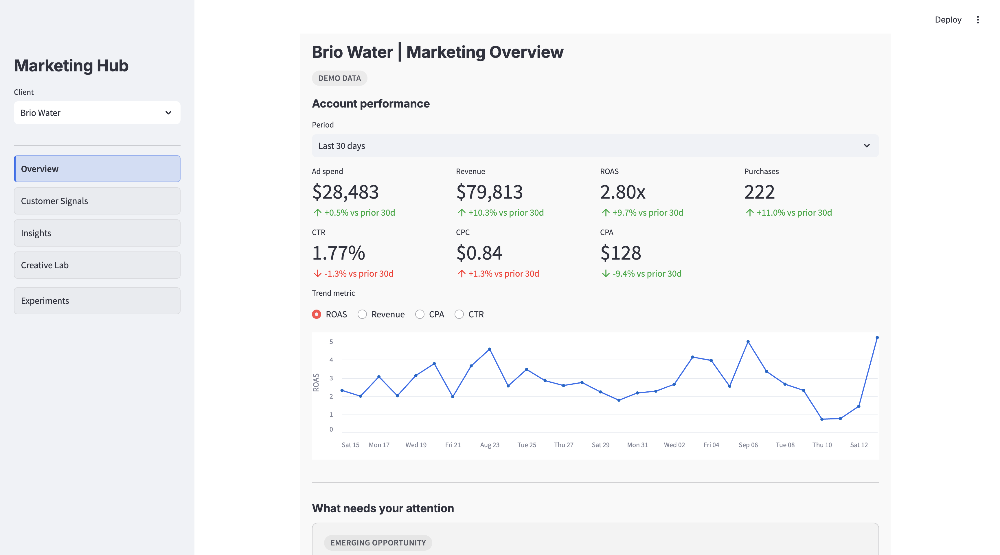
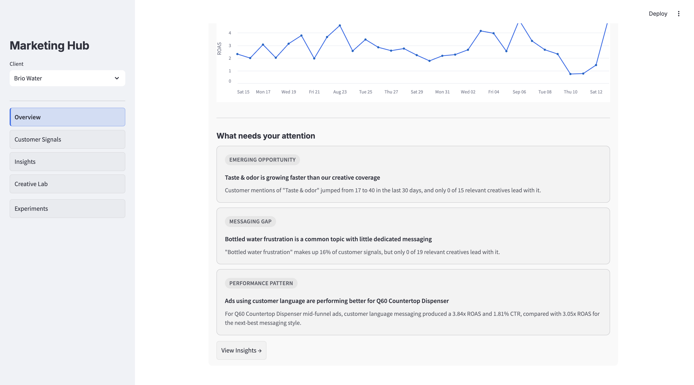
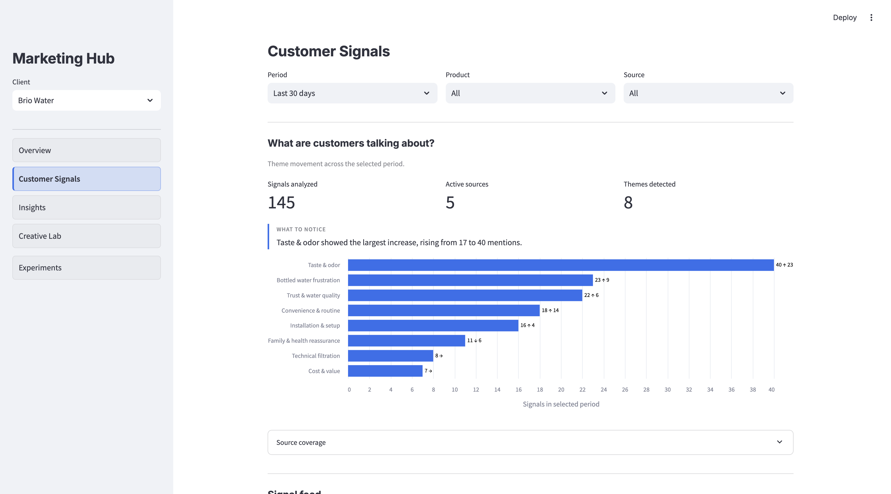
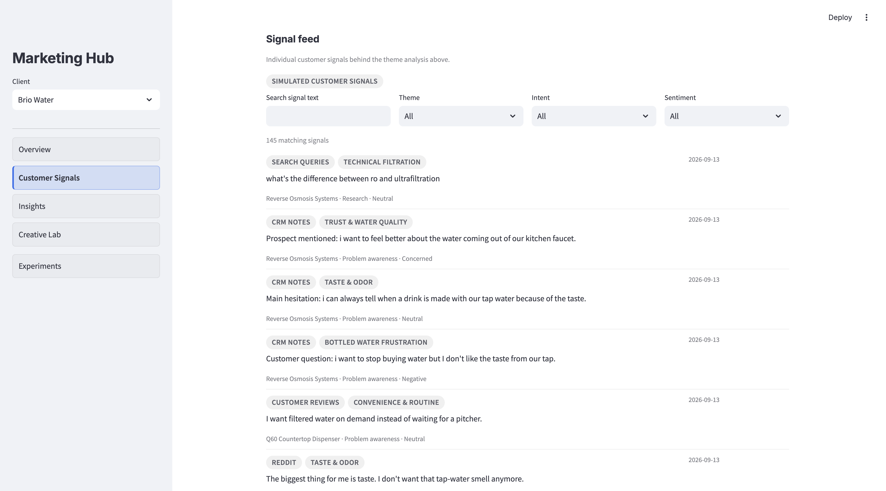
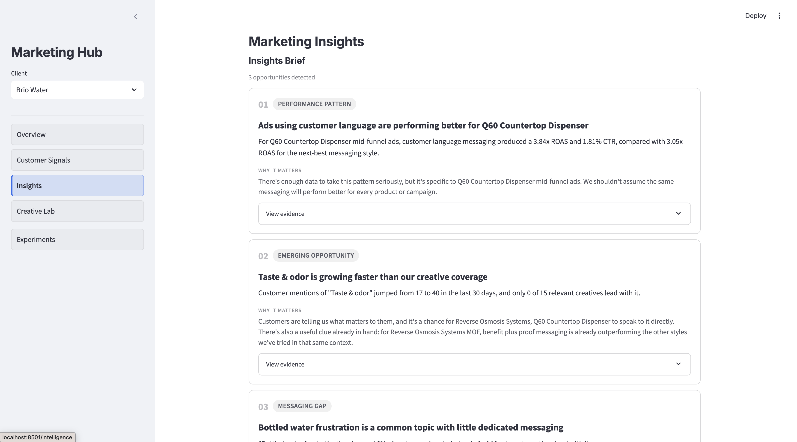
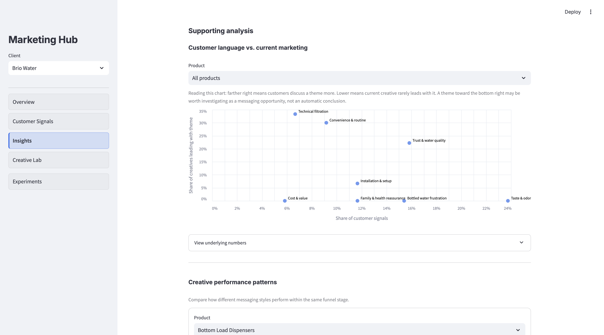
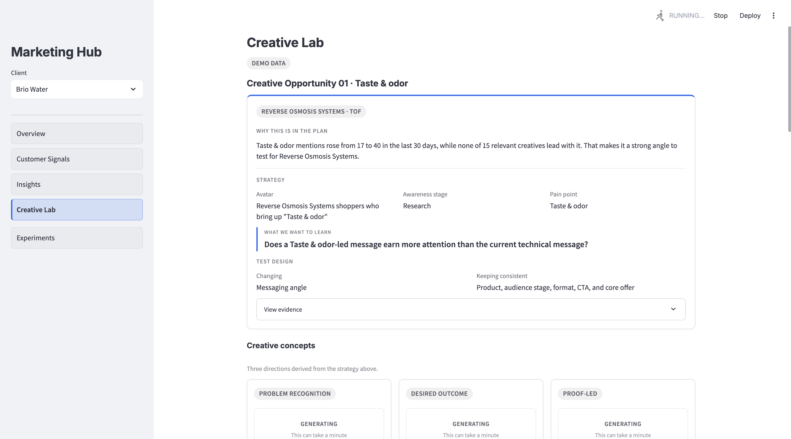
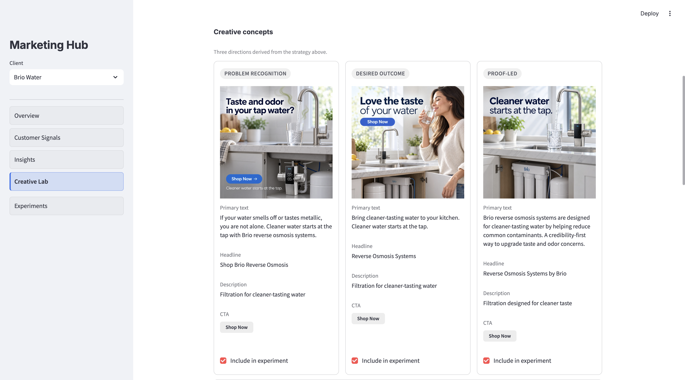
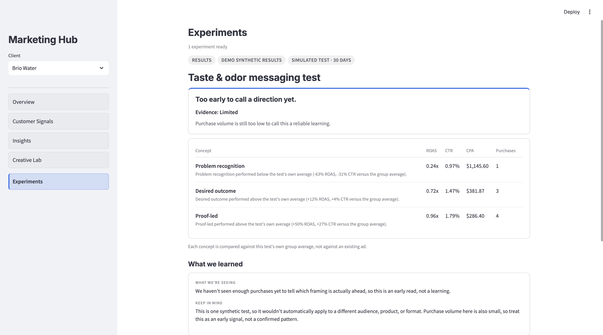

# Softline Marketing Hub

A prototype marketing tool that connects customer signals, creative
testing, and experiment results into one workflow, built for a fictional
water-filtration brand (Brio Water) as a portfolio project.

## Why I built it

I kept noticing that "what customers are saying," "what ad creative we're
running," and "what's actually performing" usually live in three
different tools that never talk to each other. This is my attempt at what
it'd look like if they did, and at using AI as the thing that connects
them, not as a replacement for a marketer's judgment.

## What it does

The app walks through one loop:

```
Customer Signals → Insights → Creative Lab → Experiments → Learnings
```

- **Customer Signals**: see what customers are actually saying, which
  themes are growing, and where that conversation is coming from.
- **Insights**: connect that conversation to current creative and
  performance data to surface specific, evidence-backed findings, not
  just "sentiment is up," but "this theme is growing and almost nothing in
  our creative addresses it."
- **Creative Lab**: turn a finding into a real creative test: three
  distinct messaging angles, each generated as an actual finished ad
  (headline, copy, image), not just a text idea.
- **Experiments**: run the test, compare the concepts against each other,
  and get a plain-language read on what happened and what it's worth
  testing next.
- **Learnings**: the experiment produces a proposed learning, a
  structured, evidence-backed conclusion a human would review. Right now
  that's as far as it goes; see [What's real vs. simulated](#whats-real-vs-simulated)
  for exactly where that stops.

At every step, AI does the gathering, organizing, and drafting. A human
still decides what moves forward: which finding matters, which concepts
to actually test, whether a result is worth acting on.

## Screenshots

### Overview



### Customer Signals



### Insights



### Creative Lab



### Experiments


## What's real vs. simulated

- The customer signals, ad performance numbers, and experiment results
  are synthetic data I wrote to be realistic, not pulled from a real ad
  account.
- The analysis logic (theme tracking, finding generation, experiment
  simulation) is real Python I wrote. It's not hardcoded to produce a
  specific outcome; it runs on whatever data it's given.
- Ad generation can go either way. By default the app runs in demo mode
  and replays six ads I actually generated earlier with the real OpenAI
  API, so anyone can click through the whole flow for free, with zero API
  calls. Flip one environment variable to "live" and it calls OpenAI for
  real: real copy generation, real image generation.
- Nothing here runs a real ad campaign. "Run Demo Test" simulates a
  result with a deterministic formula, seeded so the same setup always
  produces the same result.
- The four "agents" (Intelligence, Strategist, Creative Studio,
  Performance) are deterministic Python today, not separate LLM calls
  making decisions. Each one has a narrow, specific job, designed so a
  real model call could slot into any of them later without changing how
  the rest of the app talks to them.
- The loop stops at "proposed learning." An experiment produces a
  structured, evidence-backed conclusion (how strong the result is, what
  it suggests testing next), but there's no durable "approved learnings"
  store wired up yet. A human reviewing and approving a learning so it
  carries into the next round is the natural next step, not something
  this version does.
- There's no automated test suite in this version of the repo. There has
  been at earlier points in development; it's not something I'm claiming
  is here right now.

## What I built

I designed the workflow, built the five-page Streamlit app, and wrote the
analysis logic for customer-signal tracking, insight generation,
creative-plan synthesis, and experiment simulation. I also wrote out what
each agent is responsible for, and specifically not allowed to do, before
writing its code, and used that as the actual spec each piece of code
follows.

The six ad creatives you see in demo mode were generated for real through
the OpenAI integration I built, then cached so the demo replays them
without spending API credits every time someone clicks through it.

## Agent architecture

Four agents, each with a narrow job and its own written spec
(`agent.md` for what it owns and what it won't do, `identity.md` for its
voice, `workflow.md` for its process, `tools.md` for what it reads and
writes):

- **Intelligence**: turns customer signals, creative coverage, and
  performance data into findings.
- **Strategist**: turns a finding into a creative plan: who it's for,
  what to test, what to hold constant.
- **Creative Studio**: turns a creative plan into actual finished ads.
- **Performance**: reads an experiment's results and writes the
  plain-language interpretation.

A fifth, **Manager**, is specced out (same four files) but not built yet.
It's meant to be the cross-cutting layer that eventually coordinates the
other four.

Every agent today is deterministic Python: given the same input, it
returns the same structured output a real model call would, just without
the model call. That was a deliberate choice, reliable, free, and fast to
demo, not a limitation I'm hiding. Live generation (real OpenAI calls for
ad copy and images) is already wired in for Creative Studio; the others
are built so a real model call could be dropped in later without changing
how the rest of the app uses them.

## Tech stack

- Python
- Streamlit (multi-page app, `st.navigation`)
- pandas
- Altair, for the charts
- OpenAI's API, for live text + image generation in Creative Studio
  (model names are configurable, see `agents/creative_studio/config.py`)
- CSV / JSON / Markdown as the data and client-memory layer, no database

## Running it locally

```bash
pip install -r requirements.txt
cp .env.example .env
streamlit run app.py
```

By default `CREATIVE_GENERATION_MODE=demo`, so it runs fully offline, no
API key needed, no cost. To try real generation, set `OPENAI_API_KEY` and
`CREATIVE_GENERATION_MODE=live` in `.env`.

## Project structure

```
softline_marketing_hub/
├── app.py                  # entry point: page config, navigation, sidebar
├── app_pages/               # the 5 Streamlit pages
│   ├── overview.py
│   ├── signals.py            # "Customer Signals"
│   ├── intelligence.py       # "Insights"
│   ├── creative_lab.py
│   └── experiments.py
├── agents/
│   ├── intelligence/         # agent.md + identity/workflow/tools.md + engine.py
│   ├── strategist/
│   ├── creative_studio/
│   ├── performance/
│   └── manager/               # spec only, no engine.py yet
├── core/                     # calculation + shared logic the pages call into
├── clients/                  # per-client registry + brand/audience context
├── data/                      # synthetic source data (CSV)
├── assets/                     # generated/cached ad creatives, source ad images
└── docs/
    └── BUILD_LOG.md          # the full milestone-by-milestone build history
```

## What I'd do next

- Close the loop for real: a human-approval step that writes a learning
  to a durable store, and have the next creative plan actually read from
  it.
- A real automated test suite (there's history of one earlier in
  development; it needs to be rebuilt for this version).
- A second real client, to prove the multi-client design holds up with
  genuinely different data, not just a second row in a registry file.

---

The full build log, every milestone, in order, with what changed and why,
is in [`docs/BUILD_LOG.md`](docs/BUILD_LOG.md).
